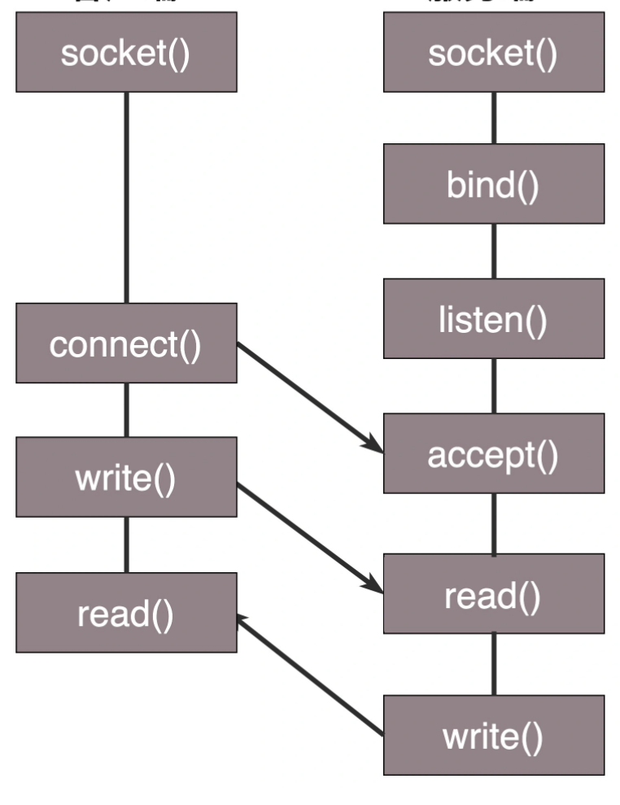
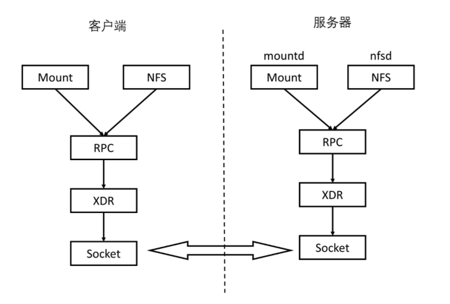
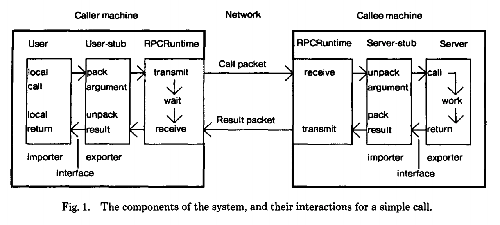
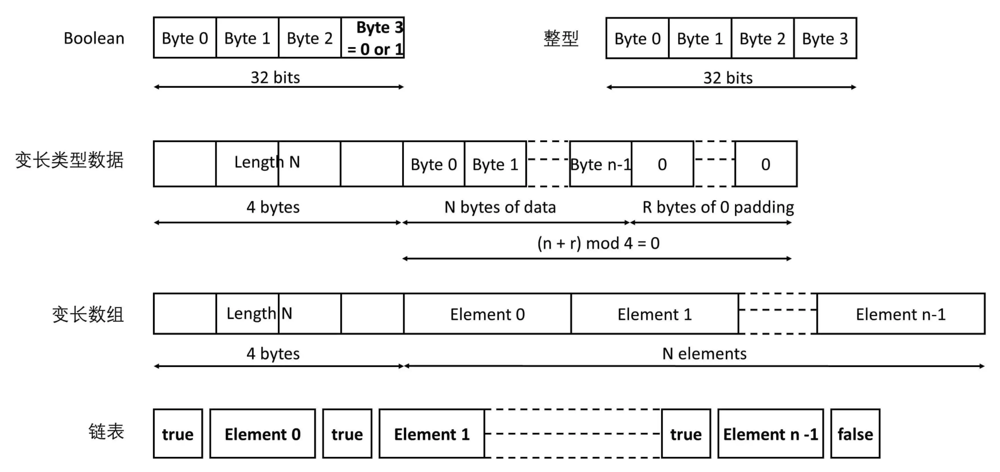
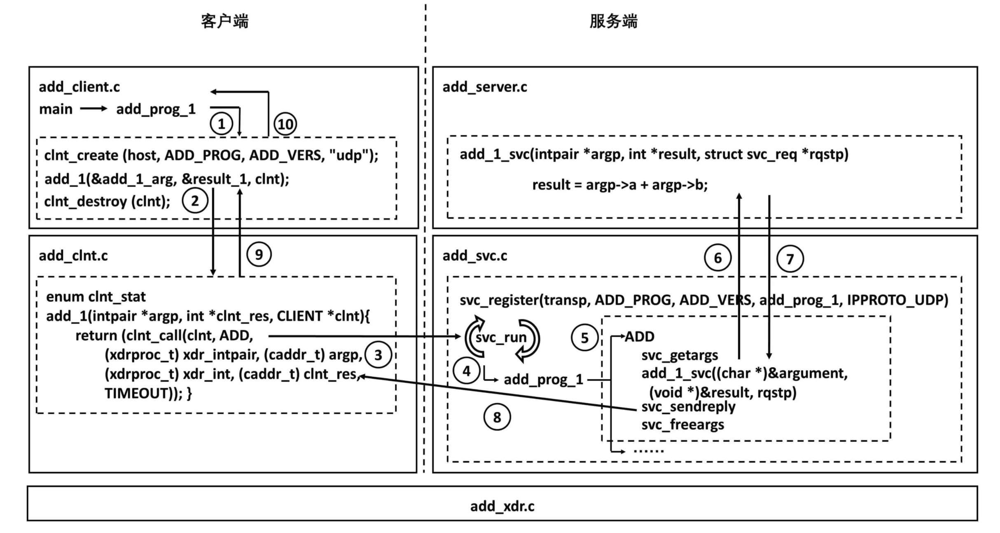
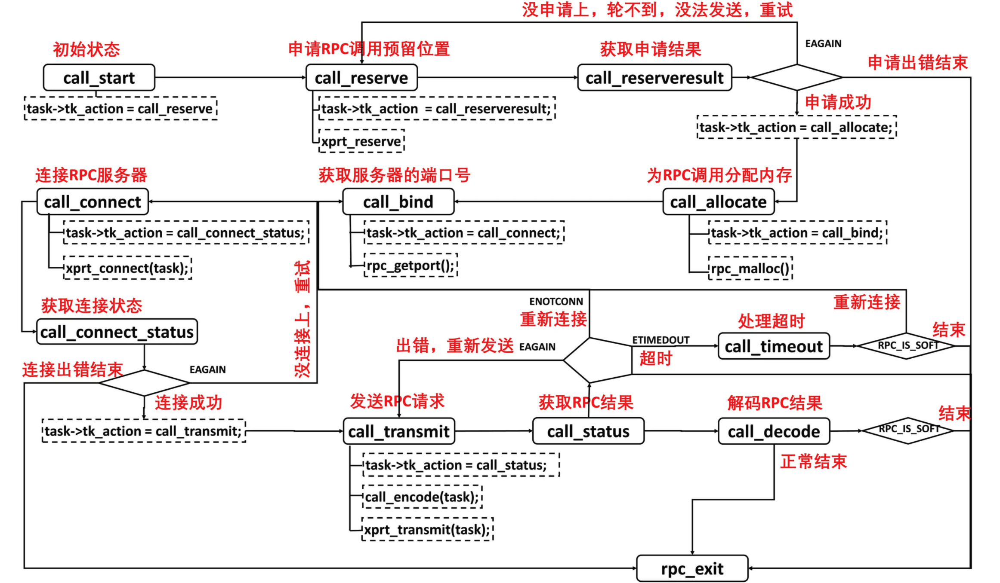
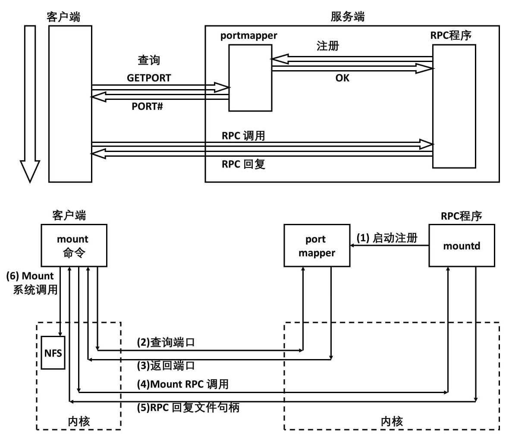

- [API Design](#api-design)
  - [Socket programming](#socket-programming)
    - [Operations](#operations)
    - [Challenges](#challenges)
  - [RPC history: SUN RPC / ONC RPC](#rpc-history-sun-rpc--onc-rpc)
    - [Use case](#use-case)
    - [Components](#components)
    - [Limitations](#limitations)
  - [XML based protocols](#xml-based-protocols)
    - [When compared with ONC RPC](#when-compared-with-onc-rpc)
    - [SOAP](#soap)
  - [Real world](#real-world)
    - [Netflix](#netflix)
    - [API redesign](#api-redesign)
    - [API specification](#api-specification)
  - [References](#references)

# API Design

## Socket programming

### Operations

* Send on the left; Receive on the right



### Challenges

**Marshal/Unmarshal**

* Challenges: For a remote procedure call, a remote machine may:
  * Different sizes of integers and other types
  * Different byte ordering. E.g. Big endian / little endian
  * Different floating point representations
  * Different character sets
  * Different alignment requirements
  * How to define the grammer for remote operations. E.g. How to represent an add operation? Use '+', 'add' or number '1'
  * How to represent the parameters for functions. E.g. Polish notation, reverse polish notation.


* Challenges: Reference variables
  * What we pass is the value of the pointer, instead of the pointer itself. A local pointer, pointing to this value is created on the server side (Copy-in). When the server procedure returns, the modified 'value' is returned, and is copied back to the address from where it was taken (Copy-out).
  * This approach is not foolproof. The procedure 'myfunction()' resides on the server machine. If the program executes on a single machine then we must expect the output to be '4'. But when run in the client-server model we get '3'. Why ? Because 'x, and 'y' point to different memory locations with the same value. Each then increments its own copy and the incremented value is returned. Thus '3' is passed back and not '4'.

```
#include <studio.h>

void myfunction(int *x, int *y)
{
    *x += 1;
    *y += 1;
}
```

**Service discovery**

* How to do service discovery. E.g. What functionalities a remote service support.

**Performance and resiliency**

* What to do when faced with performance and resiliency conditions, etc.

## RPC history: SUN RPC / ONC RPC

### Use case

* NFC protocol mount (put a remote directory on a local path) and nfsd (read / write files) commands.



### Components

* SUN RPC flowchart



* XDR means external data representation.



* Utilities for generating stub



* Resiliency 
* Service discovery with portmapper



### Limitations

* Error prone compression and decompression process.
* Hard to modify the protocol.
* ONC RPC is function oriented, not object oriented.

## XML based protocols

### When compared with ONC RPC

* It has the following benefits:
  * ONC RPC is binary based. XML allows client and server accepted data transformation to have some inconsisteny. e.g. changing the order of elements will not result in any error.
  * It is object oriented instead of function oriented.

### SOAP

**WSDL protocol**

* WSDL protocol could be used to generate client's stub.

```
// Order type
 <wsdl:types>
  <xsd:schema targetNamespace="http://www.example.org/geektime">
   <xsd:complexType name="order">
    <xsd:element name="date" type="xsd:string"></xsd:element>
    <xsd:element name="className" type="xsd:string"></xsd:element>
    <xsd:element name="Author" type="xsd:string"></xsd:element>
    <xsd:element name="price" type="xsd:int"></xsd:element>
   </xsd:complexType>
  </xsd:schema>
 </wsdl:types>

// Message structure
 <wsdl:message name="purchase">
  <wsdl:part name="purchaseOrder" element="tns:order"></wsdl:part>
 </wsdl:message>

// Expose an interface
 <wsdl:portType name="PurchaseOrderService">
  <wsdl:operation name="purchase">
   <wsdl:input message="tns:purchase"></wsdl:input>
   <wsdl:output message="......"></wsdl:output>
  </wsdl:operation>
 </wsdl:portType>

// Define a binding
 <wsdl:binding name="purchaseOrderServiceSOAP" type="tns:PurchaseOrderService">
  <soap:binding style="rpc"
   transport="http://schemas.xmlsoap.org/soap/http" />
  <wsdl:operation name="purchase">
   <wsdl:input>
    <soap:body use="literal" />
   </wsdl:input>
   <wsdl:output>
    <soap:body use="literal" />
   </wsdl:output>
  </wsdl:operation>
 </wsdl:binding>

// Define a service
 <wsdl:service name="PurchaseOrderServiceImplService">
  <wsdl:port binding="tns:purchaseOrderServiceSOAP" name="PurchaseOrderServiceImplPort">
   <soap:address location="http://www.geektime.com:8080/purchaseOrder" />
  </wsdl:port>
 </wsdl:service>
```

**UDDI**

* Universal description, discovery and integration

**Sample request**

```
// Header
POST /purchaseOrder HTTP/1.1
Host: www.geektime.com
Content-Type: application/soap+xml; charset=utf-8
Content-Length: nnn

// Body
<?xml version="1.0"?>
<soap:Envelope xmlns:soap="http://www.w3.org/2001/12/soap-envelope"
soap:encodingStyle="http://www.w3.org/2001/12/soap-encoding">
    <soap:Header>
        <m:Trans xmlns:m="http://www.w3schools.com/transaction/"
          soap:mustUnderstand="1">1234
        </m:Trans>
    </soap:Header>
    <soap:Body xmlns:m="http://www.geektime.com/perchaseOrder">
        <m:purchaseOrder">
            <order>
                <date>2018-07-01</date>
                <className>趣谈网络协议</className>
                <Author>刘超</Author>
                <price>68</price>
            </order>
        </m:purchaseOrder>
    </soap:Body>
</soap:Envelope>
```

## Real world

### Netflix

**GraphQL at Netflix:**

* [https://netflixtechblog.com/beyond-rest-1b76f7c20ef6](https://netflixtechblog.com/beyond-rest-1b76f7c20ef6)
* [https://netflixtechblog.com/how-netflix-scales-its-api-with-graphql-federation-part-2-bbe71aaec44a](https://netflixtechblog.com/how-netflix-scales-its-api-with-graphql-federation-part-2-bbe71aaec44a)
* [https://netflixtechblog.com/how-netflix-scales-its-api-with-graphql-federation-part-1-ae3557c187e2](https://netflixtechblog.com/how-netflix-scales-its-api-with-graphql-federation-part-1-ae3557c187e2)
* [https://netflixtechblog.com/our-learnings-from-adopting-graphql-f099de39ae5f](https://netflixtechblog.com/our-learnings-from-adopting-graphql-f099de39ae5f)

### API redesign

* Embracing the Differences : Inside the Netflix API Redesign
  * [https://netflixtechblog.com/embracing-the-differences-inside-the-netflix-api-redesign-15fd8b3dc49d](https://netflixtechblog.com/embracing-the-differences-inside-the-netflix-api-redesign-15fd8b3dc49d)
* Redesign the Netflix API:
  * [https://netflixtechblog.com/redesigning-the-netflix-api-db5a7221fcff](https://netflixtechblog.com/redesigning-the-netflix-api-db5a7221fcff)
* API migration at Netflix:
  * [https://netflixtechblog.com/seamlessly-swapping-the-api-backend-of-the-netflix-android-app-3d4317155187](https://netflixtechblog.com/seamlessly-swapping-the-api-backend-of-the-netflix-android-app-3d4317155187)

### API specification

* Open API spec: [https://swagger.io/specification/](https://swagger.io/specification/)
* Google API: [https://cloud.google.com/apis/design](https://cloud.google.com/apis/design)
* Handyman API guidance: [http://apistylebook.com/design/topics/governance](http://apistylebook.com/design/topics/governance)

## References

* The Design of Web APIs: [https://www.manning.com/books/the-design-of-web-apis](https://www.manning.com/books/the-design-of-web-apis)
* API design patterns: [https://www.manning.com/books/the-design-of-web-apis](https://www.manning.com/books/the-design-of-web-apis)
* API security in action: [https://www.manning.com/books/api-security-in-action](https://www.manning.com/books/api-security-in-action)
* API design guidance: [https://tyk.io/api-design-guidance-long-running-background-jobs/](https://tyk.io/api-design-guidance-long-running-background-jobs/)
* Geektime \[Chinese]:
  * [RPC实战与核心原理专栏](https://time.geekbang.org/column/article/205910)
  * [从0开始学微服务](https://time.geekbang.org/column/article/15092)
* [https://www.imaginarycloud.com/blog/grpc-vs-rest/](https://www.imaginarycloud.com/blog/grpc-vs-rest/)
