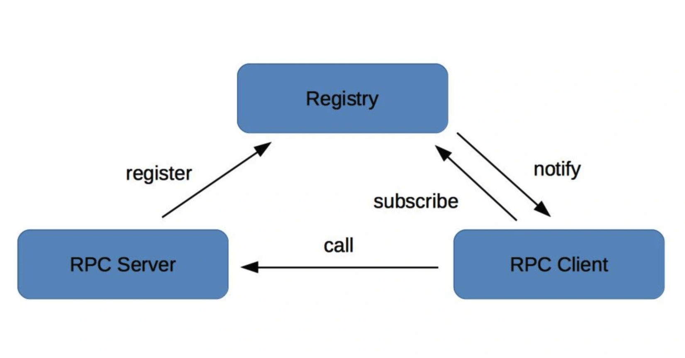
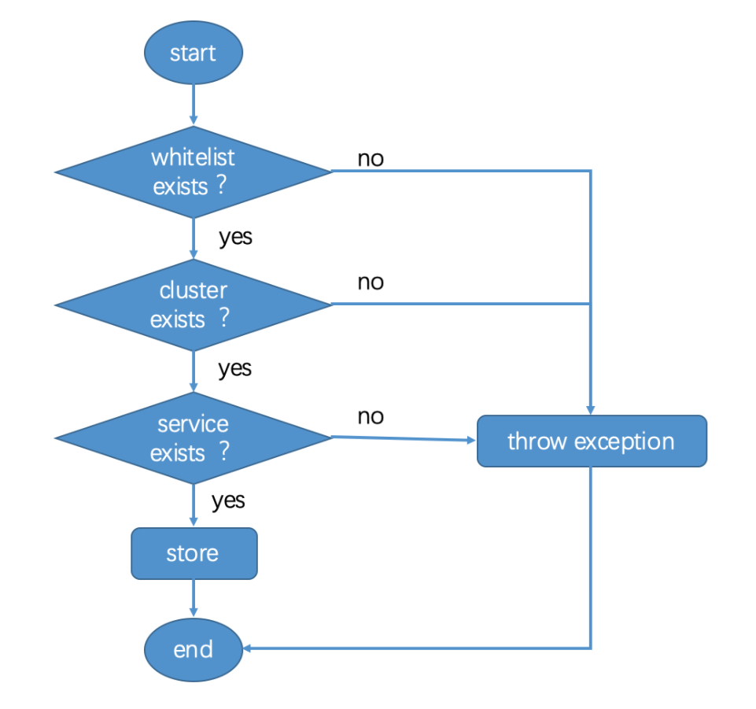
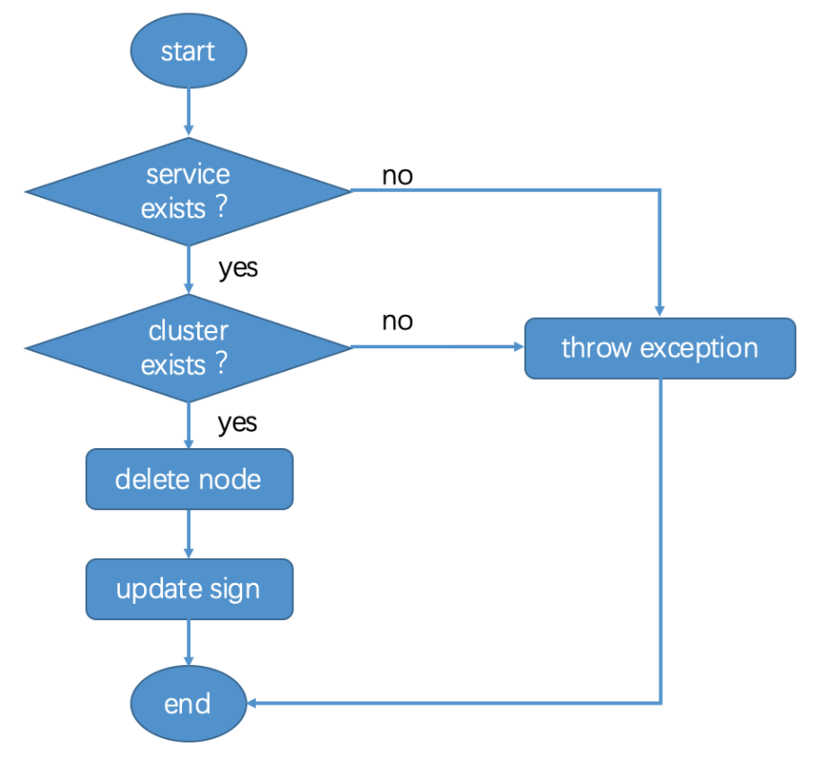
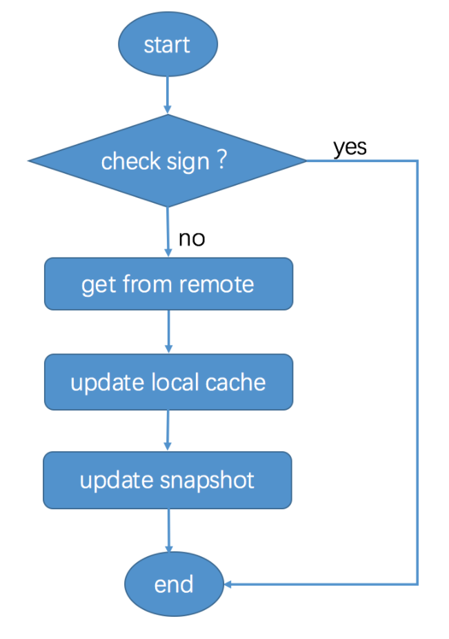
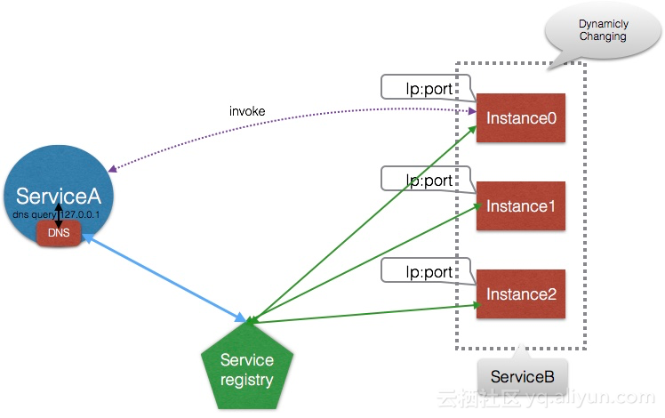
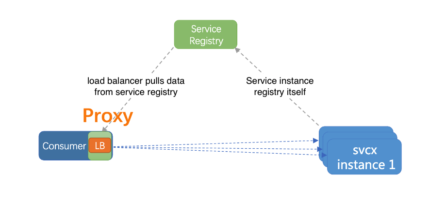

# RegistryCenter-Overview

* [Registry center](registrycenter-overview.md#registry-center)
  * [Motivation: Use Nginx as an example](registrycenter-overview.md#motivation-use-nginx-as-an-example)
  * [Roles and functionalities](registrycenter-overview.md#roles-and-functionalities)
  * [Functionalities registry center should support](registrycenter-overview.md#functionalities-registry-center-should-support)
    * [Service provider register and unregister service](registrycenter-overview.md#service-provider-register-and-unregister-service)
    * [Consumers look up service provider info](registrycenter-overview.md#consumers-look-up-service-provider-info)
    * [Healthcheck information](registrycenter-overview.md#healthcheck-information)
      * [Design heartbeat messages](registrycenter-overview.md#design-heartbeat-messages)
        * [Proactive vs reactive heartbeat messages](registrycenter-overview.md#proactive-vs-reactive-heartbeat-messages)
        * [Report frequency](registrycenter-overview.md#report-frequency)
        * [Subhealth criteria](registrycenter-overview.md#subhealth-criteria)
        * [Resilient to network latency](registrycenter-overview.md#resilient-to-network-latency)
    * [Event subscription](registrycenter-overview.md#event-subscription)
      * [How to avoid notification storm](registrycenter-overview.md#how-to-avoid-notification-storm)
    * [Administration](registrycenter-overview.md#administration)
    * [High availability](registrycenter-overview.md#high-availability)
      * [Cluster](registrycenter-overview.md#cluster)
      * [Multi-DC](registrycenter-overview.md#multi-dc)
  * [Popular implementations](registrycenter-overview.md#popular-implementations)
    * [DNS based implementation](registrycenter-overview.md#dns-based-implementation)
      * [Put service providers under a domain](registrycenter-overview.md#put-service-providers-under-a-domain)
      * [DNS service points to a load balancer address](registrycenter-overview.md#dns-service-points-to-a-load-balancer-address)
      * [Ali DNS implementation](registrycenter-overview.md#ali-dns-implementation)
    * [Proxy based](registrycenter-overview.md#proxy-based)
      * [In-App Registration](registrycenter-overview.md#in-app-registration)
      * [Side car](registrycenter-overview.md#side-car)
      * [Consul implementation](registrycenter-overview.md#consul-implementation)
    * [Zookeeper based implementation](registrycenter-overview.md#zookeeper-based-implementation)
    * [Message bus based registration](registrycenter-overview.md#message-bus-based-registration)
  * [Choose among service registry frameworks](registrycenter-overview.md#choose-among-service-registry-frameworks)
    * [Integration mechanism](registrycenter-overview.md#integration-mechanism)
  * [References](registrycenter-overview.md#references)

## Registry center

### Motivation: Use Nginx as an example

* Nginx is a reverse proxy. It knows the application servers' address because it is inside configuration file. This approach has some limitations:
  * When application servers scale up, needs to update Nginx's config file and restart. 
  * When application servers have problems, also need to update Nginx's config file and restart. 

### Roles and functionalities

* RPC server: 
  * Upon start, send registration information to registry center according to config file (e.g. server.xml)
  * Upon running, regularly report heartbeat information to the server. 
* RPC client: 
  * Upon start, subscribe to registry center according to config file and cache the response from registry center inside cache. 
  * Upon running, based on some load balancing algorithm, connect with RPC servers. 
* Registry center:
  * When RPC servers have changes, registry center will notify RPC clients on these changes. 



### Functionalities registry center should support

#### Service provider register and unregister service

* Storage structure is as the following:
  * Service layer
  * Cluster layer
  * Info entries as KV


* Flowchart for registering service



* Flowchart for unregistering service



* Multiple registration center deployed
  * Different gateways/business logic units are connected to different registration center
* What if a pushdown instruction arrives at the wrong registration center
  * Gossip protocol to discover between different registration centers
    * Cons: Long message delay / Forward redundancy
    * Pros: Suitable for large number of clusters. Used in P2P, Redis cluster, Consul
  * An open source implementation for Gossip [https://github.com/scalecube/scalecube-cluster](https://github.com/scalecube/scalecube-cluster)

#### Consumers look up service provider info

* Local cache: Need local cache to improve performance. 
* Snapshot: This snapshot in disk is needed because the network between consumers and registry center are not always good. If consumers restart and connection is not good, then consumers could still read from snapshot (there is no cache so far). 


#### Healthcheck information

* Service providers report heartbeat messages to registry center.  
* Take the example of Zookeeper:
  1. Upon connection establishment, a long connection will be established between service providers and Zookeeper with a unique SESSION_ID and SESSION_TIMEOUT period. 
  2. Clients will regularly report heartbeat messages to the Zookeeper. 
  3. If Zookeeper does not receive heartbeat messages within SESSION_TIMEOUT period, it will consider that the service provider is not healthy and remove it fromm the pool. 

**Design heartbeat messages**

**Proactive vs reactive heartbeat messages**

* Proactive: Registry center proactively calls service providers. 
  * Cons: Registry center needs to loop through all service providers regularly. There will be some delay. 
* Reactive: Service providers reports heartbeat messages to service registry. 

**Report frequency**

* Usually the health ping frequency is set to 30s. This will avoid too much pressure on the server, and at the same time avoid too much delay in catching a node's health states. 

**Subhealth criteria**

* A State transition between death, health and subhealth. An interesting question is how to decide the threshold for a node to transit from health to subhealth? 
  * Both application layer and service layer health info needs to be gathered. For application layer, the RPS/response time of each API will be different, so simply setting threshold for total failure or TPS. Use the percentage of success / total as standards. 

**Resilient to network latency**

* Deploy detectors across different locations. 
* But set up a threshold (like 40%) to avoid remove all nodes due to network problems. 

#### Event subscription

* RPC client subscribes to certain services
* Take the example of Zookeeper: Use watch mechanism



**How to avoid notification storm**

* Problem: Suppose a service provider has 100 nodes and each node has 100 consumers. Then when there is an update in the service provider, there will be 100\*100 notifications generated. 
* Solution: 
  * Capacity planning for registry center. 
  * Scale up registry center. 
  * Only transmit incremental information. 

#### Administration

* Administrative functionalities:
  * Update a service provider's information
* Blacklist and whitelist service providers
  * e.g. Service providers in production environments should not register inside register center of test environments. 

#### High availability

**Cluster**

* Take the example of Zookeeper
  1. Upon Zookeeper start, a leader will be elected according to Paxos protocol. 
  2. Leader will be responsible for update operations according to ZAB protocol. 
  3. An update operation is considered successful only if majority servers have finished update. 


**Multi-DC**

* Please see the following chart for Consul


### Popular implementations

#### DNS based implementation

* Benefits: Low intrusion to the business logic when compared with SDK-based solution. 

**Put service providers under a domain**

* Idea: Put all service providers under a domain. 
* Cons:
  * If an IP address goes offline, then the service provider could not easily remove the node because DNS has many layers of cache. 
  * If scaling up, then newly scaled nodes will not receive enough traffic. 

```
┌───────────┐       ┌───────────┐      ┌───────────────┐       ┌───────────┐       ┌─────────────┐      ┌───────────┐
│user browse│       │           │      │Local DNS cache│       │ local DNS │       │Regional DNS │      │ authority │
│ a domain  ├──────▶│ JVM cache │─────▶│  (Host file)  │──────▶│  server   │──────▶│(with cache) │─────▶│    DNS    │
│           │       │           │      │               │       │           │       │             │      │           │
└───────────┘       └───────────┘      └───────────────┘       └───────────┘       └─────────────┘      └───────────┘
```

**DNS service points to a load balancer address**

* Idea: Consumers connect to the virtual ip address of a load balancer, not DNS servers. 
* Cons:
  * All traffic needs to go through an additional hop, causing performance degradation. 
  * Usually for load balancers, if you want to add or remove nodes, it needs to be done manually. 
  * When it comes to service governance, usually a more flexible load balancing algorithm will be needed. 

```
                                           ┌─────────────────────────┐                                              
                                           │                         │                                              
             ┌──────Discover───────────────│           DNS           │                                              
             │                             │                         │                                              
             │                             └─────────────────────────┘                                              
             │                                                                                                      
             │                                                                                                      
             │                                                                                                      
             ▼                                                                                                      
┌─────────────────────────┐                ┌─────────────────────────┐                   ┌─────────────────────────┐
│                         │                │                         │       Load        │                         │
│    Service consumer     │ ──Invoke──────▶│      Load balancer      │─────balancing ───▶│    Service Provider     │
│                         │                │                         │    and revoke     │                         │
└─────────────────────────┘                └─────────────────────────┘                   └─────────────────────────┘
```

**Ali DNS implementation**

* Independent DNS server
  * Pros:
    * Centralized DNS server. Easy for maintenance. 
  * Cons:
    * High requirement on DNS server performance. 
    * SPOF


* Filter based on DNS server: Embed a DNS server in local server. All DNS queries will first be parsed by the local DNS.
  * Pros:
    * Avoid the SPOF
  * Cons:
    * Higher maintenance cost because DNS is embedded within each service. 



* Ali's implementation derive from filter based DNS server. 
  1. Service A query service B's IP address
  2. DNS-F intercept service A's request, and see whether VIPServer has the data.
  3. Otherwise, DNS-F will query the actual DNS server. 


* Reference in Chinese: [https://developer.aliyun.com/article/598792](https://developer.aliyun.com/article/598792)

#### Proxy based

**In-App Registration**

* Def: Each app embed a proxy (e.g. Alibaba Dubbo / Netflix karyon / Twitter Finagle)
* Pros:
  * No single point of failure
  * High performant
* Cons:
  * Language compatibility. Requires multiple language support.
* Use cases:
  * In mid/large sized company where language stack is consistent and unified. 



**Side car**

* Def: Run two separate applications on the same machine. One for service registration, and the other for service discovery. 


**Consul implementation**

* Consul: Registry center's server end, will store registration information and provide registration and discovery service. 
* Registrator: An open-source third party service management project. It will listen to services' docker instances and provide registration and unregistration. 
* Consul template: Regularly pull information from registry center and update load balancer configuration (such as Nginx stream module). Then service consumers could get latest info by querying Nginx. 


#### Zookeeper based implementation

* It is becoming popular because it is the default registration center for Dubbo framework. 
* Idea: Use Zookeeper ephemeral node to work as service registry and watch mechanism for notifications. 
* Cons: 
  * When there are too many directories or too many clients connecting to Zookeeper, the performance will have a natural degradation because Zookeeper enforces strong consistency. 

```
                                       ┌────────────────┐                             
                                       │Service consumer│                             
                                       │                │                             
                                       └────────────────┘                             
                                           │       ▲                                  
                                           │       │                                  
              Step 3. Create a node        │       │                                  
                "consumer1" under          │       │                                  
          /service/consumer directory.     │       │   Step 4. ZooKeeper notifies the 
                                           │       │       client that a new node     
            And watch all nodes under      │       │   "providerN" is added under the 
                /service/provider          │       │   /service/provider registration 
                                           │       │                                  
                                           │       │                                  
                                           ▼       │                                  
                          ┌───────────────────────────────────────┐                   
                          │                                       │                   
                          │               Zookeeper               │                   
                          │                                       │                   
                          │           /service/provider           │                   
                          │      /service/provider/provider1      │                   
   Step 1. Create a root  │                  ...                  │                   
       service path       │      /service/provider/providerN      │                   
                          │                                       │                   
     /service/provider    │                                       │                   
     /service/consumer    │           /service/consumer           │                   
                          │      /service/consumer/consumer1      │                   
                          │                  ...                  │                   
                          │      /service/consumer/consumerN      │                   
                          │                                       │                   
                          └───────────────────────────────────────┘                   
                                               ▲                                      
                                               │                                      
                                               │                                      
                                               │                                      
                                               │  Step 2. Create a node under         
                                               │       service provider               
                                               │                                      
                                               │  /service/provider/provider1         
                                               │                                      
                                               │                                      
                                               │                                      
                                               │                                      
                                      ┌────────────────┐                              
                                      │Service provider│                              
                                      │                │                              
                                      └────────────────┘
```

#### Message bus based registration

* Idea: 
  * When service providers come online, consumers could tolerate some latency in discovering these service providers. A strong consistency model such as what Zookeeper provides is not needed. 
  * Could have multiple registry center connectecd by message bus. Registry center could have a full cached copy of service providers and multiple registry centers could sync the data via a message bus. 
* How to solve the above idea's update latency problem
  * Client retry when the service provider is no longer there. 

```
  ┌─────────────────────────────┐                                                          
  │      Service provider       │                                                          
  │                             │                                                          
  └─────────────────────────────┘                                                          
                 │                                                                         
                 │                                                                         
          Step 1. Create a                                                                 
            registration                                                                   
               message                                                                     
                 │                                     ┌──────────────────────────────────┐
                 │                                     │           Message bus            │
                 ▼                                     │                                  │
  ┌────────────────────────────┐    Step 3. Publish    │  ┌───────────────────────────┐   │
  │                            │     registration      │  │Service: Checkout          │   │
  │                            │  ────message to ───▶  │  │Address: 192.168.1.9:9080  │   │
  │                            │      message bus      │  │Version: 2019113589        │   │
  │                            │                       │  └───────────────────────────┘   │
  │                            │                       │                                  │
  │                            │                       │  ┌───────────────────────────┐   │
  │                            │                       │  │Service: addToCart         │   │
  │                            │                       │  │Address: 192.168.1.2:9080  │   │
  │                            │                       │  │Version: 2019103243        │   │
  │    Registration center     │                       │  └───────────────────────────┘   │
  │                            │                       │                                  │
  │                            │        Step 4.        │  ┌───────────────────────────┐   │
  │                            │   Pull/receive push   │  │          ......           │   │
  │                            │◀──notification from── │  │                           │   │
  │                            │      message bus      │  │                           │   │
  │                            │                       │  └───────────────────────────┘   │
  │                            │                       │                                  │
  │                            │                       │  ┌───────────────────────────┐   │
  │                            │                       │  │Service: Checkout          │   │
  └────────────────────────────┘                       │  │Address: 192.168.1.9:9080  │   │
         ▲                │                            │  │Version: 2019113590        │   │
         │                │                            │  └───────────────────────────┘   │
         │                │                            └──────────────────────────────────┘
Step 2. Consumer          │                                                                
  subscribe to            │                                                                
  registration            Step 5. Receive                                                  
 center change       notification for service                                              
         │                │provider list                                                   
         │                │                                                                
         │                ▼                                                                

  ┌─────────────────────────────┐                                                          
  │      Service consumer       │                                                          
  │                             │                                                          
  └─────────────────────────────┘
```

### Choose among service registry frameworks

| `Criteria`            | `Zookeeper` | `etcd`       | `Eureka`       | `Consul`     |
| --------------------- | ----------- | ------------ | -------------- | ------------ |
| CAP model             | CP          | CP           | AP             | CP           |
| Consensus protocol    | ZAB (Paxos) | Raft         | Not applicable | Raft         |
| Integration mechanism | SDK client  | HTTP/gRPC    | HTTP           | HTTP/DNS     |
| Watch support         | Support     | Long polling | Long polling   | Long polling |
| KV storage            | Support     | Support      | Not support    | Support      |
| Written language      | Java        | Go           | Java           | Go           |

#### Integration mechanism

* In-app solutions are typically suitable when both service providers and consumers belong to the same technology stack. Such as Euruka
* Out-app solutions are typically suitable in cloud apps (container). Such as Consul

### References

* Three ways for service discovery: [https://time.geekbang.org/course/detail/100003901-2269](https://time.geekbang.org/course/detail/100003901-2269)
* Discovery and internals: 
  * Theory: [https://time.geekbang.org/column/article/14603](https://time.geekbang.org/column/article/14603)
  * Practical: [https://time.geekbang.org/column/article/39783](https://time.geekbang.org/column/article/39783)
* TODO: Registry center: 
  * [https://time.geekbang.org/column/article/39792](https://time.geekbang.org/column/article/39792)
* TODO: Select among registry centers
  * [https://time.geekbang.org/column/article/39797](https://time.geekbang.org/column/article/39797)
* TODO: Whether a node is alive:
  * [https://time.geekbang.org/column/article/40684](https://time.geekbang.org/column/article/40684)
* Notification storm problem 高并发设计40问
