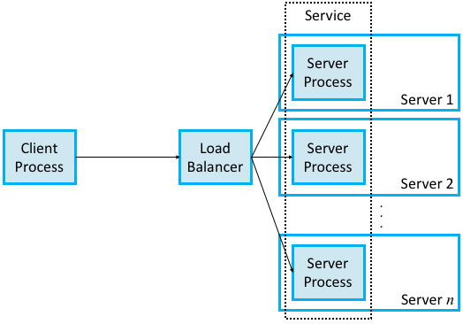

<!-- MarkdownTOC -->

- [RPC](#rpc)
	- [Goal](#goal)
	- [RPC vs REST](#rpc-vs-rest)
	- [Implementations](#implementations)
		- [History](#history)
		- [gRPC](#grpc)
			- [History](#history-1)
			- [Features](#features)
				- [Multi-language, multi-platform framework](#multi-language-multi-platform-framework)
				- [Transport over HTTP/2 + TLS](#transport-over-http2--tls)
				- [C/C++ implementation goals](#cc-implementation-goals)
			- [Components](#components)
		- [Comparison](#comparison)
	- [Components](#components-1)
		- [Stub generator](#stub-generator)
			- [Marshalling](#marshalling)
		- [Run-time library](#run-time-library)
			- [Transport protocol](#transport-protocol)
			- [Semantics of RPC](#semantics-of-rpc)
				- [At least once](#at-least-once)
				- [Exactly once](#exactly-once)
				- [At most once](#at-most-once)
				- [Last of many](#last-of-many)
			- [Binding](#binding)
		- [Exception handling](#exception-handling)
			- [Synchronous vs asynchronous protocols](#synchronous-vs-asynchronous-protocols)
	- [Design challenges](#design-challenges)
		- [Parameter passing](#parameter-passing)
			- [Copy-in Copy-Out](#copy-in-copy-out)
		- [Idempotent operations](#idempotent-operations)
	- [Performance optimization](#performance-optimization)
		- [Synchrnoized IO multiplex](#synchrnoized-io-multiplex)
		- [Serialization](#serialization)
			- [JSON](#json)
			- [Thrift](#thrift)
			- [Protobuf](#protobuf)

<!-- /MarkdownTOC -->

# RPC 
## Goal
* Make the process of executing code on a remote machine as simple and straight-forward as calling a local function.

## RPC vs REST

## Implementations
### History
* SunRPC is the basis for Network File System. 
* DCE-RPC is the basis of Microsoft's DCOM and ActiveX. 
* RMI
	- RMI uses Java Remote Messaging Protocol for communication. It has limitation that both the sender and receiver need to be Java programs. It could not be used in cross-language scenarios
	- RMI uses Java's native approach for serialization and deserialization. The generated binary format is not efficient. 

### gRPC
#### History
* The biggest differences between gRPC and SunRPC/DCE-RPC/RMI is that gRPC is designed for cloud services rather than the simpler client/server paradigm. In the client/server world, one server process is presumed to be enough to serve calls from all the client processes that might call it. With cloud services, the client invokes a method on a service, which in order to support calls from arbitrarily many clients at the same time, is implemented by a scalable number of server processes, each potentially running on a different server machine.
* The caller identifies the service it wants to invoke, and a load balancer directs that invocation to one of the many available server processes (containers) that implement that service



#### Features
##### Multi-language, multi-platform framework
* Native implementations in C, Java, and Go
* Platforms supported: Linux, Android, iOS, MacOS, Windows

##### Transport over HTTP/2 + TLS
* First, gRPC runs on top of TCP instead of UDP, which means it outsources the problems of connection management and reliably transmitting request and reply messages of arbitrary size. 
* Second, gRPC actually runs on top of a secured version of TCP called Transport Layer Security (TLS)—a thin layer that sits above TCP in the protocol stack—which means it outsources responsibility for securing the communication channel so adversaries can’t eavesdrop or hijack the message exchange. 
* Third, gRPC actually, actually runs on top of HTTP/2 (which is itself layered on top of TCP and TLS), meaning gRPC outsources yet two other problems: 
	- Binary framing and compression: Efficiently encoding/compressing binary data into a message.
	- Multiplexing: Requests by introducing concept of streams.
		- HTTP: The client could send a single request message and the server responds with a single reply message.
		- HTTP 1.1: The client could send multiple requests without waiting for the response. However, the server is still required to send the responses in the order of incoming requests. So Http 1.1 remained a FIFO queue and suffered from requests getting blocked on high latency requests in the front [Head-of-line blocking](https://en.wikipedia.org/wiki/Head-of-line_blocking)
		- HTTP2 introduces fully asynchronous, multiplexing of requests by introducing concept of streams. lient and servers can both initiate multiple streams on a single underlying TCP connection. Yes, even the server can initiate a stream for transferring data which it anticipates will be required by the client. For e.g. when client request a web page, in addition to sending theHTML content the server can initiate a separate stream to transfer images or videos, that it knows will be required to render the full page. 

##### C/C++ implementation goals
* High throughput and scalability, low latency
* Minimal external dependencies

#### Components


### Comparison

## Components


### Stub generator
* The stubs are responsible for placing a specification and packing / unpacking the arguments falling that specification into the message. This message is then forwarded to the runtime so that it can be wired to the callee (in case of the user-stub).
	- The process of packing the arguments is usually called marshalling or serialization of the message. 
	- Likewise, unmarshalling or deserialization involves extracting information received into something which the system can understand.

```
// An example of an interface for generating stubs
service FacebookService {
  // Returns a descriptive name of the service
  string getName(),

  // Returns the version of the service
  string getVersion(),
    
  // Gets an option
  string getOption(1: string key),

  // Gets all options
  map<string, string> getOptions()
}
```

#### Marshalling
* Parameters must be marshalled into a standard representation.
* Parameters consist of simple types (e.g., integers) and compound types (e.g., C structures or Pascal records). Moreover, because each type has its own representation, the types of the various parameters must be known to the modules that actually do the conversion. For example, 4 bytes of characters would be uninterpreted, while a 4-byte integer may need to the order of its bytes reversed.

### Run-time library
* The runtime is responsible for retransmissions, acknowledgments, packet routing, and encryption. It handles much of the heavy lifting in the RPC system. One of the key challenges faced by the runtime is locating the remote service. Once the service is located, the RPC package then binds the importer of the interface to an exporter of the interface.

#### Transport protocol
* UDP is preferred than TCP. Another key implementation issue is the protocol to be used - TCP or UDP. If TCP is used then there may be problem in case of network breakdown. No problem occurs if the breakdown happens before client sends its request (client will be notified of this), or after the request is sent and the reply is not received ( time-out will occur). In case the breakdown occurs just after the server has sent the reply, then it won't be able to figure out whether its response has reached the client or not. This could be devastating for bank servers, which need to make sure that their reply has in fact reached to the client ( probably an ATM machine). So UDP is generally preferred over TCP, in making remote procedure calls.

* Building RPC on top of a reliable communication protocol can lead to a severe drop in performance. Hence, many RPC packages are built on top of unreliable communication layers (e.g. UDP) and then bake in the extra logic for dealing with ACKs, retries etc.

#### Semantics of RPC
##### At least once
* Def: For every request message that the client sends, at least one copy of that message is delivered to the server. The client stub keeps retrying until it gets an ack. This is applicable for idempotent operations.

##### Exactly once
* Def: For every request message that the client sends, exactly one copy of that message is delivered to the server.
* But this goal is extremely hard to build. For example, in case of a server crash, the server stub call and server business logic could happen not in an atomic manner. 

##### At most once
* Def: For every request message that the client sends, at most one copy of that message is delivered to the server.
* RPC on the server side must recognize duplicate requests (and ignore them), even if it has already successfully replied to the original request. Hence, it must maintain some state information that identifies past requests. One approach is to identify requests using sequence numbers, so a server need only remember the most recent sequence number. Unfortunately, this would limit an RPC to one outstanding request (to a given server) at a time, since one request must be completed before the request with the next sequence number can be transmitted. Once again, channels provide a solution. The server could recognize duplicate requests by remembering the current sequence number for each channel, without limiting the client to one request at a time.

##### Last of many
* Last of many : This a version of 'At least once', where the client stub uses a different transaction identifier in each retransmission. Now the result returned is guaranteed to be the result of the final operation, not the earlier ones. So it will be possible for the client stub to tell which reply belongs to which request and thus filter out all but the last one.

#### Binding
* Identify the target procedure: One of the design choices when identifying things is whether to make this name space flat or hierarchical. A flat name space would simply assign a unique, unstructured identifier (e.g., an integer) to each procedure, and this number would be carried in a single field in an RPC request message. This would require some kind of central coordination to avoid assigning the same procedure number to two different procedures. Alternatively, the protocol could implement a hierarchical name space, analogous to that used for file pathnames, which requires only that a file’s “basename” be unique within its directory. This approach potentially simplifies the job of ensuring uniqueness of procedure names. A hierarchical name space for RPC could be implemented by defining a set of fields in the request message format, one for each level of naming in, say, a two- or three-level hierarchical name space.
* Match a reply message to the corresponding request: To uniquely identify request-replies pairs using a message ID field. A reply message had its message ID field set to the same value as the request message. When the client RPC module receives the reply, it uses the message ID to search for the corresponding outstanding request. To make the RPC transaction appear like a local procedure call to the caller, the caller is blocked until the reply message is received. When the reply is received, the blocked caller is identified based on the request number in the reply, the remote procedure’s return value is obtained from the reply, and the caller is unblocked so that it can return with that return value.
	- One of the recurrent challenges in RPC is dealing with unexpected responses, and we see this with message IDs. For example, consider the following pathological (but realistic) situation. A client machine sends a request message with a message ID of 0, then crashes and reboots, and then sends an unrelated request message, also with a message ID of 0. The server may not have been aware that the client crashed and rebooted and, upon seeing a request message with a message ID of 0, acknowledges it and discards it as a duplicate. The client never gets a response to the request.
	- One way to eliminate this problem is to use a boot ID. A machine’s boot ID is a number that is incremented each time the machine reboots; this number is read from nonvolatile storage (e.g., a disk or flash drive), incremented, and written back to the storage device during the machine’s start-up procedure. This number is then put in every message sent by that host. If a message is received with an old message ID but a new boot ID, it is recognized as a new message. In effect, the message ID and boot ID combine to form a unique ID for each transaction.
* Port identification problem
	- At the bottom of every communication in the RPC model there are transport protocols like UDP and TCP. Thus every communication takes place with the help of sockets. Now, how does the client know to which port to connect to the server? 
	- Once an RPC program has registered itself, callers on other machines can find its protocol port by sending a request to the server. To contact a remote program, a caller must know the address of the machine on which the remote program executes as well as the RPC program number assigned to the program. The caller first contacts the server on the target machine, and sends an RPC program number. The server returns the protocol port number that the specified program is currently using. This server is called the RPC port mapper or simply the port mapper. A caller can always reach the port mapper because it communicates using the well known protocol port, 111. Once a caller knows the protocol port number the target program is using, it can contact the remote program program directly.
* Binding: How does the client know who to call, and where the service resides?
	- The most flexible solution is to use dynamic binding and find the server at run time when the RPC is first made. The first time the client stub is invoked, it contacts a name server to determine the transport address at which the server resides.


### Exception handling
* As was the case with reliability, the two reasons why an RPC protocol might implement message fragmentation and reassembly are that it is not provided by the underlying protocol stack or that it can be implemented more efficiently by the RPC protocol. Consider the case where RPC is implemented on top of UDP/IP and relies on IP for fragmentation and reassembly. If even one fragment of a message fails to arrive within a certain amount of time, IP discards the fragments that did arrive and the message is effectively lost. Eventually, the RPC protocol (assuming it implements reliability) would time out and retransmit the message. In contrast, consider an RPC protocol that implements its own fragmentation and reassembly and aggressively ACKs or NACKs (negatively acknowledges) individual fragments. Lost fragments would be more quickly detected and retransmitted, and only the lost fragments would be retransmitted, not the whole message.

#### Synchronous vs asynchronous protocols
* At the asynchronous end of the spectrum, the application knows absolutely nothing when send returns. Not only does it not know if the message was received by its peer, but it doesn’t even know for sure that the message has successfully left the local machine. At the synchronous end of the spectrum, the send operation typically returns a reply message. That is, the application not only knows that the message it sent was received by its peer, but it also knows that the peer has returned an answer. Thus, synchronous protocols implement the request/reply abstraction, while asynchronous protocols are used if the sender wants to be able to transmit many messages without having to wait for a response. Using this definition, RPC protocols are usually synchronous protocols.

## Design challenges
### Parameter passing
#### Copy-in Copy-Out
* What we pass is the value of the pointer, instead of the pointer itself. A local pointer, pointing to this value is created on the server side (Copy-in). When the server procedure returns, the modified 'value' is returned, and is copied back to the address from where it was taken (Copy-out).

* This approach is not foolproof. The procedure 'myfunction()' resides on the server machine. If the program executes on a single machine then we must expect the output to be '4'. But when run in the client-server model we get '3'. Why ? Because 'x, and 'y' point to different memory locations with the same value. Each then increments its own copy and the incremented value is returned. Thus '3' is passed back and not '4'.

```
#include <studio.h>

void myfunction(int *x, int *y)
{
	*x += 1;
	*y += 1;
}

```

### Idempotent operations
* If the server crashes, in the middle of the computation of a procedure on behalf of a client, then what must the client do? Suppose it again sends its request, when the server comes up. So some part of the procedure will be re-computed. It may have instructions whose repeated execution may give different results each time. If the side effect of multiple execution of the procedure is exactly the same as that of one execution, then we call such procedures as Idempotent Procedures. In general, such operations are called Idempotent Operations.

## Performance optimization
### Synchrnoized IO multiplex
### Serialization
#### JSON
#### Thrift
#### Protobuf