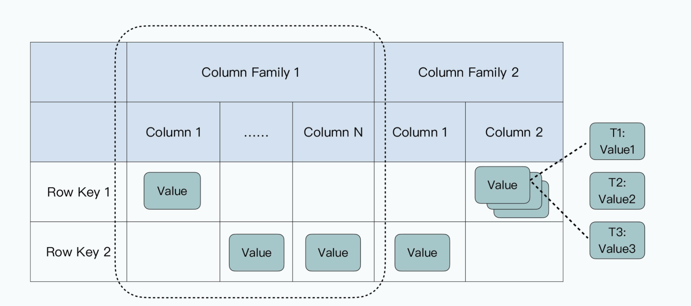
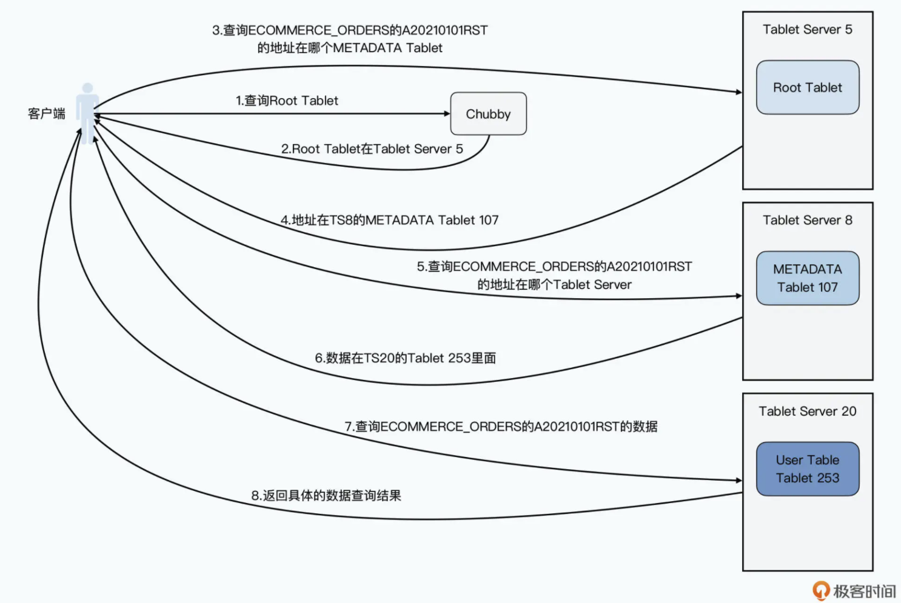

- [History](#history)
  - [Pain points of mySQL](#pain-points-of-mysql)
  - [Motivation](#motivation)
- [Data model](#data-model)
- [Components](#components)
  - [Tablet server](#tablet-server)
  - [Master](#master)
  - [Chubby](#chubby)
    - [SPOF in master without Chubby](#spof-in-master-without-chubby)
  - [Tablet](#tablet)
    - [Metadata table](#metadata-table)
      - [Root tablet](#root-tablet)
      - [User tablet](#user-tablet)
- [Flowchart of looking for data](#flowchart-of-looking-for-data)
- [Design thoughts](#design-thoughts)
- [Initial design flow chart](#initial-design-flow-chart)
  - [Read process](#read-process)
  - [Write process](#write-process)
  - [Pros](#pros)
  - [Cons](#cons)
- [References](#references)

# History
## Pain points of mySQL
* Scaling up typically requires doubling the number of machines. Otherwise, lots of data move across partitions need to happen to make data evenly distribution. 
* Sharding strategy is not transparent for developers. 
  * If using time as dimension, whether you should shard by year, month, or day. This year's volume might be 10X when compared with previous year; If by month or day, then there is the challenge of promotion seasons such as black friday.
* Within mySQL cluster, each server could have a backup. However, it typically needs manual intervention for the switch when there is a harddrive failure. 

## Motivation
* Elasticity: Randomly add/reduce number of servers
* Dynamic load shedding: Adjust the load on a single node
* Fault tolerant: Minority of machine going down won't impact the availability. 

# Data model
* The same column family will be stored together. 
* A single value could be stored with multiple versions.



# Components
* BigTable will dynamically allocate data to different partitions. 
* BigTable uses Master + Chubby to manage the partition information. 

## Tablet server
* Provides online data read/write service
* Note: tablet server is not responsible for storing the actual data. 

## Master
* Assign tablets to tablet server
* Examine the addition and expiration of tablet servers
* Balance load of tablet servers
* Garbage collect on data stored in GFS

## Chubby
* Guarantee that there is only one master
* Store the bootstrap location for bigtable
* Discover tablet servers and cleanup after their termination
* Store access control list

### SPOF in master without Chubby
* If storing the tablets mapping info inside master, then master will become a SPOF. And there are ways such as backup/shadow master which could improve availability. 
* A outside service could be used to monitor the health of master. However, how to guarantee the network connection between outside service and master. 
* Chubby is the outside service which has five servers. It will use consensus algorithm like Paxos to gaurantee that there is no false positive. 

## Tablet
### Metadata table
* Metadata table stores the mapping of tablets. It is similar to the information_schema table in MySQL. 

#### Root tablet
* Bigtable stores the root tablet location in a never-changing position. Root table is the first partition of metadata table and it will never be partitioned further. 

#### User tablet
* Stores the location of user created data

# Flowchart of looking for data
* All data is tored in ECOMMERCE_ORDERS table and look for order ID A20210101RST




# Design thoughts

1. Sorted file with (Key, Value) entries
   * Disk-based binary search based read O(lgn)
   * Linear read operations write O(n)
2. Unsorted file with (Key, Value) entries. Then build index on top of it.
   * Linear read operations O(n)
   * Constant time write O(1)
3. Combine append-only write and binary search read
   * Process:
     * Break the large table into a list of smaller tables 0 to N
       * 0 to N-1 th tables are all stored in disk in sorted order as File 0 to File N-1.
       * Nth table is stored in disk unsorted as File N.
     * Have a in-memory table mapping mapping tables/files to its address.
   * Write: O(1)
     * Write directly goes to the Nth table/file.
     * If the Nth table is full, sort it and write it to disk. And then create a new table/file.
   * Read: O(n)
     * Linearly scan through the Nth table.
     * If cannot find, perform binary search on N-1, N-2, ..., 0th.
4. Store the Nth table/file in memory
   * Disk-based approach vs in-memory approach
     * Disk-based approach: All data Once disk reading + disk writing + in-memory sorting
     * In-memory approach: All data Once disk writing + in-memory sorting
   * What if memory is lost?
     * Problem: Nth in memory table is lost.
     * Write ahead log / WAL: The WAL is the lifeline that is needed when disaster strikes. Similar to a BIN log in MySQL it records all changes to the data. This is important in case something happens to the primary storage. So if the server crashes it can effectively replay that log to get everything up to where the server should have been just before the crash. It also means that if writing the record to the WAL fails the whole operation must be considered a failure. Have a balance between between latency and durability.
5. Further optimization
   * Write: How to Save disk space. Consume too much disk space due to repetitive entries (Key, Value)
     * Have a background process doing K-way merge for the sorted tables regularly
   * Read:
     * Optimize read with index
       * Each sorted table should have an index inside memory.
         * The index is a sketch of key value pairs
       * More advanced way to build index with B tree.
     * Optimize read with Bloom filter
       * Each sorted table should have a bloomfilter inside memory.
       * Accuracy of bloom filter
         * Number of hash functions
         * Length of bit vector
         * Number of stored entries

# Initial design flow chart

```
      ┌─────────────────────────────┐              ┌─────────────────────────┐         
      │Read tries to find the entry │              │                         │         
      │in the following order:      │              │Write directly happens to│         
      │1. in-memory sorted list     │              │  in-memory sorted list  │         
      │2. If not found, then search │              │                         │         
      │the in-disk sorted list in   │              │                         │         
      │reverse chronological order -│              └──────┬─────────▲────────┘         
      │newer ones first, older ones │                     │         │                  
      │later                        │                     │         │                  
      └─────────────────────────────┘                     │         │                  
                                                          │         │                  
                                                          │         │                  
┌─────────────────────────────────────────────────────────┼─────────┼─────────────────┐
│                                     Data Server         │         │                 │
│                                                         │         │                 │
│   ┌─────────────────────────────────────────────────────┼─────────┼──────────┐      │
│   │                          In-Memory sorted list      │         │          │      │
│   │                                                     │         │          │      │
│   │                               key1, value1          ▼         │          │      │
│   │                               key2, value2                               │      │
│   │                                   ...                                    │      │
│   │                               keyN, valueN                               │      │
│   └──────────────────────────────────────────────────────────────────────────┘      │
│                                                                                     │
│                                                                                     │
│                                                                                     │
│   ┌────────────┐   ┌────────────┐  ┌────────────┐   ┌────────────┐  ┌────────────┐  │
│   │bloom filter│   │bloom filter│  │            │   │bloom filter│  │bloom filter│  │
│   │and index 1 │   │and index 2 │  │   ......   │   │ and index  │  │and index N │  │
│   │            │   │            │  │            │   │    N-1     │  │            │  │
│   └────────────┘   └────────────┘  └────────────┘   └────────────┘  └────────────┘  │
│                                                                                     │
│   ┌────────────┐   ┌────────────┐  ┌────────────┐   ┌────────────┐  ┌────────────┐  │
│   │            │   │            │  │            │   │            │  │            │  │
│   │  In-disk   │   │  In-disk   │  │            │   │  In-disk   │  │  In-disk   │  │
│   │sorted list │   │sorted list │  │   ......   │   │sorted list │  │sorted list │  │
│   │     1      │   │     2      │  │            │   │    N-1     │  │     N      │  │
│   │            │   │            │  │            │   │            │  │            │  │
│   │            │   │            │  │            │   │            │  │            │  │
│   └────────────┘   └────────────┘  └────────────┘   └────────────┘  └────────────┘  │
│                                                                                     │
└─────────────────────────────────────────────────────────────────────────────────────┘


    ┌─────┐                                                               ┌─────┐      
   ─┤older├─────────────────────Chronological order───────────────────────┤newer├─────▶
    └─────┘                                                               └─────┘
```

## Read process

1. First check the Key inside in-memory skip list.
2. Check the bloom filter for each file and decide which file might have this key.
3. Use the index to find the value for the key.
4. Read and return key, value pair.

## Write process

1. Record the write operation inside write ahead log.
2. Write directly goes to the in-memory skip list.
3. If the in-memory skip list reaches its maximum capacity, sort it and write it to disk as a Sstable. At the same time create index and bloom filter for it.
4. Then create a new table/file.

## Pros

* Optimized for write: Write only happens to in-memory sorted list

## Cons

* In the worst case, read needs to go through a chain of units (in-memory, in-disk N, ..., in-disk 1)
  * Compaction could help reduce the problem


# References
* [大数据经典论文解读-BigTable](https://time.geekbang.org/column/article/423600)