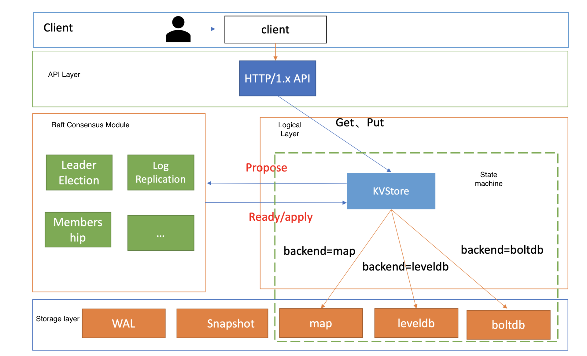
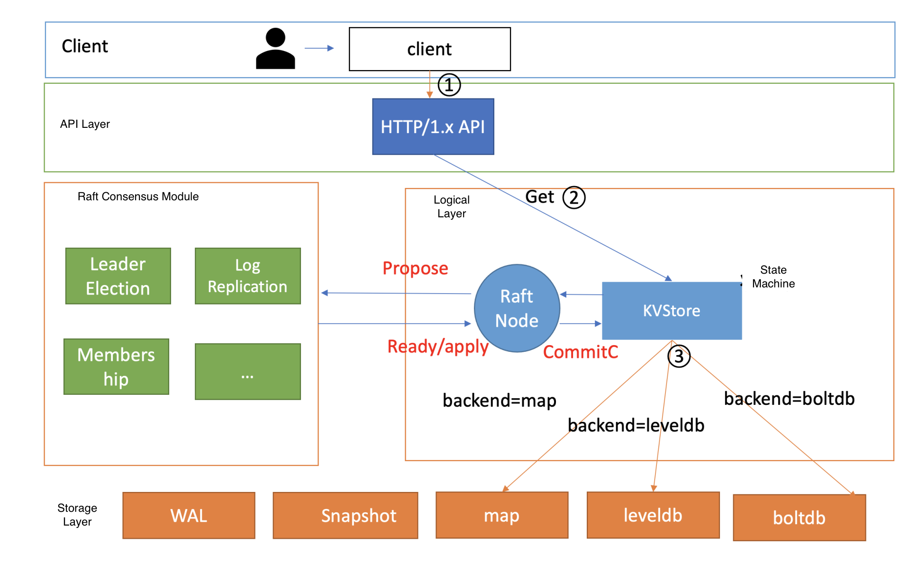
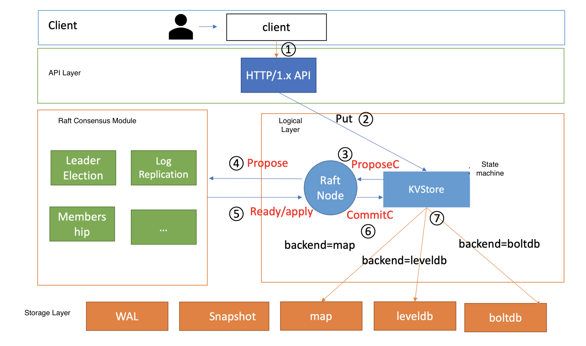

- [Distributed "sharding proxy"](#distributed-sharding-proxy)
  - [Design thoughts](#design-thoughts)
  - [Flow chart](#flow-chart)
  - [Read process](#read-process)
  - [Write process](#write-process)
- [Consistency model](#consistency-model)
  - [Gossip](#gossip)
  - [Raft based](#raft-based)
    - [Overview](#overview)
    - [Read process](#read-process-1)
    - [Write process](#write-process-1)
- [Data distribution model](#data-distribution-model)
  - [Consistent hashing](#consistent-hashing)
- [Access pattern](#access-pattern)
  - [Read intensive: boltdb](#read-intensive-boltdb)
  - [Write intensive: leveldb](#write-intensive-leveldb)
- [Concurrency](#concurrency)
- [Performant bootup](#performant-bootup)
- [Reference](#reference)
  - [Bitcask](#bitcask)
  - [TODO](#todo)

# Distributed "sharding proxy"

## Design thoughts

1. Master slave model
   * Master has the hashmap \[Key, server address]
   * Slave is responsible for storing data
   * Read process
     1. Client sends request of reading Key K to master server.
     2. Master returns the server index by checking its consistent hashmap.
     3. Client sends request of Key to slave server.
        1. First check the Key pair inside memory.
        2. Check the bloom filter for each file and decide which file might have this key.
        3. Use the index to find the value for the key.
        4. Read and return key, value pair
   * Write process
     1. Clients send request of writing pair K,V to master server.
     2. Master returns the server index
     3. Clients send request of writing pair K,V to slave server.
        1. Slave records the write operation inside write ahead log.
        2. Slave writes directly go to the in-memory skip list.
        3. If the in-memory skip list reaches its maximum capacity, sort it and write it to disk as a Sstable. At the same time create index and bloom filter for it.
        4. Then create a new table/file.
2. How to handle race condition
   * Master server also has a distributed lock (such as Chubby/Zookeeper)
   * Distributed lock
     * Consistent hashmap is stored inside the lock server
3. (Optional) Too much data to store on slave local disk
   * Replace local disk with distributed file system (e.g. GFS) for
     * Disk size
     * Replica
     * Failure and recovery
   * Write ahead log and SsTable are all stored inside GFS.
     * How to write SsTable to GFS
       * Divide SsTable into multiple chunks (64MB) and store each chunk inside GFS.
4. Config server will easily become single point of failure
   * Client could cache the routing table

## Flow chart

* The dashboard lines means these network calls could be avoided if the routing table is cached on client.

```
                                         ┌─────────────────────────────────┐      
                                         │          Config server          │      
 ┌────────────────────┐ ─ ─ ─step5─ ─ ─▶ │   (where routing table stays)   │      
 │       Client       │                  │                                 │      
 │  ┌──────────────┐  │                  │ ┌───────────┐     ┌───────────┐ │      
 │  │cache of      │  │                  │ │           │     │           │ │      
 │  │routing table │  │  ─ ─Step1─ ─ ─ ▶ │ │  Master   │     │   Slave   │ │      
 │  └──────────────┘  │                  │ │           │     │           │ │      
 └────────────────────┘ ◀─ ─ ─ Step3 ─ ─ │ └───────────┘     └───────────┘ │      
            │                            └─────────────────────────────────┘      
            │                                           │      │                  
            │                                                                     
            │                                          Step2  step 6              
            │                                                                     
            │                                           ▼      ▼                  
            └─────────Step4─────────────────────┐  ┌──────────────┐               
                                                │  │ Distributed  │               
                                                │  │     lock     │       ─       
                                                │  └──────────────┘               
                                                │                                 
                                                │                                 
                                                ▼                                 
┌───────────────┐     ┌───────────────┐    ┌───────────────┐     ┌───────────────┐
│ Data server 1 │     │ Data server 2 │    │               │     │ Data server N │
│               │     │               │    │               │     │               │
│┌────────────┐ │     │┌────────────┐ │    │    ......     │     │┌────────────┐ │
││in-memory   │ │     ││in-memory   │ │    │               │     ││in-memory   │ │
││sorted list │ │     ││sorted list │ │    │               │     ││sorted list │ │
│└────────────┘ │     │└────────────┘ │    └───────────────┘     │└────────────┘ │
│┌────────────┐ │     │┌────────────┐ │                          │┌────────────┐ │
││in-disk     │ │     ││in-disk     │ │                          ││in-disk     │ │
││sorted list │ │     ││sorted list │ │                          ││sorted list │ │
││1 and bloom │ │     ││1 and bloom │ │                          ││1 and bloom │ │
││filter/index│ │     ││filter/index│ │                          ││filter/index│ │
│└────────────┘ │     │└────────────┘ │                          │└────────────┘ │
│┌────────────┐ │     │┌────────────┐ │                          │┌────────────┐ │
││......      │ │     ││......      │ │                          ││......      │ │
│└────────────┘ │     │└────────────┘ │                          │└────────────┘ │
│┌────────────┐ │     │┌────────────┐ │                          │┌────────────┐ │
││in-disk     │ │     ││in-disk     │ │                          ││in-disk     │ │
││sorted list │ │     ││sorted list │ │                          ││sorted list │ │
││N and bloom │ │     ││N and bloom │ │                          ││N and bloom │ │
││filter/index│ │     ││filter/index│ │                          ││filter/index│ │
│└────────────┘ │     │└────────────┘ │                          │└────────────┘ │
└───────────────┘     └───────────────┘                          └───────────────┘
```

## Read process

1. Step1: Client sends request of reading Key K to master server.
2. Step2/3: Master server locks the key. Returns the server index by checking its consistent hashmap.
3. Step4: Client sends request of Key to slave server.
   1. First check the Key pair inside memory.
   2. Check the bloom filter for each file and decide which file might have this key.
   3. Use the index to find the value for the key.
   4. Read and return key, value pair
   5. Read process finishes. Slave notifies the client.
4. Step5: The client notifies the master server to unlock the key.
5. Step6: Master unlocks the key

## Write process

1. step1: Clients send request of writing pair K,V to master server.
2. step2/3: Master server locks the key. Returns the server index.
3. Step4: Clients send request of writing pair K,V to slave server.
   1. Slave records the write operation inside write ahead log.
   2. Slave writes directly go to the in-memory skip list.
   3. If the in-memory skip list reaches its maximum capacity, sort it and write it to disk as a Sstable. At the same time create index and bloom filter for it.
   4. Then create a new table/file.
   5. Write process finishes. Slave notifies the client.
4. Step5: The client notifies the master server to unlock the key.
5. Step6: Master unlocks the key


# Consistency model
## Gossip

## Raft based

### Overview



### Read process

* There are multiple options for read consistency:
  * Default: Will read the old data sometimes
  * Consistent: Will not read the old data
  * Stale: Will read the old data



### Write process

1. Client send http request to server.
2. After server receives the request, server will put the message into ProposeC channel of KVStore.
3. RaftNode submit the message to Raft Module's propose interface.
4. Raft module output Ready structure. After server persists the log entry, it will send it to other nodes.
5. After majority nodes persisted the log entry, the log entry will be submitted to KVStore for execution.
6. KVStore calls backend storage engine.



# Data distribution model
## Consistent hashing
* Ref: Riak https://www.infoq.com/articles/dynamo-riak-random-slicing/

# Access pattern

## Read intensive: boltdb
* Based on B+ tree
* Performance benchmarks: A 3-node 8-core 16G cluster, linear read throughput is 190K QPS and write QPS is 50K QPS.

## Write intensive: leveldb

* Based on LSM tree

# Concurrency

# Performant bootup

# Reference

* using level DB and Rocks DB as an example - [https://soulmachine.gitbooks.io/system-design/content/cn/key-value-store.html](https://soulmachine.gitbooks.io/system-design/content/cn/key-value-store.html)
* Meituan build on top of tair and redis - [https://tech.meituan.com/2020/07/01/kv-squirrel-cellar.html](https://tech.meituan.com/2020/07/01/kv-squirrel-cellar.html)
* TairDB
  * hot key problem: [https://zhuanlan.zhihu.com/p/32743904](https://zhuanlan.zhihu.com/p/32743904)
  * Tair db in detail: [https://www.cnblogs.com/chenny7/p/4875396.html](https://www.cnblogs.com/chenny7/p/4875396.html)
* LevelDB:
  * [https://leveldb-handbook.readthedocs.io/zh/latest/basic.html](https://leveldb-handbook.readthedocs.io/zh/latest/basic.html)
  * [https://zhuanlan.zhihu.com/p/51360281](https://zhuanlan.zhihu.com/p/51360281)
* Disk IO
  * [https://medium.com/databasss/on-disk-io-part-1-flavours-of-io-8e1ace1de017](https://medium.com/databasss/on-disk-io-part-1-flavours-of-io-8e1ace1de017)
* 极客时间：
  * [https://time.geekbang.org/column/article/347136](https://time.geekbang.org/column/article/347136)
  * [https://time.geekbang.org/column/article/217049](https://time.geekbang.org/column/article/217049)

## Bitcask
* https://medium.com/@arpitbhayani/bitcask-a-log-structured-fast-kv-store-c6c728a9536b
* storage model-merge and hint files: https://topic.alibabacloud.com/a/implementation-of-the-bitcask-storage-model-merge-and-hint-files_8_8_31516931.html
* Implement a custom key-value storage system: https://medium.com/@felipedutratine/implement-a-custom-key-value-storage-system-3df4c1eb35e9

## TODO

* [Build keyvalue store ontop of MySQL with Uber example](https://kousiknath.medium.com/mysql-key-value-store-a-schema-less-approach-6d243a3cee5b)
* [How does Riak use Version Vectors to resolve conflicts](https://medium.com/geekculture/all-things-clock-time-and-order-in-distributed-systems-logical-clocks-in-real-life-2-ad99aa64753)
* [How Cassandra handles conflicts](https://medium.com/geekculture/all-things-clock-time-and-order-in-distributed-systems-logical-clock-vs-google-true-time-dba552f2d842)
