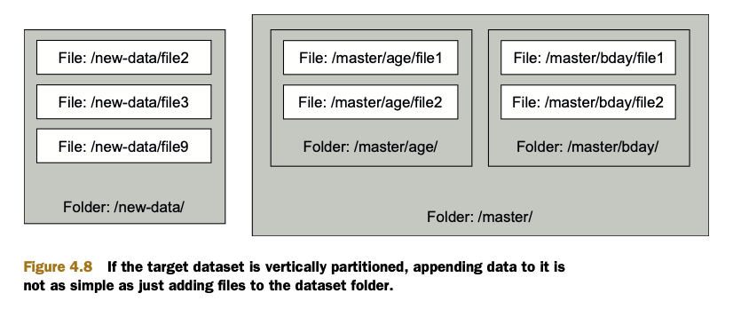
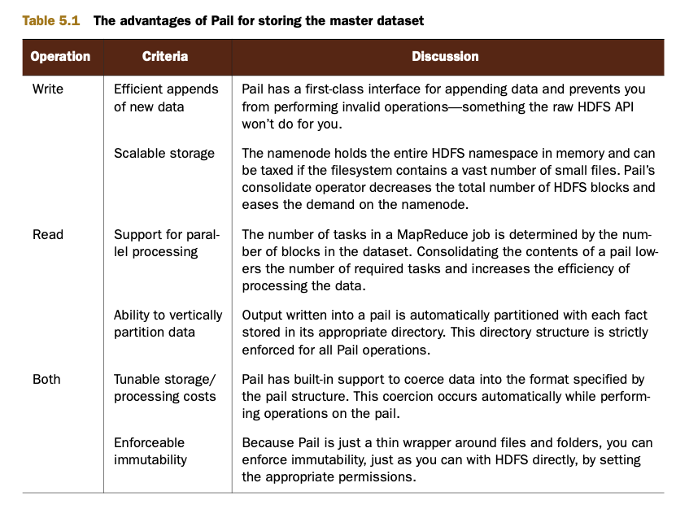
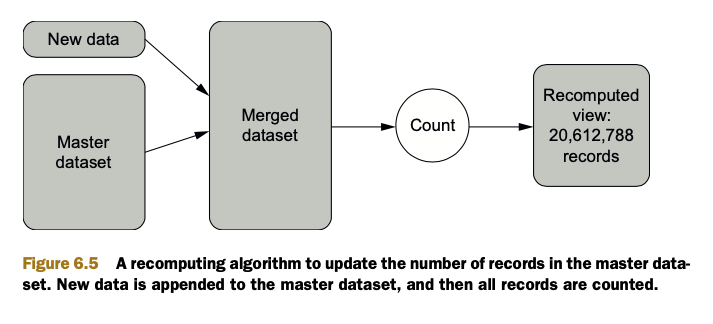
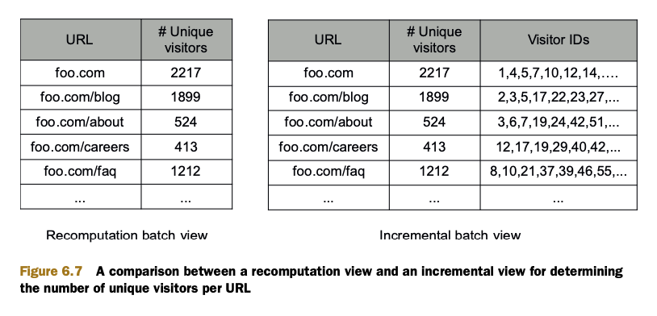
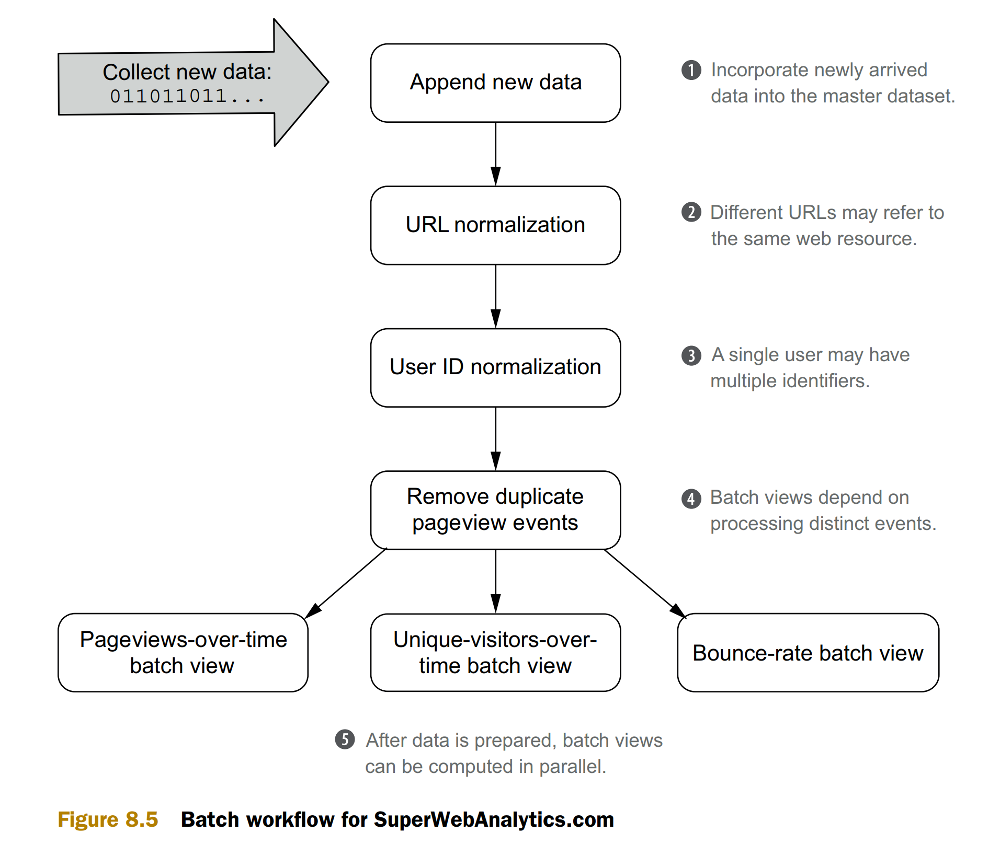
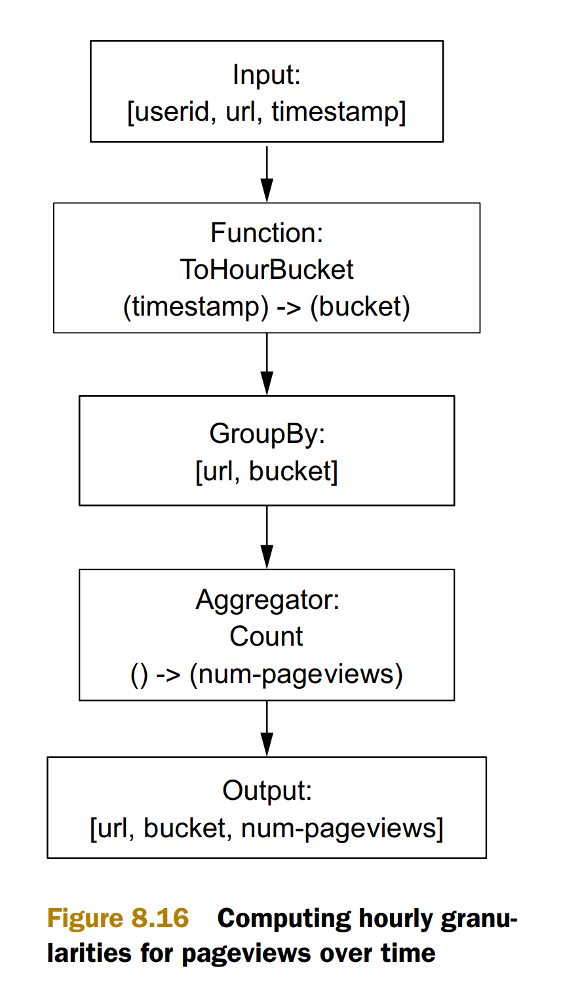
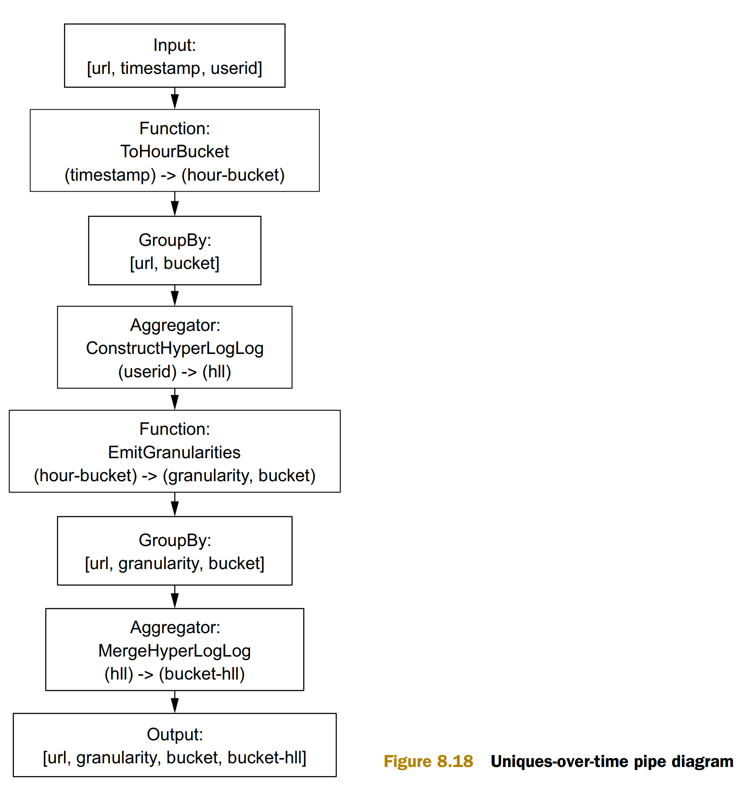
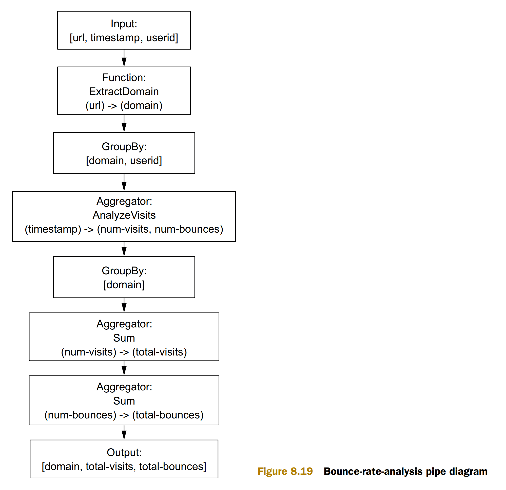

- [SuperWebAnalytics.com requiements](#superwebanalyticscom-requiements)
  - [Functional requirements](#functional-requirements)
  - [NonFunctional requirements](#nonfunctional-requirements)
- [Overview](#overview)
- [References](#references)
- [Batch](#batch)
  - [Data model](#data-model)
  - [Storage requirements](#storage-requirements)
    - [DFS (Distributed file systems)](#dfs-distributed-file-systems)
    - [Partition](#partition)
    - [Pail on top of DFS](#pail-on-top-of-dfs)
    - [Recomputation vs incremental algorithm](#recomputation-vs-incremental-algorithm)
  - [Workflow overview](#workflow-overview)
    - [Time bucket](#time-bucket)
    - [Flowchart](#flowchart)
      - [Url normalization](#url-normalization)
      - [User id normalization](#user-id-normalization)
      - [PageView query](#pageview-query)
      - [Unique visitors](#unique-visitors)
      - [Bounce rate](#bounce-rate)
- [Lambda speed](#lambda-speed)
  - [Requirements](#requirements)
  - [Asynchronous design](#asynchronous-design)
  - [Page view](#page-view)
- [Lambda serving](#lambda-serving)
  - [Def](#def)
  - [Requirements](#requirements-1)
  - [Index design](#index-design)
    - [Pageview](#pageview)
    - [Unique visitors](#unique-visitors-1)
    - [Bounce rate](#bounce-rate-1)

# SuperWebAnalytics.com requiements
## Functional requirements
* Pageview counts by URL sliced by time—Example queries are “What are the pageviews for each day over the past year?” and “How many pageviews have there been in the past 12 hours?”
* Unique visitors by URL sliced by time—Example queries are “How many unique people visited this domain in 2010?” and “How many unique people visited this domain each hour for the past three days?”
* Bounce-rate analysis—“What percentage of people visit the page without visiting any other pages on this website?”

## NonFunctional requirements
* Real time metrics

# Overview

# References
* Book "Big Data: Principles and best practices of scalable and real-time data systems". Nathan Marz, James Warren

# Batch
## Data model

## Storage requirements

### DFS (Distributed file systems)

### Partition

### Pail on top of DFS

### Recomputation vs incremental algorithm

## Workflow overview

### Time bucket

### Flowchart

#### Url normalization

#### User id normalization

#### PageView query

#### Unique visitors

#### Bounce rate

# Lambda speed
## Requirements
* Random reads—A realtime view should support fast random reads to answer
queries quickly. This means the data it contains must be indexed.
* Random writes—To support incremental algorithms, it must also be possible to
modify a realtime view with low latency.
* Scalability—As with the serving layer views, the realtime views should scale with
the amount of data they store and the read/write rates required by the application. Typically this implies that realtime views can be distributed across many
machines.
* Fault tolerance—If a disk or a machine crashes, a realtime view should continue
to function normally. Fault tolerance is accomplished by replicating data across
machines so there are backups should a single machine fail.

## Asynchronous design

## Page view 

# Lambda serving
## Def
* The serving layer consists of databases that index and serve the results of the batch layer

## Requirements
* Batch writable—The batch views for a serving layer are produced from scratch.
When a new version of a view becomes available, it must be possible to completely swap out the older version with the updated view.
* Scalable—A serving layer database must be capable of handling views of arbitrary size. As with the distributed filesystems and batch computation framework
previously discussed, this requires it to be distributed across multiple machines.
* Random reads—A serving layer database must support random reads, with
indexes providing direct access to small portions of the view. This requirement
is necessary to have low latency on queries.
* Fault-tolerant—Because a serving layer database is distributed, it must be tolerant of machine failures.

## Index design
### Pageview

### Unique visitors

### Bounce rate

