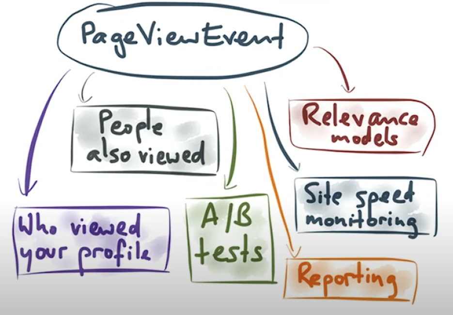
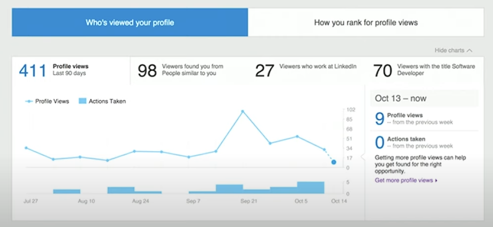
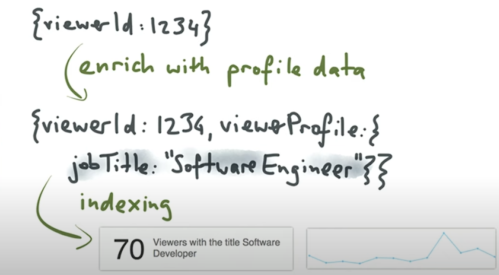
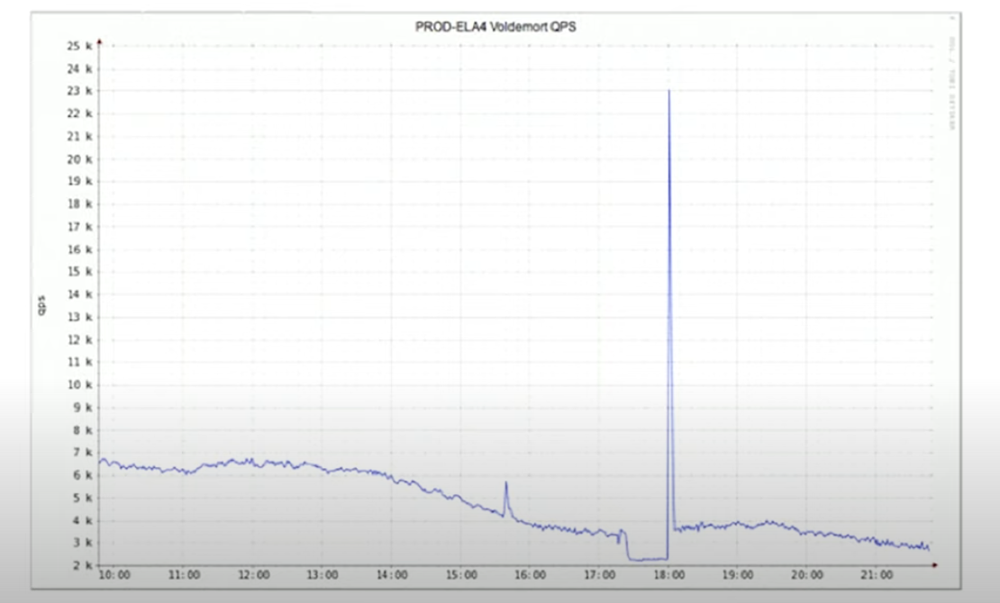

- [Samza Use cases](#samza-use-cases)
- [Samza Example - Enrich tracking events](#samza-example---enrich-tracking-events)
  - [Enrich feature in detail: Who viewed your profile](#enrich-feature-in-detail-who-viewed-your-profile)
    - [Problem](#problem)
    - [Naive solution](#naive-solution)
      - [Cache](#cache)
      - [Stream processing impacts critical storage](#stream-processing-impacts-critical-storage)
    - [Solution: A second event type with profile edit](#solution-a-second-event-type-with-profile-edit)
- [References](#references)

# Samza Use cases
* Filtering, aggregation & joining of streams

# Samza Example - Enrich tracking events
* Once you have the tracking events, a number of use cases are possible. 

* Feature: People also viewed

## Enrich feature in detail: Who viewed your profile

### Problem

### Naive solution
* Too slow because connecting to database could be slow

#### Cache
* If expiration time is too short, not much benefit.
* If expiration time is too long, outdated profiles. 

#### Stream processing impacts critical storage
* After a stream processing is shutdown for half an hour (pretty common in production) and restarted, it will hit the database really quick because it is designed to be realtime.

### Solution: A second event type with profile edit

* Every time get a profile edit event, write to a profile edit database. Each time who edits an event, write to a profiles database. 

 

# References
* https://www.youtube.com/watch?v=yO3SBU6vVKA&list=PLeKd45zvjcDHJxge6VtYUAbYnvd_VNQCx&index=7