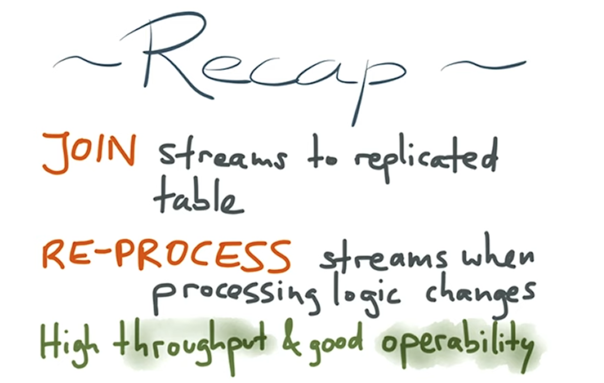
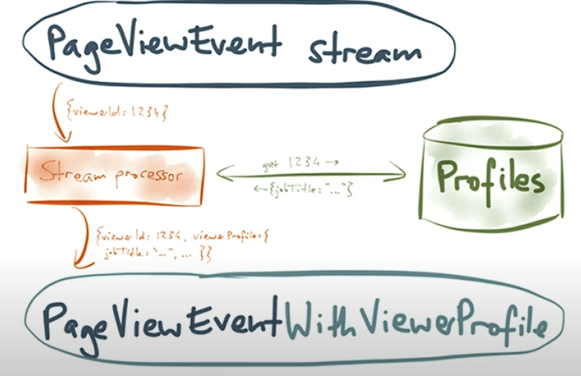
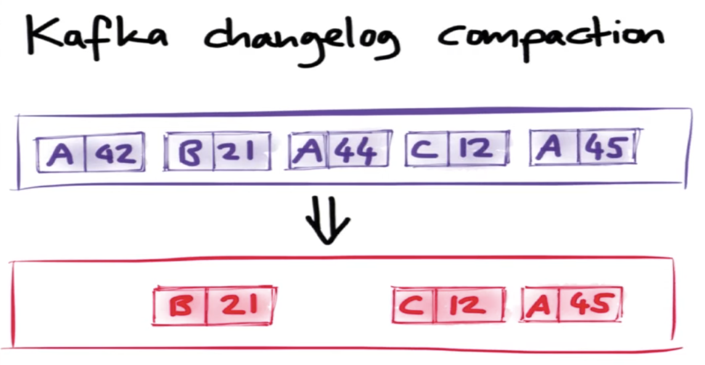
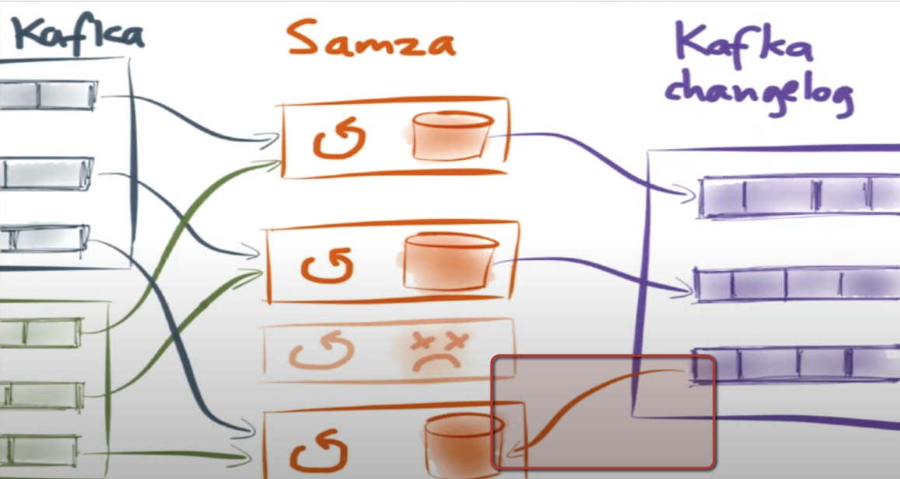
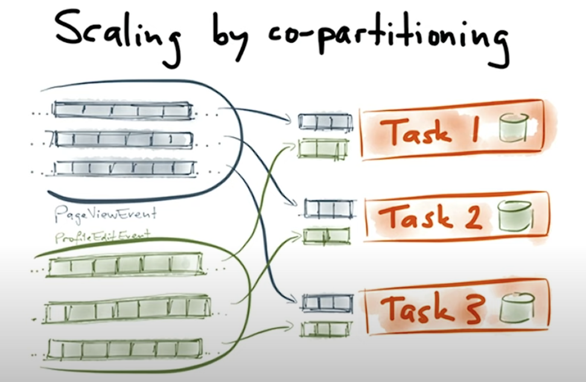
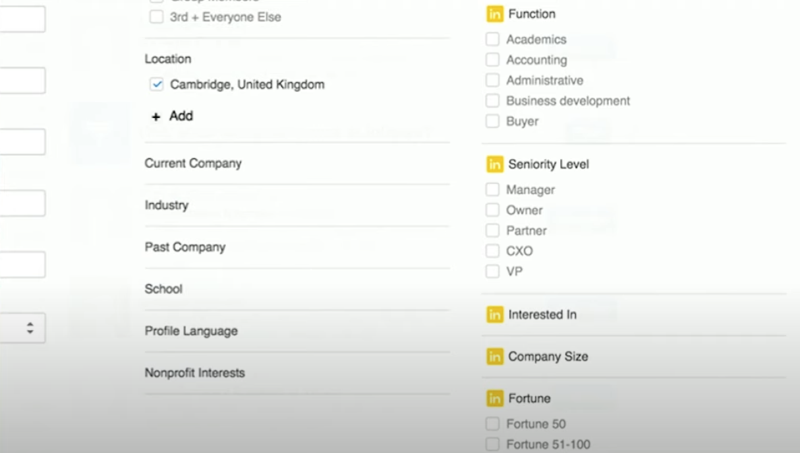
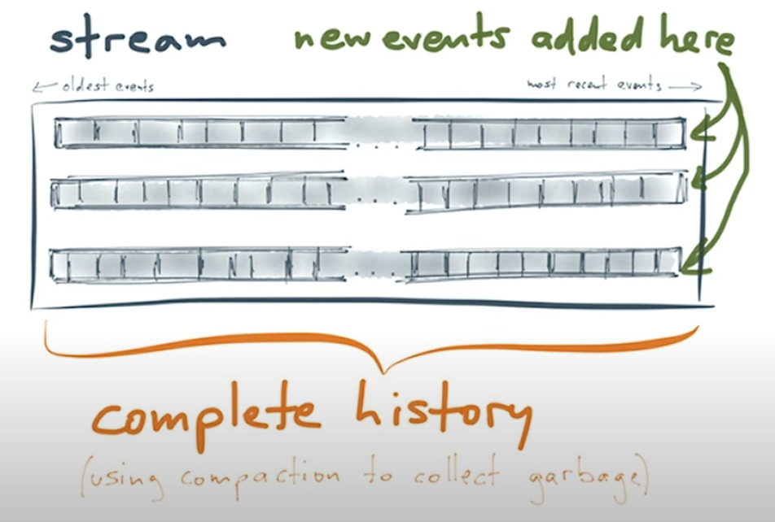
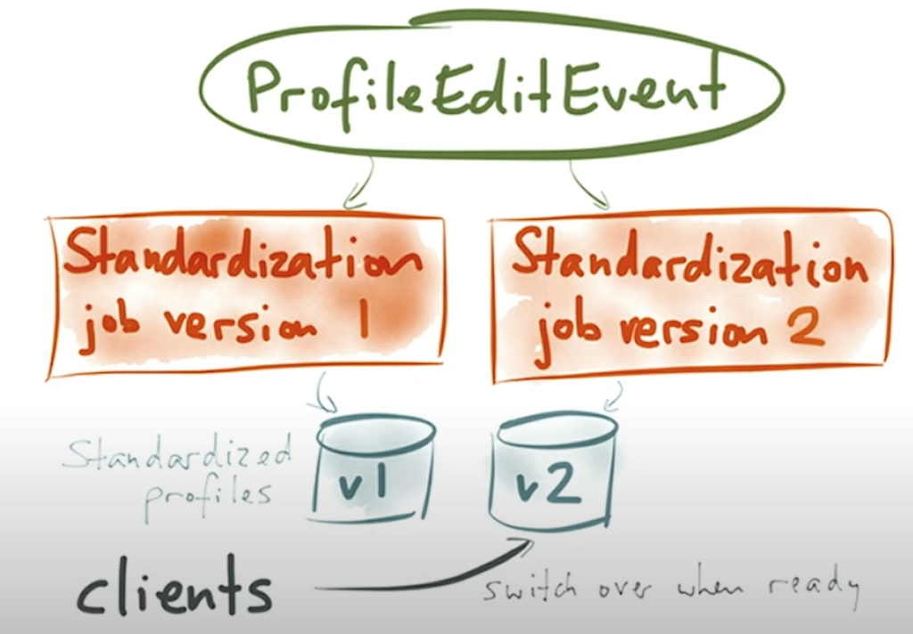
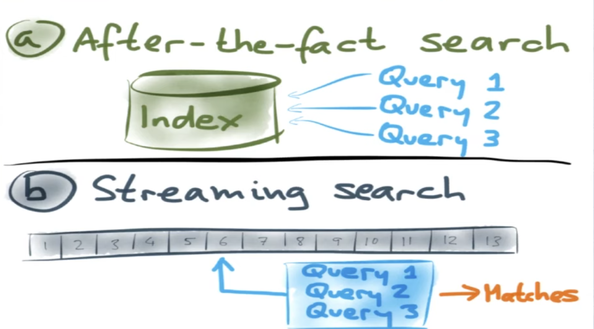
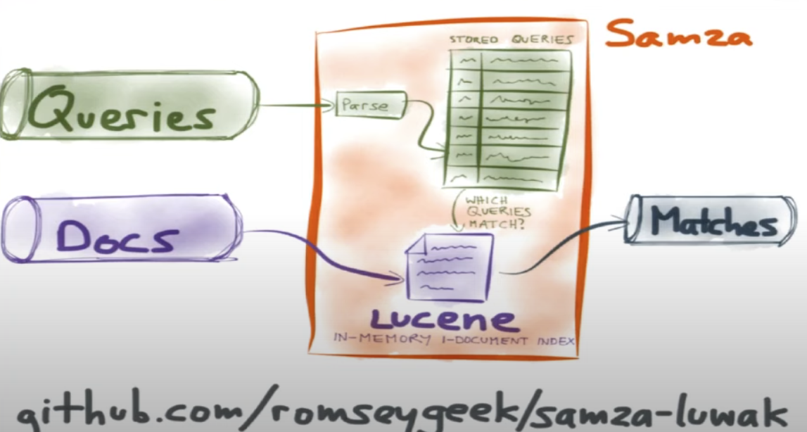

- [Samza Use cases](#samza-use-cases)
- [Samza Example - Enrich tracking events](#samza-example---enrich-tracking-events)
  - [Enrich feature in detail: Who viewed your profile](#enrich-feature-in-detail-who-viewed-your-profile)
    - [Problem](#problem)
    - [Naive solution](#naive-solution)
      - [Cache](#cache)
      - [Stream processing impacts critical storage](#stream-processing-impacts-critical-storage)
    - [Solution: A second event type with profile edit](#solution-a-second-event-type-with-profile-edit)
      - [Embedded database - Lose data if we lose the machine](#embedded-database---lose-data-if-we-lose-the-machine)
      - [Scale by partitioning](#scale-by-partitioning)
- [Samze example - Data standardization](#samze-example---data-standardization)
  - [Overall flowchart for standardization](#overall-flowchart-for-standardization)
  - [When standardization rule change](#when-standardization-rule-change)
    - [Lambda architecture](#lambda-architecture)
    - [Kappa architecture](#kappa-architecture)
- [Example - Streaming search](#example---streaming-search)
  - [Solution](#solution)
- [Samza usage at Uber](#samza-usage-at-uber)
- [References](#references)

# Samza Use cases
* Filtering, aggregation & joining of streams

# Samza Example - Enrich tracking events
* Once you have the tracking events, a number of use cases are possible. 

* Feature: People also viewed

## Enrich feature in detail: Who viewed your profile

### Problem

### Naive solution
* Too slow because connecting to database could be slow

#### Cache
* If expiration time is too short, not much benefit.
* If expiration time is too long, outdated profiles. 

#### Stream processing impacts critical storage
* After a stream processing is shutdown for half an hour (pretty common in production) and restarted, it will hit the database really quick because it is designed to be realtime.

### Solution: A second event type with profile edit

* Every time get a profile edit event, write to a profile edit database. Each time who edits an event, write to a profiles database. 

 

* Samza has an embedded database which could hold profiles. 

#### Embedded database - Lose data if we lose the machine
* Solution: Reprocess the data stream from the beginning

* Speed up: Kafka data compaction could help speed up the process. 

* Samza maintains an in-memory key value store, and it has multiple incoming Kafka sources. For each Samza store, there could also be a kafka changelog stream output defined. In cases where a Samza instance is dead, its corresponding Kafka changelog could be replayed back to rebuild Samza instance. 

#### Scale by partitioning

# Samze example - Data standardization
* Job terms get standardized to basic categories.

## Overall flowchart for standardization

## When standardization rule change
* Expect search index update happening in real time

### Lambda architecture
* Cons: Implement the same job twice

### Kappa architecture
* Process realtime data and reprocess historical data in the same framework

* There could be two jobs. Each job writes result to a different location. 
  * One consuming the latest entries in the stream
  * The other one starting from the beginning

* The client could switch over when the new standardization rule when it is ready

# Example - Streaming search

* Following the search result for some time

* Reverse patttern of traditional search

## Solution
* Mark each query with ID
  * Delete query:
  * Update query: 

# Samza usage at Uber
* https://www.youtube.com/watch?v=i4QxJIHrfOY

# References
* [Building real-time data products at LinkedIn with Apache Samza](https://www.youtube.com/watch?v=yO3SBU6vVKA&list=PLeKd45zvjcDHJxge6VtYUAbYnvd_VNQCx&index=7)
* [Scalable real-time data processing with Apache Samza](https://www.youtube.com/watch?v=uRmYJGRPfKU&list=PLeKd45zvjcDHJxge6VtYUAbYnvd_VNQCx&index=17)