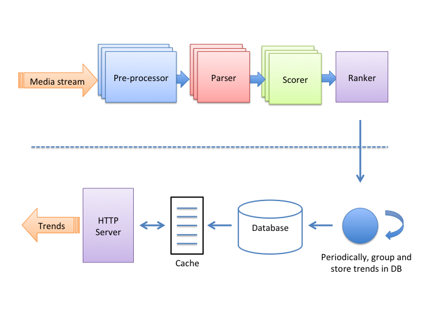

- [Trend detection service](#trend-detection-service)
  - [Imp with elasticsearch at Pinterest](#imp-with-elasticsearch-at-pinterest)
  - [Statistical view](#statistical-view)
- [TODO](#todo)

## Trend detection service

### Imp with elasticsearch at Pinterest

* [Pinterest trends](https://medium.com/pinterest-engineering/pinterest-trends-insights-into-unstructured-data-b4dbb2c8fb63)

### Statistical view

* [Microsoft](https://devblogs.microsoft.com/cse/2019/01/02/real-time-time-series-analysis-at-scale-for-trending-topics-detection/#:\~:text=Detecting%20trending%20topics%20requires%20the,the%20entire%20set%20of%20topics.)
* [Trend at instagram](https://instagram-engineering.com/trending-on-instagram-b749450e6d93)
* [Trend at Twitter](https://blog.twitter.com/engineering/en_us/a/2015/building-a-new-trends-experience.html)
  * Whitepaper: [https://blog.twitter.com/en_us/a/2015/trend-detection-social-data.html](https://blog.twitter.com/en_us/a/2015/trend-detection-social-data.html)

## TODO
* Stream processing: https://highlyscalable.wordpress.com/2013/08/20/in-stream-big-data-processing/
* https://highlyscalable.wordpress.com/
* Build realtime data platforms at LinkedIn: https://www.youtube.com/watch?v=yO3SBU6vVKA&list=PLeKd45zvjcDHJxge6VtYUAbYnvd_VNQCx&index=8&ab_channel=MartinKleppmann