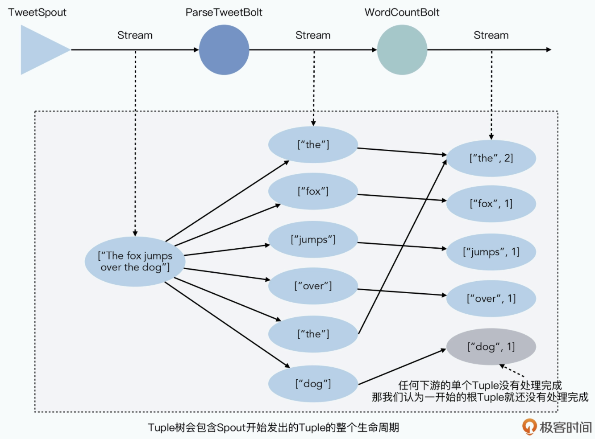
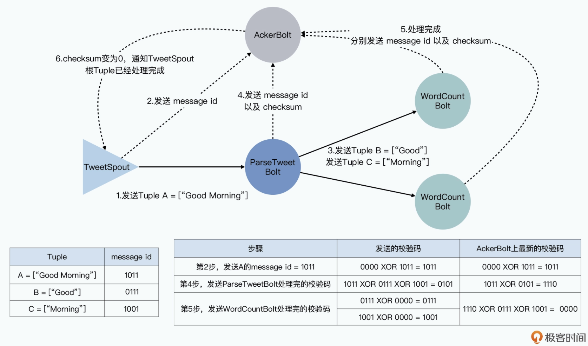
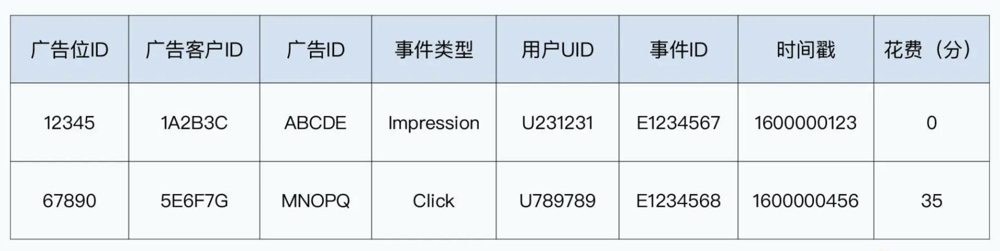
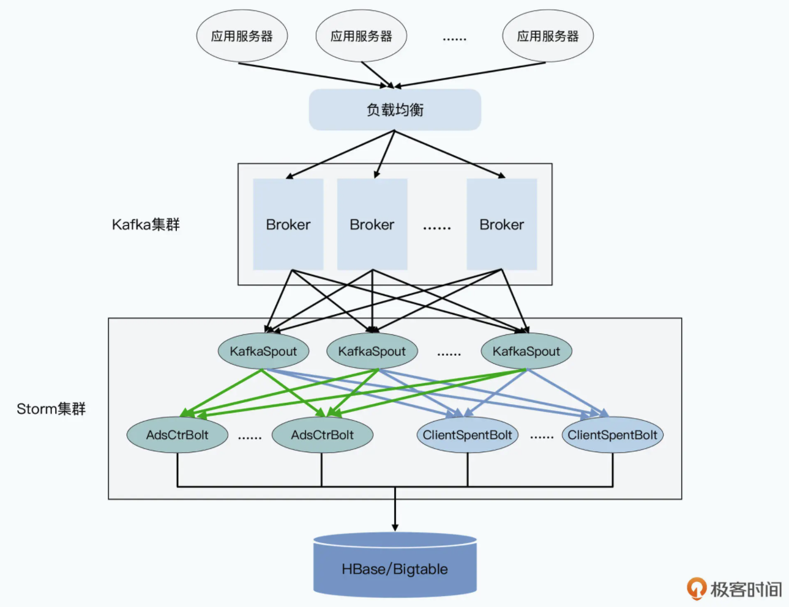
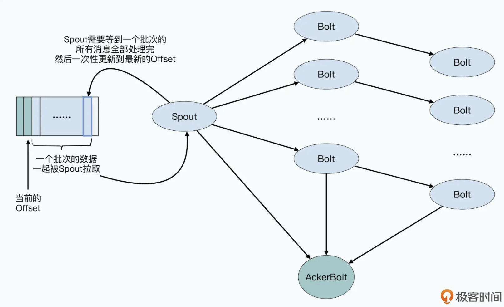
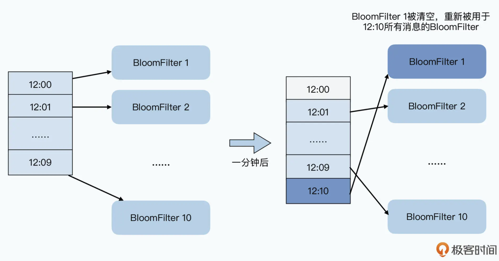
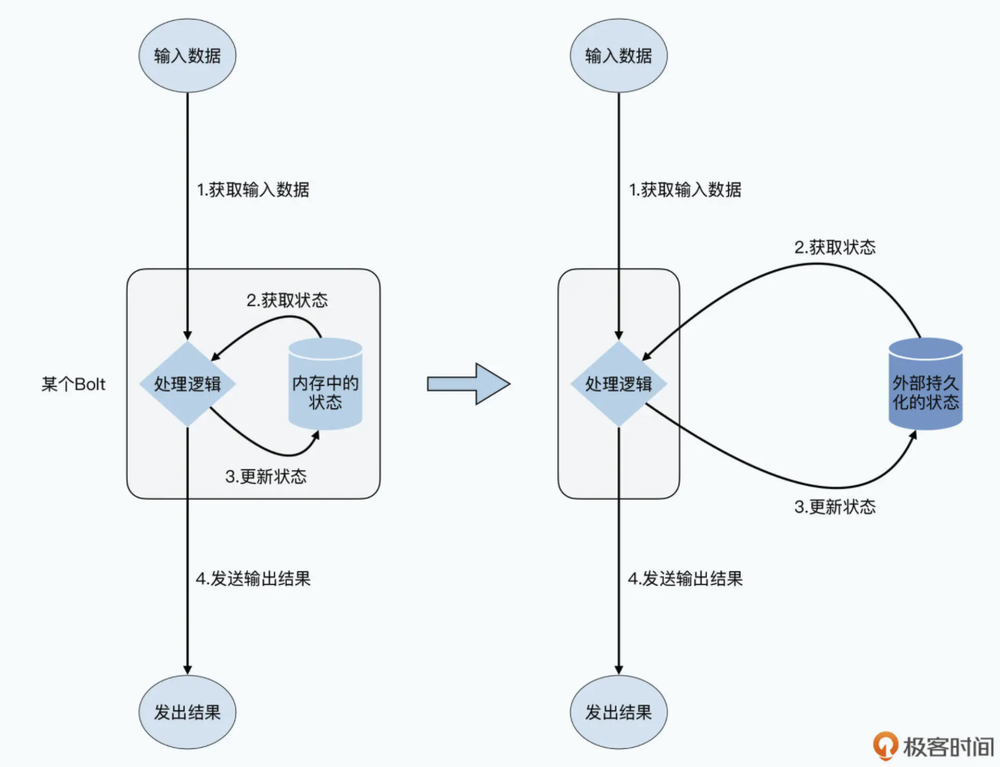

- [History](#history)
- [Model](#model)
- [Architecture](#architecture)
  - [Nimbus](#nimbus)
  - [Supervisor](#supervisor)
  - [Worker](#worker)
  - [Zookeeper](#zookeeper)
- [Fault tolerant (At least once)](#fault-tolerant-at-least-once)
  - [AckerBolt](#ackerbolt)
  - [XOR](#xor)
- [Sample ads stream with storm](#sample-ads-stream-with-storm)
  - [Ads model](#ads-model)
  - [Tasks](#tasks)
  - [Architecture](#architecture-1)
    - [AdsCtrBolt](#adsctrbolt)
    - [ClientSpentBolt](#clientspentbolt)
- [NonFunc requirement](#nonfunc-requirement)
  - [Exactly once delivery](#exactly-once-delivery)
    - [Example conditions that will trigger duplicated messages:](#example-conditions-that-will-trigger-duplicated-messages)
    - [Dedupe with bloomfilter](#dedupe-with-bloomfilter)
  - [Deficiencies in fault tolerant](#deficiencies-in-fault-tolerant)
  - [Time window concept](#time-window-concept)
- [Real world](#real-world)

# History
* Storm is an improvements on Yahoo S4. It solved the following pain points:
  * Yahoo S4 will create a huge number of PE, consuming huge number of memory and GC cost. 
  * Yahoo S4 needs to embed data distribution logic into business logic layer. 

# Model
* Spout: Data source. 
* Tuple: The minimum unit for data transmission. A key, value pair. 
* Streams: A stream contain huge number of tuples. 
* Bolts: The place where business logic is calculated. 

# Architecture

## Nimbus
* Master node in cluster. Resource manager and job scheduler. 

## Supervisor
* Receive jobs from Nimus. 
* Monitor whether workers are alive. 
* Assign jobs to workers. 

## Worker
* Each worker process is an independent JVM. 

## Zookeeper
* Nimbus write corresponding tasks to Zookeeper for durability and high availability. 

# Fault tolerant (At least once)

## AckerBolt
* When Spout sends out a message, it will also notify AckerBolt. 
* Once Bolt finished processing root tuple, it will notify AckerBolt.
* Bolt will tell AckerBolt two pieces of information:
  * It has finished processing a tuple. 
  * What derivative downstream tuples it has already sent out. 
* Last layer bolt will notify that there are no additional tuples. 

## XOR
* It could only guarantee that each tuple sent out by spout is processed at least once. 

# Sample ads stream with storm
## Ads model
* Each log entry represents an ad display: Ad location + Ad customer location + Ad ID
* Event type: Impression means display, or click
* UID: 
* Event ID: Unique ID for retry. 
* Last timestamp: 

## Tasks
1. Calculate realtime ads fee for each customer. 
2. Calculate ads click rate. For an ad with low click rate, stop ad display. 

## Architecture
1. KafkaSpout which pulls log from Kafka, parse segments and send to downstream bolt. 
2. For each log from Kafka spout, it will send to the following two types of bolts: AdsCounterBolt and ClientSpentBolt
3. AckerBolt guarantees that each message is processed at least once. 

### AdsCtrBolt
* AdsCtrBolt: Calculate click rate for different type of ads
* Maintains an in-memory map of Ads ID => (Num of display, Num of click, AD cost) and update to HBase every minute. 

### ClientSpentBolt
* ClientSpentBolt: Calculate cost for each client and update HBase
* Update the cost data in HBase according to a higher frequency, even update HBase with each click. 

# NonFunc requirement
## Exactly once delivery
### Example conditions that will trigger duplicated messages: 
* A KafkaSpout has hardware failure and need to reboot
  * The offset in Kafka is stored inside Zookeeper. 
  * Zookeeper is designed as a coarse distributed lock, not as a high-throughput KV so usually only a batch offset update will be recorded by Zookeeper. 
  * A KafkaSpout reboot usually indicates that a large number of messages need to be resent. 
* A ClientSpentBolt has high latency when write message. As a result of Storm AckerBolt, it will resend the message. 

### Dedupe with bloomfilter
* Put all message id inside this bloomfilter.
* Parition the global bloomfilter into multiple time window. 
  * Typically for a resend, it won't span beyond 30 minutes. 

## Deficiencies in fault tolerant
* 

## Time window concept

# Real world

* [Strom near real time](https://www.michael-noll.com/blog/2013/01/18/implementing-real-time-trending-topics-in-storm/)
