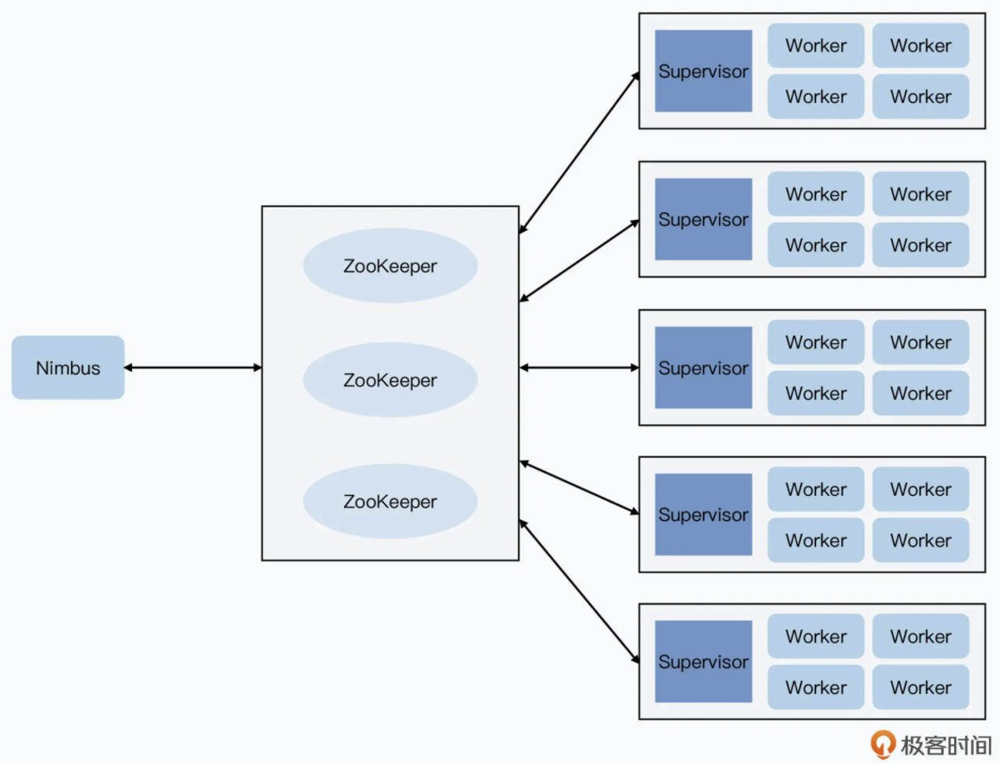
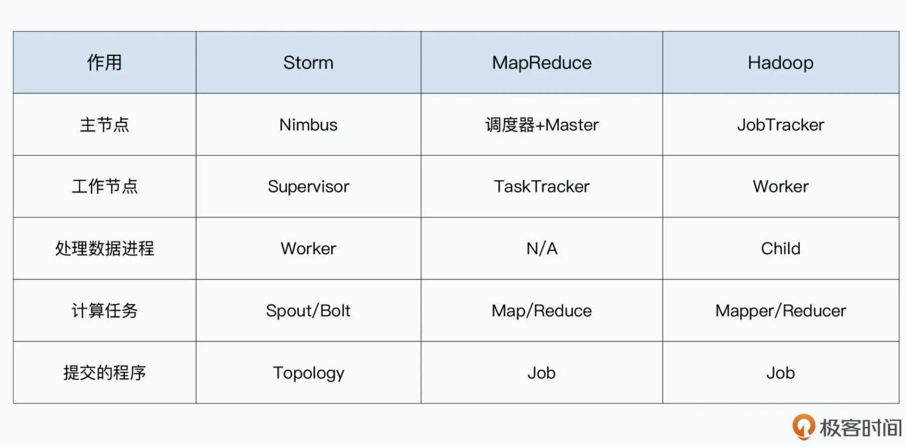

- [History](#history)
- [Model](#model)
- [architecture](#architecture)
  - [Nimbus](#nimbus)
  - [Supervisor](#supervisor)
  - [Worker](#worker)
  - [Zookeeper](#zookeeper)
- [Fault tolerant](#fault-tolerant)
  - [AckerBolt](#ackerbolt)
  - [XOR](#xor)
- [Cons](#cons)
  - [At least instead of exactly once](#at-least-instead-of-exactly-once)
  - [Deficiencies in fault tolerant](#deficiencies-in-fault-tolerant)
  - [Time window concept](#time-window-concept)

# History
* Storm is an improvements on Yahoo S4. It solved the following pain points:
  * Yahoo S4 will create a huge number of PE, consuming huge number of memory and GC cost. 
  * Yahoo S4 needs to embed data distribution logic into business logic layer. 

# Model
* Spout: Data source. 
* Tuple: The minimum unit for data transmission. A key, value pair. 
* Streams: A stream contain huge number of tuples. 
* Bolts: The place where business logic is calculated. 

# architecture

## Nimbus
* Master node in cluster. Resource manager and job scheduler. 

## Supervisor
* Receive jobs from Nimus. 
* Monitor whether workers are alive. 
* Assign jobs to workers. 

## Worker
* Each worker process is an independent JVM. 

## Zookeeper
* Nimbus write corresponding tasks to Zookeeper for durability and high availability. 

# Fault tolerant

## AckerBolt
* When Spout sends out a message, it will also notify AckerBolt. 
* Once Bolt finished processing root tuple, it will notify AckerBolt.
* Bolt will tell AckerBolt two pieces of information:
  * It has finished processing a tuple. 
  * What derivative downstream tuples it has already sent out. 
* Last layer bolt will notify that there are no additional tuples. 

## XOR
* It could only guarantee that each tuple sent out by spout is processed at least once. 

# Cons
## At least instead of exactly once

## Deficiencies in fault tolerant

## Time window concept