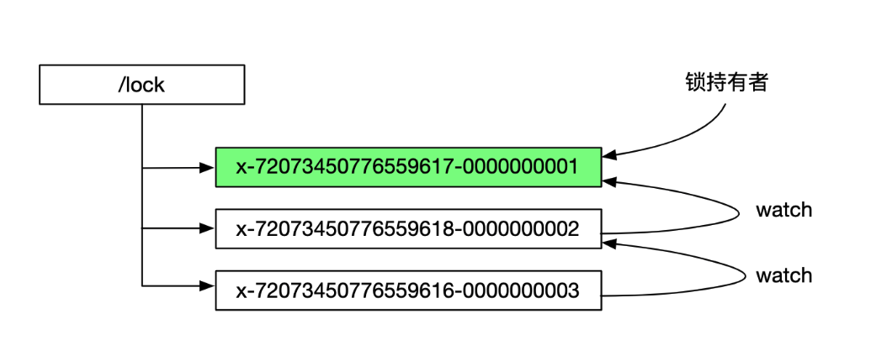
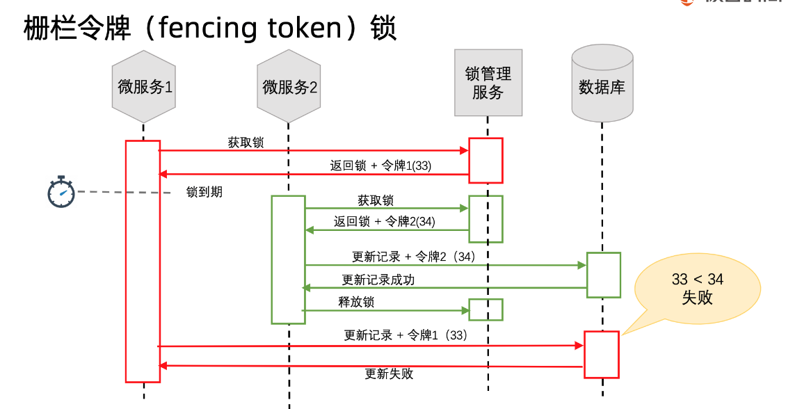

# Scenario\_DistributedLock

* [Using oversell problem as an example](scenario_distributedlock.md#using-oversell-problem-as-an-example)
  * [Case 1: Subtract purchased count in program and update database to target count](scenario_distributedlock.md#case-1-subtract-purchased-count-in-program-and-update-database-to-target-count)
  * [Case 2: Decrement database count with purchased count](scenario_distributedlock.md#case-2-decrement-database-count-with-purchased-count)
* [Standalone lock](scenario_distributedlock.md#standalone-lock)
  * [Synchronized lock](scenario_distributedlock.md#synchronized-lock)
    * [Method](scenario_distributedlock.md#method)
    * [Block](scenario_distributedlock.md#block)
  * [Reentrant lock](scenario_distributedlock.md#reentrant-lock)
* [Distributed lock](scenario_distributedlock.md#distributed-lock)
  * [Use cases](scenario_distributedlock.md#use-cases)
  * [Requirementss](scenario_distributedlock.md#requirementss)
  * [Comparison](scenario_distributedlock.md#comparison)
  * [CP model](scenario_distributedlock.md#cp-model)
    * [Database](scenario_distributedlock.md#database)
      * [Ideas](scenario_distributedlock.md#ideas)
      * [Pros and Cons](scenario_distributedlock.md#pros-and-cons)
      * [Example](scenario_distributedlock.md#example)
    * [Zookeeper](scenario_distributedlock.md#zookeeper)
      * [Curator](scenario_distributedlock.md#curator)
        * [Implementation](scenario_distributedlock.md#implementation)
    * [etcd](scenario_distributedlock.md#etcd)
      * [Operations](scenario_distributedlock.md#operations)
  * [AP model - Redis SetNX](scenario_distributedlock.md#ap-model---redis-setnx)
    * [Ideas](scenario_distributedlock.md#ideas-1)
    * [Example](scenario_distributedlock.md#example-1)
      * [Initial implementation](scenario_distributedlock.md#initial-implementation)
      * [Encapsulated implementation](scenario_distributedlock.md#encapsulated-implementation)
    * [Pros](scenario_distributedlock.md#pros)
    * [Cons](scenario_distributedlock.md#cons)
      * [Limited use cases](scenario_distributedlock.md#limited-use-cases)
        * [Link to history on RedLock](scenario_distributedlock.md#link-to-history-on-redlock)
    * [Redisson](scenario_distributedlock.md#redisson)
    * [Optimistic / Pessimistic lock](scenario_distributedlock.md#optimistic--pessimistic-lock)

## Using oversell problem as an example

### Case 1: Subtract purchased count in program and update database to target count

```text
┌ ─ ─ ─ ─ ─ ─ ─ ─ ─ ─ ─ ─ ─ ─ ─ ─ ─ ─ ─ ─ ─ ─ ─ ─ ─ ─ ─ 
                        Program                        │
│                                                       
     ┌──────────────────────────────────────────┐      │
│    │    Get the number of inventory items     │       
     └──────────────────────────────────────────┘      │
│                          │                            
                           ▼                           │
│     ┌─────────────────────────────────────────┐       
      │Subtract the number of purchased items to│      │
│     │           get target count B            │       
      │                                         │      │
│     └─────────────────────────────────────────┘       
 ─ ─ ─ ─ ─ ─ ─ ─ ─ ─ ─ ─ ─ ┬ ─ ─ ─ ─ ─ ─ ─ ─ ─ ─ ─ ─ ─ ┘
                           │                            
                           │                            
┌ ─ ─ ─ ─ ─ ─ ─ ─ ─ ─ ─ ─ ─│─ ─ ─ ─ ─ ─ ─ ─ ─ ─ ─ ─ ─ ─ 
                           ▼                           │
│     ┌─────────────────────────────────────────┐       
      │    Update database to target count B    │      │
│     └─────────────────────────────────────────┘       
                                                       │
│                       Database                        
 ─ ─ ─ ─ ─ ─ ─ ─ ─ ─ ─ ─ ─ ─ ─ ─ ─ ─ ─ ─ ─ ─ ─ ─ ─ ─ ─ ┘
```

### Case 2: Decrement database count with purchased count

```text
┌ ─ ─ ─ ─ ─ ─ ─ ─ ─ ─ ─ ─ ─ ─ ─ ─ ─ ─ ─ ─ ─ ─ ─ ─ ─ ─ ─ 
                        Program                        │
│                                                       
     ┌──────────────────────────────────────────┐      │
│    │    Get the number of inventory items     │       
     └──────────────────────────────────────────┘      │
│                          │                            
                           │                           │
└ ─ ─ ─ ─ ─ ─ ─ ─ ─ ─ ─ ─ ─│─ ─ ─ ─ ─ ─ ─ ─ ─ ─ ─ ─ ─ ─ 
                           │                            
                           ▼                            
┌ ─ ─ ─ ─ ─ ─ ─ ─ ─ ─ ─ ─ ─ ─ ─ ─ ─ ─ ─ ─ ─ ─ ─ ─ ─ ─ ┐ 

│     ┌─────────────────────────────────────────┐     │ 
      │     Decrement database count with B     │       
│     └─────────────────────────────────────────┘     │ 

│                      Database                       │ 
 ─ ─ ─ ─ ─ ─ ─ ─ ─ ─ ─ ─ ─ ─ ─ ─ ─ ─ ─ ─ ─ ─ ─ ─ ─ ─ ─
```

## Standalone lock

### Synchronized lock

#### Method

```text
    @Transactional(rollbackFor = Exception.class)
    public synchronized Integer createOrder() throws Exception
    {
        Product product = null;

        // !!! Manual transaction management is required. Otherwise, 
        TransactionStatus transaction1 = platformTransactionManager.getTransaction(transactionDefinition);
        product = productMapper.selectByPrimaryKey(purchaseProductId);
        if (product==null)
        {
            platformTransactionManager.rollback(transaction1);
            throw new Exception("item："+purchaseProductId+"does not exist");
        }

        // current inventory
        Integer currentCount = product.getCount();
        System.out.println(Thread.currentThread().getName()+"number of inventory："+currentCount);

        // check against inventory
        if (purchaseProductNum > currentCount)
        {
            platformTransactionManager.rollback(transaction1);
            throw new Exception("item"+purchaseProductId+"only has"+currentCount+" inventory，not enough for purchase");
        }

        productMapper.updateProductCount(purchaseProductNum,"xxx",new Date(),product.getId());
        platformTransactionManager.commit(transaction1);

        TransactionStatus transaction = platformTransactionManager.getTransaction(transactionDefinition);
        Order order = new Order();
        order.setOrderAmount(product.getPrice().multiply(new BigDecimal(purchaseProductNum)));
        order.setOrderStatus(1);//待处理
        order.setReceiverName("xxx");
        order.setReceiverMobile("13311112222");
        order.setCreateTime(new Date());
        order.setCreateUser("xxx");
        order.setUpdateTime(new Date());
        order.setUpdateUser("xxx");
        orderMapper.insertSelective(order);

        OrderItem orderItem = new OrderItem();
        orderItem.setOrderId(order.getId());
        orderItem.setProductId(product.getId());
        orderItem.setPurchasePrice(product.getPrice());
        orderItem.setPurchaseNum(purchaseProductNum);
        orderItem.setCreateUser("xxx");
        orderItem.setCreateTime(new Date());
        orderItem.setUpdateTime(new Date());
        orderItem.setUpdateUser("xxx");
        orderItemMapper.insertSelective(orderItem);
        platformTransactionManager.commit(transaction);
        return order.getId();
    }
```

#### Block

```text
    // OrderService.java

    private Object object = new Object();

    @Transactional(rollbackFor = Exception.class)
    public Integer createOrder() throws Exception{
        Product product = null;
        synchronized(OrderService.class) // synchronized(this)
        {
            TransactionStatus transaction1 = platformTransactionManager.getTransaction(transactionDefinition);
            product = productMapper.selectByPrimaryKey(purchaseProductId);
            if (product==null)
            {
                platformTransactionManager.rollback(transaction1);
                throw new Exception("item："+purchaseProductId+"does not exist");
            }

            // current inventory
            Integer currentCount = product.getCount();
            System.out.println(Thread.currentThread().getName()+"number of inventory："+currentCount);

            // check against inventory
            if (purchaseProductNum > currentCount)
            {
                platformTransactionManager.rollback(transaction1);
                throw new Exception("item"+purchaseProductId+"only has"+currentCount+" inventory，not enough for purchase");
            }

            productMapper.updateProductCount(purchaseProductNum,"xxx",new Date(),product.getId());
            platformTransactionManager.commit(transaction1);

            TransactionStatus transaction = platformTransactionManager.getTransaction(transactionDefinition);
            Order order = new Order();
            order.setOrderAmount(product.getPrice().multiply(new BigDecimal(purchaseProductNum)));
            order.setOrderStatus(1); // Wait to be processed
            order.setReceiverName("xxx");
            order.setReceiverMobile("13311112222");
            order.setCreateTime(new Date());
            order.setCreateUser("xxx");
            order.setUpdateTime(new Date());
            order.setUpdateUser("xxx");
            orderMapper.insertSelective(order);

            OrderItem orderItem = new OrderItem();
            orderItem.setOrderId(order.getId());
            orderItem.setProductId(product.getId());
            orderItem.setPurchasePrice(product.getPrice());
            orderItem.setPurchaseNum(purchaseProductNum);
            orderItem.setCreateUser("xxx");
            orderItem.setCreateTime(new Date());
            orderItem.setUpdateTime(new Date());
            orderItem.setUpdateUser("xxx");
            orderItemMapper.insertSelective(orderItem);
            platformTransactionManager.commit(transaction);
            return order.getId();
        }        
    }
```

### Reentrant lock

```text
    private Lock lock = new ReentrantLock();

    @Transactional(rollbackFor = Exception.class)
    public Integer createOrder() throws Exception{
        Product product = null;

        lock.lock();
        try 
        {
            TransactionStatus transaction1 = platformTransactionManager.getTransaction(transactionDefinition);
            product = productMapper.selectByPrimaryKey(purchaseProductId);
            if (product==null)
            {
                platformTransactionManager.rollback(transaction1);
                throw new Exception("item："+purchaseProductId+"does not exist");
            }

            // current inventory
            Integer currentCount = product.getCount();
            System.out.println(Thread.currentThread().getName()+"number of inventory："+currentCount);

            // check against inventory
            if (purchaseProductNum > currentCount)
            {
                platformTransactionManager.rollback(transaction1);
                throw new Exception("item"+purchaseProductId+"only has"+currentCount+" inventory，not enough for purchase");
            }

            productMapper.updateProductCount(purchaseProductNum,"xxx",new Date(),product.getId());
            platformTransactionManager.commit(transaction1);
        }
        finally 
        {
            lock.unlock();
        }

        TransactionStatus transaction = platformTransactionManager.getTransaction(transactionDefinition);
        Order order = new Order();
        order.setOrderAmount(product.getPrice().multiply(new BigDecimal(purchaseProductNum)));
        order.setOrderStatus(1);//待处理
        order.setReceiverName("xxx");
        order.setReceiverMobile("13311112222");
        order.setCreateTime(new Date());
        order.setCreateUser("xxx");
        order.setUpdateTime(new Date());
        order.setUpdateUser("xxx");
        orderMapper.insertSelective(order);

        OrderItem orderItem = new OrderItem();
        orderItem.setOrderId(order.getId());
        orderItem.setProductId(product.getId());
        orderItem.setPurchasePrice(product.getPrice());
        orderItem.setPurchaseNum(purchaseProductNum);
        orderItem.setCreateUser("xxx");
        orderItem.setCreateTime(new Date());
        orderItem.setUpdateTime(new Date());
        orderItem.setUpdateUser("xxx");
        orderItemMapper.insertSelective(orderItem);
        platformTransactionManager.commit(transaction);
        return order.getId();
    }
```

## Distributed lock

### Use cases

* Efficiency: Taking a lock saves you from unnecessarily doing the same work twice \(e.g. some expensive computation\).
  * e.g. If the lock fails and two nodes end up doing the same piece of work, the result is a minor increase in cost \(you end up paying 5 cents more to AWS than you otherwise would have\)
  * e.g. SNS scenarios: A minor inconvenience \(e.g. a user ends up getting the same email notification twice\).
  * e.g. eCommerce website inventory control
* Correctness: Taking a lock prevents concurrent processes from stepping on each others’ toes and messing up the state of your system. If the lock fails and two nodes concurrently work on the same piece of data, the result is a corrupted file, data loss, permanent inconsistency, the wrong dose of a drug administered to a patient, or some other serious problem.

### Requirementss

* Exclusive
* Avoid deadlock
* High available
* Reentrant

### Comparison

| Approach | Pros | Cons |
| :--- | :--- | :--- |
| Database | Easy to understand | High pressure on DB |
| Redis | Easy to understand | Not support blocking |
| Zookeeper | Support blocking | Rely on Zookeeper, high complexity |
| Curator | Easy to use | Rely on Zookeeper, |
| Redisson | Easy to use, support blocking |  |

### CP model

#### Database

**Ideas**

* Use database locks
  * Table lock 
  * Unique index
* "SELECT ... For UPDATE" adds a row lock on record
  * e.g. SELECT \* FROM distributed\_lock WHERE business\_code='demo' FOR UPDATE

**Pros and Cons**

* Pros:
  * Easy to build
* Cons: 
  * Big pressure on database if there are high number of concurrent requests. Recommend to separate the business logic DB and lock DB

**Example**

```text
// DistributeLockMapper.xml
  <select id="selectDistributeLock" resultType="com.example.distributelock.model.DistributeLock">
    select * from distribute_lock
    where business_code = #{businessCode,jdbcType=VARCHAR}
    for update
  </select>

// DemoController.java
@RestController
@Slf4j
public class DemoController 
{
    @Resource
    private DistributeLockMapper distributeLockMapper;

    @RequestMapping("singleLock")
    @Transactional(rollbackFor = Exception.class)
    public String singleLock() throws Exception 
    {
        DistributeLock distributeLock = distributeLockMapper.selectDistributeLock("demo");
        if (distributeLock==null) throw new Exception("cannot get distributed lock");
        try 
        {
            Thread.sleep(20000);
        } 
        catch (InterruptedException e) 
        {
            e.printStackTrace();
        }
        return "Finished execution！";
    }
}
```

#### Zookeeper



* How will the node be deleted:
  * Client deletes the node proactively
    * How will the previous node get changed?
      1. Watch mechanism get -w /gupao. 
  * Too many notifications:
    * Each node only needs to monitor the previous node

```text
@Slf4j
public class ZkLock implements AutoCloseable, Watcher 
{

    private ZooKeeper zooKeeper;
    private String znode;

    public ZkLock() throws IOException 
    {
        this.zooKeeper = new ZooKeeper("localhost:2181",
                10000,this);
    }

    public boolean getLock(String businessCode) 
    {
        try 
        {
            // Create business root node, e.g. /root
            Stat stat = zooKeeper.exists("/" + businessCode, false);
            if (stat==null)
            {
                zooKeeper.create("/" + businessCode,businessCode.getBytes(),
                        ZooDefs.Ids.OPEN_ACL_UNSAFE, 
                        CreateMode.PERSISTENT); 
            }

            // Create temporary sequential node  /order/order_00000001
            znode = zooKeeper.create("/" + businessCode + "/" + businessCode + "_", businessCode.getBytes(),
                    ZooDefs.Ids.OPEN_ACL_UNSAFE,
                    CreateMode.EPHEMERAL_SEQUENTIAL);

            // Get all nodes under business node
            List<String> childrenNodes = zooKeeper.getChildren("/" + businessCode, false);

            // Sort children nodes under root
            Collections.sort(childrenNodes);

            // Obtain the node which has the least sequential number
            String firstNode = childrenNodes.get(0);

            // If the node created is the first one, then get the lock
            if (znode.endsWith(firstNode))
            {
                return true;
            }

            // If not the first child node, then monitor the previous node
            String lastNode = firstNode;
            for (String node:childrenNodes)
            {
                if (znode.endsWith(node))
                {
                    // watch parameter is implemented in the process method below
                    zooKeeper.exists("/"+businessCode+"/"+lastNode, watch: true);
                    break;
                }
                else 
                {
                    lastNode = node;
                }
            }

            // Wait for the previous node to release
            // This is 
            synchronized (this)
            {
                wait();
            }

            return true;

        } 
        catch (Exception e) 
        {
            e.printStackTrace();
        }
        return false;
    }

    @Override
    public void close() throws Exception 
    {
        zooKeeper.delete(znode, -1); // path, version: version is to avoid deleting wrong node. Passing -1 here because it is not used before at all
        zooKeeper.close();
        log.info("I have unlocked！");
    }

    @Override
    public void process(WatchedEvent event) 
    {
        // Only get notification when the previous node get deleted. 
        if (event.getType() == Event.EventType.NodeDeleted)
        {
            synchronized (this)
            {
                notify();
            }
        }
    }
}

@Slf4j
public class ZookeeperController 
{
    @Autowired
    private CuratorFramework client;

    @RequestMapping("zkLock")
    public String zookeeperLock()
    {
        log.info("entered method！");
        try (ZkLock zkLock = new ZkLock()) 
        {
            if (zkLock.getLock("order"))
            {
                log.info("get the lock");
                Thread.sleep(10000);
            }
        } 
        catch (IOException e) 
        {
            e.printStackTrace();
        } 
        catch (Exception e) 
        {
            e.printStackTrace();
        }
        log.info("finish method execution！");
        return "finish method execution！";
    }
}
```

**Curator**

* Motivation: Curator encapsulates the one-time watch logic so easier to use. 
  * There are three methods which could set watcher: GetData\(\); getChildren\(\); exists\(\). 
  * Whenever there is a change to the watched data, the result will be returned to client. 
  * However, the watcher could be used only once. 

**Implementation**

```text
@RestController
@Slf4j
public class ZookeeperController {
    @Autowired
    private CuratorFramework client;

    @RequestMapping("curatorLock")
    public String curatorLock()
    {
        log.info("Entered method！");
        InterProcessMutex lock = new InterProcessMutex(client, "/order");
        try
        {            
            if (lock.acquire(30, TimeUnit.SECONDS)) // 
            {
                log.info("Get the lock！！");
                Thread.sleep(10000);
            }
        } 
        catch (IOException e) 
        {
            e.printStackTrace();
        } 
        catch (Exception e) 
        {
            e.printStackTrace();
        }
        finally 
        {
            try 
            {
                log.info("Release lock！！");
                lock.release();
            } 
            catch (Exception e) 
            {
                e.printStackTrace();
            }
        }
        log.info("method finish execution！");
        return "method finish execution！";
    }
}
```

#### etcd

**Operations**

1. business logic layer apply for lock by providing \(key, ttl\)
2. etcd will generate uuid, and write \(key, uuid, ttl\) into etcd
3. etcd will check whether the key already exist. If no, then write it inside. 
4. After getting the lock, the heartbeat thread starts and heartbeat duration is ttl/3. It will compare and swap uuid to refresh lock

```text
// acquire lock
curl http://127.0.0.1:2379/v2/keys/foo -XPUT -d value=bar -d ttl=5 prevExist=false

// renew lock based on CAS
curl http://127.0.0.1；2379/v2/keys/foo?prevValue=prev_uuid -XPUT -d ttl=5 -d refresh=true -d prevExist=true

// delete lock
curl http://10.10.0.21:2379/v2/keys/foo?prevValue=prev_uuid -XDELETE
```

### AP model - Redis SetNX

#### Ideas

* SET resource\_name my\_random\_value NX PX 30000
  * resource\_name: key
  * my\_random\_value: UUID, used for validation when releasing lock among different threads. Only release lock if the random\_value is the same.
  * NX: succeed only if key does not exist; Otherwise fail the operation. Use the atomic property of NX to guarantee that only one client could configure it successfully.
  * PX: automatic expiration time in case there are some exceptions happening

```text
// Flowchart for potential problems without random_value 

  ┌─────────────┐   ┌─────────────┐  ┌─────────────┐                                    ┌ ─ ─ ─ ─ ─ ─ ┐
  │             │   │  A execute  │  │  A's lock   │                                      A releases   
  │ A get lock  │   │    task     │  │   expire    │                                    │  B's lock   │
  │             │   │             │  │             │                                                   
  └─────────────┘   └─────────────┘  └─────────────┘                                    └ ─ ─ ─ ─ ─ ─ ┘

─────────────────────────────────────────────────────────────────────────────────────────────────────▶ 

                                                     ┌─────────────┐   ┌─────────────┐                 
                                                     │             │   │  B execute  │                 
                                                     │ B get lock  │   │    task     │                 
                                                     │             │   │             │                 
                                                     └─────────────┘   └─────────────┘
```

```text
// Script to release the lock with Lua script

if redis.call("get", KEYS[1]) == ARGV[1] then
    return redis.call("del", KEYS[1])
else
    return 0
end
```

#### Example

**Initial implementation**

```text
@RestController
@Slf4j
public class RedisLockController {
    @Autowired
    private RedisTemplate redisTemplate;

    @RequestMapping("redisLock")
    public String redisLock(){
        log.info("Enter the method！");
        string key = "redisKey";
        string value = UUID.randomUUID().toString();

        // set up redis connection
        RedisCallBack<Boolean> redisCallback = connection -> {
            // Set up NX
            RedisStringCommands.SetOption setOption = RedisStringCommands.SetOption.IfAbsent();

            // Set up expiration time
            Expiration expiration = Expiration.seconds(30);
            byte[] redisKey = redisTemplate.getKeySerializer().serialize(key);
            byte[] redisValue = redisTemplate.getValueSerializer().serialize(value);

            Boolean result = connection.set(redisKey, redisValue, expiration, setOption);
            return result;
        };

        // Get distributed lock
        Boolean lock = (Boolean) redisTemplate.execute(redisCallback);
        if (lock)
        {
            log.info("entered the lock！！");
            Thread.sleep(15000);
        }
        catch (InterruptedException e)
        {
            e.printStackTrace();
        }
        finally
        {
            String script = "if redis.call(\"get\", KEYS[1]) == ARGV[1] then\n"+
            "   return redis.call(\"del\", KEYS[1])" +
            "else\n" +
            "   return 0\n" +
            "end";
            RedisScrit<Boolean> redisScript = RedisScript.of(script, Boolean.class)
            List<String> keys = Arrays.asList(key);
            boolean result = redisTemplate.execute(redisScript, keys, value);
            // finished releasing lock
            e.printStackTrace();
        }
        return "finished executing method";
    }
}
```

**Encapsulated implementation**

```text
@RestController
@Slf4j
public class RedisLockController {
    @Autowired
    private RedisTemplate redisTemplate;

    @RequestMapping("redisLock")
    public String redisLock(){
        log.info("Enter the method！");
        RedisLock redisLock = new RedisLock(redisTemplate, key: "redisKey", expireTime: 30);

        if (redisLock.getLock())
        {
            log.info("entered the lock！！");
            Thread.sleep(15000);
        }
        catch (InterruptedException e)
        {
            e.printStackTrace();
        }
        finally
        {
            boolean result = redisLock.unLock();
            log.info("the result of releasing lock" + result);
        }
        return "finished executing method";
    }
}
```

```text
// RedisLock.cs
@Slf4j
public class RedisLock implements AutoCloseable {

    private RedisTemplate redisTemplate;
    private String key;
    private String value;
    private int expireTime;

    public RedisLock(RedisTemplate redisTemplate,String key,int expireTime){
        this.redisTemplate = redisTemplate;
        this.key = key;
        this.expireTime=expireTime;
        this.value = UUID.randomUUID().toString();
    }

    public boolean getLock(){
        RedisCallback<Boolean> redisCallback = connection -> {
            // configure NX
            RedisStringCommands.SetOption setOption = RedisStringCommands.SetOption.ifAbsent();
            // Configure expiration time
            Expiration expiration = Expiration.seconds(expireTime);
            // Serialize key
            byte[] redisKey = redisTemplate.getKeySerializer().serialize(key);
            // Serialize value
            byte[] redisValue = redisTemplate.getValueSerializer().serialize(value);
            // Execute SetNx operation
            Boolean result = connection.set(redisKey, redisValue, expiration, setOption);
            return result;
        };

        // Get distributed lock
        Boolean lock = (Boolean)redisTemplate.execute(redisCallback);
        return lock;
    }

    public boolean unLock() {
        String script = "if redis.call(\"get\",KEYS[1]) == ARGV[1] then\n" +
                "    return redis.call(\"del\",KEYS[1])\n" +
                "else\n" +
                "    return 0\n" +
                "end";
        RedisScript<Boolean> redisScript = RedisScript.of(script,Boolean.class);
        List<String> keys = Arrays.asList(key);

        Boolean result = (Boolean)redisTemplate.execute(redisScript, keys, value);
        log.info("释放锁的结果："+result);
        return result;
    }


    @Override
    public void close() throws Exception {
        unLock();
    }
}
```

#### Pros

* Lock is stored in memory. No need to access disk

#### Cons

**Limited use cases**

* Only applicable for efficiency use cases, not for correctness use cases.
  * Efficiency
    * You could use a single Redis instance, of course you will drop some locks if the power suddenly goes out on your Redis node, or something else goes wrong. But if you’re only using the locks as an efficiency optimization, and the crashes don’t happen too often, that’s no big deal. This “no big deal” scenario is where Redis shines. At least if you’re relying on a single Redis instance, it is clear to everyone who looks at the system that the locks are approximate, and only to be used for non-critical purposes.
    * Add on top of the single application case, you could use master-slave setup for high availability. 
  * Correctness
    * A simple master - slave setup won't work. Think about the following scenario: 
      1. Client A writes an entry A to master. 
      2. Master dies before the asynchronous replication of the write operation reaches slave. 
      3. The slave becomes the master
      4. Client B writes the same entry A to original salve \(current master\)
      5. Now A and B share the same lock.
    * You will need to rely on Redlock. However, there are [some concerns](https://martin.kleppmann.com/2016/02/08/how-to-do-distributed-locking.html) about it. To summarize:
      * Redlock does not have any facility to generate fencing tokens. And it is not straightforward to repurpose Redlock for generating fencing tokens. 
        * Relying on expiration time to avoid deadlock is not reliable. 
          * What if the lock owner dies? The lock will be held forever and we could be in a deadlock. To prevent this issue Redis will set an expiration time on the lock, so the lock will be auto-released. However, if the time expires before the task handled by the owner isn't yet finish, another microservice can acquire the lock, and both lock holders can now release the lock causing inconsistency. 
          * A fencing token needed to be used to avoid race conditions. Please see [this post](https://medium.com/@davidecerbo/everything-i-know-about-distributed-locks-2bf54de2df71) for details. 
      * Redlock depends on a lot of timing assumptions
        1. All Redis nodes hold keys for approximately the right length of time before expiring
        2. The network delay is small compared to the expiry duration
        3. Process pauses are much shorter than the expiry duration

**Link to history on RedLock**

* Typical failures causing [failures of distributed locks](https://redislabs.com/ebook/part-2-core-concepts/chapter-6-application-components-in-redis/6-2-distributed-locking/6-2-2-simple-locks/)
* What Redlock tries to solve?
  * The simplest way to use Redis to lock a resource is to create a key in an instance. The key is usually created with a limited time to live, using the Redis expires feature, so that eventually it will get released \(property 2 in our list\). When the client needs to release the resource, it deletes the key.
  * Superficially this works well, but there is a problem: this is a single point of failure in our architecture. What happens if the Redis master goes down? Well, let’s add a slave! And use it if the master is unavailable. This is unfortunately not viable. By doing so we can’t implement our safety property of mutual exclusion, because Redis replication is asynchronous.
  * There is an obvious race condition with this model:
    * Client A acquires the lock in the master.
    * The master crashes before the write to the key is transmitted to the slave.
    * The slave gets promoted to master.
    * Client B acquires the lock to the same resource A already holds a lock for. SAFETY VIOLATION!
* How to implement distributed lock with Redis, an algorithm called [RedLock](https://redis.io/topics/distlock)
  * How to implement it in a single instance case
  * How to extend the single instance algorithm to cluster
* [A hot debate on the security perspective of RedLock algorithm](http://zhangtielei.com/posts/blog-redlock-reasoning.html).

#### Redisson

* Relationship with Redis could be thought as similar to Curator to Zookeeper

#### Optimistic / Pessimistic lock

* Pessimistic lock - Fencing token



* Industrial implementation -ShedLock

