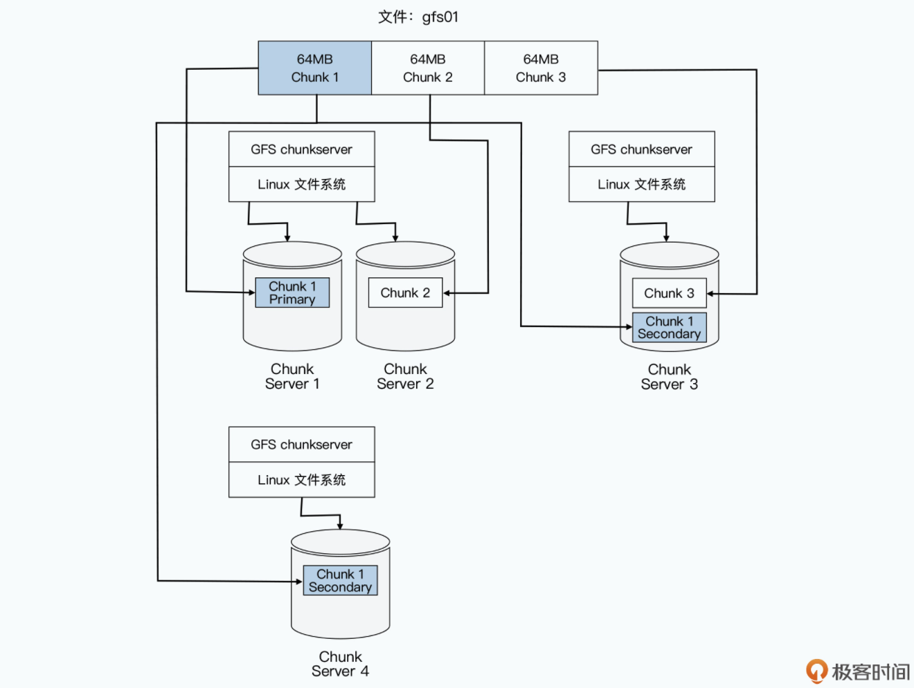
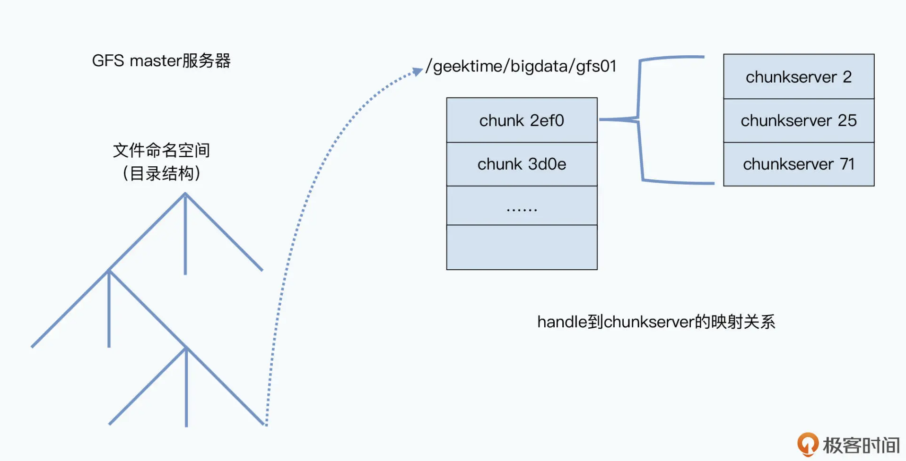
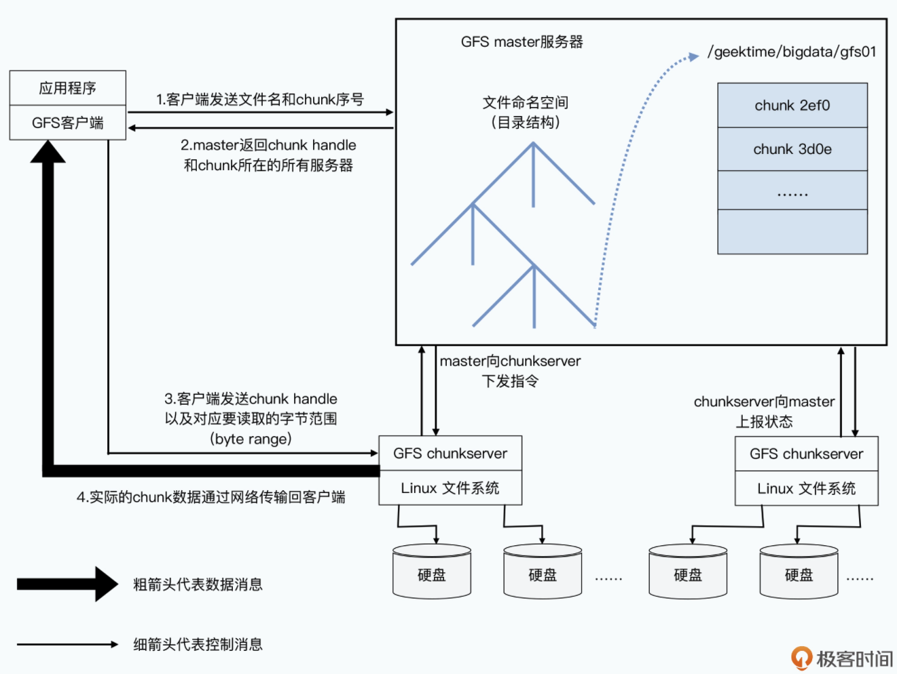
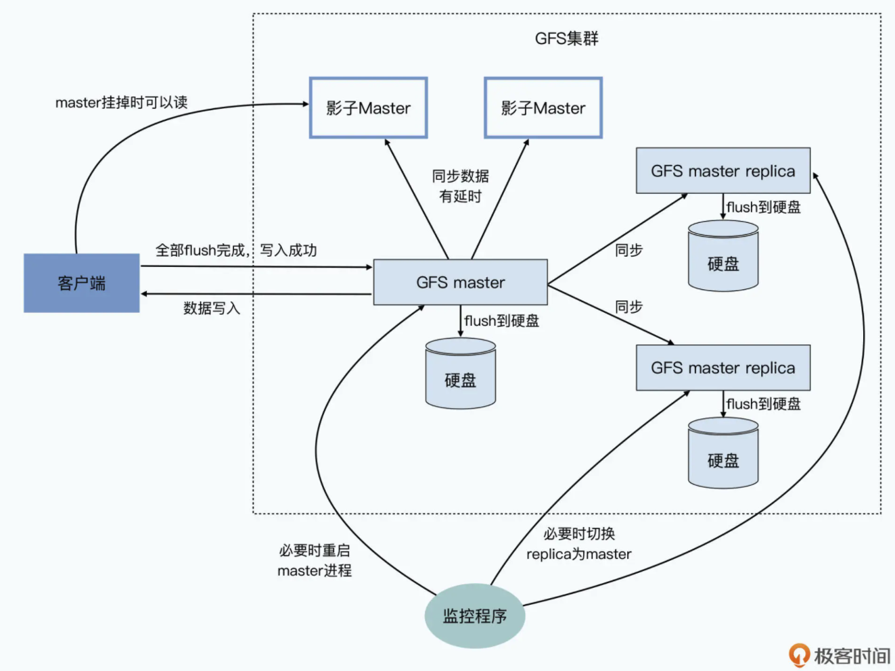

- [Single master](#single-master)
  - [Master as directory service](#master-as-directory-service)
    - [Chunk size of 64MB](#chunk-size-of-64mb)
    - [Three types of metadat](#three-types-of-metadat)
    - [Access pattern](#access-pattern)
  - [High availability](#high-availability)
    - [Restart master](#restart-master)
    - [Switch to master backup](#switch-to-master-backup)
    - [Read from shadow backup](#read-from-shadow-backup)

# Single master
## Master as directory service
### Chunk size of 64MB
* When compared with chunk server used for dat storage, master is a 
directory service. 
* GFS also uses namespace + filename to identify a file. 
* Each file is divided to chunk of size 64MB. 
* GFS client knows which chunk server to find the file. 

### Three types of metadat
* File and chunk namespace
* Mapping from file full path name to chunk handle list. 
* Mapping from chunk handle list to chunk server list. 

### Access pattern
1. GFS client sends file name and chunk offset to GFS master. Since all chunks have the same size of 64MB, chunk index could be easily calculated. 
2. After GFS master gets the request, it will return addresses of chunk servers to clients. 
3. After GFS client gets addresses, it could reach out to any of it to get chunk data. 

## High availability

### Restart master
* All master metadata is cached inside memory. There will be checkpoints where all memory is dumped to disk. 
* If the master has software failures, then it will first recover from checkpoints. And then operation logs after that timestamp will be replayed. 

### Switch to master backup
* The above procedure could handle software but not hardware failures. 
* If the master has hardware failures, then it could failover to the backups which master synchronously replicates to. 

### Read from shadow backup 
* The switch process could take seconds or minutes to complete. 
* In the meanwhile, When compared with shadow master used for availability for asynchronous read. 
* The data in shadow back might be stale. But the chance that client read stale metadata from shadow backup is quite slim because it only happens when all these three conditions are met: 
  * Master is dead. 
  * The metadata on master has not completely been replicated to shadow backup. 
  * The data clients is trying to read is just these metadata not replicated yet. 
