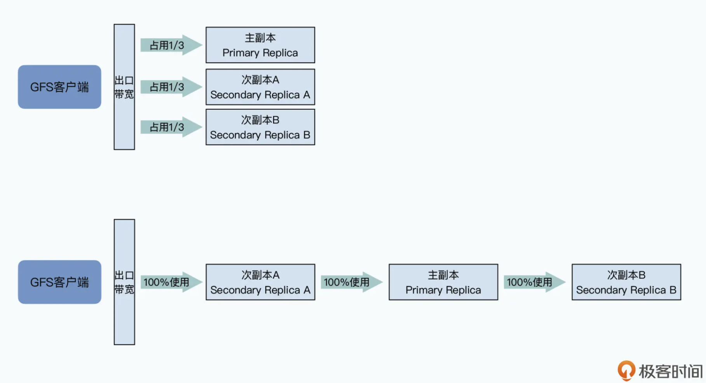

- [Single master](#single-master)
  - [Master as directory service](#master-as-directory-service)
    - [Chunk size of 64MB](#chunk-size-of-64mb)
    - [Three types of metadata](#three-types-of-metadata)
    - [Access pattern](#access-pattern)
  - [High availability](#high-availability)
    - [Restart master](#restart-master)
    - [Switch to master backup](#switch-to-master-backup)
    - [Read from shadow backup](#read-from-shadow-backup)
- [Network bottleneck](#network-bottleneck)
  - [Identify the bottleneck](#identify-the-bottleneck)
  - [Terminology](#terminology)
  - [GFS write (control signal/data) flow](#gfs-write-control-signaldata-flow)
    - [Separation of control signal and data flow](#separation-of-control-signal-and-data-flow)
    - [GFS data flow](#gfs-data-flow)
      - [Process](#process)
      - [Reason](#reason)
- [Consistency](#consistency)

# Single master
## Master as directory service
### Chunk size of 64MB
* When compared with chunk server used for dat storage, master is a 
directory service. 
* GFS also uses namespace + filename to identify a file. 
* Each file is divided to chunk of size 64MB. 
* GFS client knows which chunk server to find the file. 

### Three types of metadata
* File and chunk namespace
* Mapping from file full path name to chunk handle list. 
* Mapping from chunk handle list to chunk server list. 

### Access pattern
1. GFS client sends file name and chunk offset to GFS master. Since all chunks have the same size of 64MB, chunk index could be easily calculated. 
2. After GFS master gets the request, it will return addresses of chunk servers to clients. 
3. After GFS client gets addresses, it could reach out to any of it to get chunk data. 

## High availability

### Restart master
* All master metadata is cached inside memory. There will be checkpoints where all memory is dumped to disk. 
* If the master has software failures, then it will first recover from checkpoints. And then operation logs after that timestamp will be replayed. 

### Switch to master backup
* The above procedure could handle software but not hardware failures. 
* If the master has hardware failures, then it could failover to the backups which master synchronously replicates to. 

### Read from shadow backup 
* The switch process could take seconds or minutes to complete. 
* In the meanwhile, When compared with shadow master used for availability for asynchronous read. 
* The data in shadow back might be stale. But the chance that client read stale metadata from shadow backup is quite slim because it only happens when all these three conditions are met: 
  * Master is dead. 
  * The metadata on master has not completely been replicated to shadow backup. 
  * The data clients is trying to read is just these metadata not replicated yet. 

# Network bottleneck
## Identify the bottleneck
* In GFS case
  * It uses 100Mbps network card, it has a maximum throughput of 12.5MB/s. 
  * It uses 5400 rpm disk, its bandwidth is usually 60~90MB/s. And multiple hard disks could be plugged together, and there will be a maximum bandwidth of 500MB/s. 
  * The bottleneck is in network layer. 

## Terminology
* Master: Stores the metadata.
* Primary replica.
* Secondary replica.

## GFS write (control signal/data) flow
### Separation of control signal and data flow
* Master only tells GFS client which chunk servers to read/write data. After that it is out of the business. 

1. **Control signal**: Client queries master for locations of chunk servers. 
2. **Control signal**: Master replies with primary and secondary replica locations of chunk servers. 
3. **Data**: Client sends data to all replicas (by picking the nearest replica first). However, after secondary replicas receive the data, they will not immediately write it to disk. Instead, they will cache it in the memory. 
4. **Control signal**: After all secondary replicas receive data, clients will send a write request to primary replica. Primary replica will order all the write requests. 
5. **Control signal**: Primary replica will forward all write requests to secondary replicas. Then all secondary replicas will write data to disk with the same order. 
6. **Control signal**: After secondary replicas finish writing, they will reply to primary replica that they have finished. 
7. **Control signal**: Primary replica will tell clients that write requests have completed successfully. 

### GFS data flow
#### Process
* Data might not first be transmitted to primary replica. It depends on which replica is closer to the client. 
* Then the closer replica will send the data to the next replica. 

#### Reason
* All servers on the same rack will be plugged to the same access switch. 
* All switches on the rack will connect to a single aggregate switch. 
* Aggregate switches will connect to core switch. 

# Consistency
