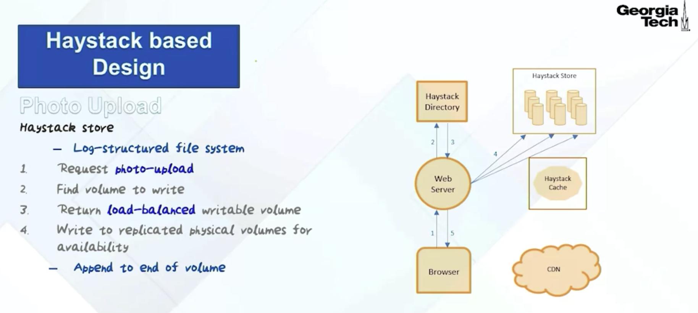

- [Scale](#scale)
- [Motivation](#motivation)
- [Network file system based design](#network-file-system-based-design)
  - [Flowchart](#flowchart)
  - [Bottlenecks](#bottlenecks)
    - [Metadata bottleneck](#metadata-bottleneck)
    - [Miss in CDN expensive](#miss-in-cdn-expensive)
- [Haystack based design](#haystack-based-design)
  - [Photo upload](#photo-upload)
    - [Haystack store file system](#haystack-store-file-system)
    - [Logical to physical volume mapping](#logical-to-physical-volume-mapping)
    - [Process](#process)
  - [Photo download](#photo-download)
    - [CDN or haystack cache](#cdn-or-haystack-cache)
    - [No haystack cache if miss in CDN](#no-haystack-cache-if-miss-in-cdn)
    - [Source of truth](#source-of-truth)
    - [Process](#process-1)
- [Summary](#summary)
- [References](#references)

# Scale

# Motivation
* This haystack storage system is a good example of how to build a scalable and available PhotoStore. It's a good example of a problem-oriented design. So in another words, the design point of this particular system is not for generality as we saw in the Amazon Dynamo system, but it is more for customization. 
* Look for an image in the store. 

# Network file system based design
## Flowchart

* The idea is that from your browser you're accessing a particular photograph and then what happens is you go to the Web server and the Web server gives you a handle, which is called a needle. 

## Bottlenecks
### Metadata bottleneck
* The first bottleneck is what is called metadata bottleneck. Now, I should give a little bit of a background for those who may not be completely familiar. In Unix, you'll have a file on the disk, and this file has a metadata, which we will call an inode. So this is called an inode. What typically happens is that in the DRAM of the server, so if there's a server in the DRAM of the server, you bring in this inode. So the inode data structure comes in here and you're using this inode data structure to access the file. So this is the metadata. This is something that you pay for in any Unix system that you have inodes that have to be cached in the DRAM of the server for efficient access. What I mean by metadata bottleneck in the context of the photo store is that we've got a staggering number of files here. If every photograph, even if you take 65 billion as the number right now, every photograph, if it is stored in a separate file, we're talking about 65 billion inodes. There is no way you have space in your DRAM for this many. The way it works is that you are going to be caching the most recently accessed files and the metadata associated with that file. So the metadata bottleneck is one big problem when you have this NFS based design. The second is the latency. So the latency because of the fact that if you miss in the CDN, then you're going all the way to the server to get it before you can see it on your browser is a big expense.

### Miss in CDN expensive
* So you're going to needle, and with that needle you go to the CDN. The CDN, hopefully will have that photograph that you're looking for. If it doesn't, then it goes to the photo store and the photo store will go to the network attached storage and find the photograph that you're looking for and return it back to CDN and then it comes back to you. So that's what is the typical path when you have an NFS based design. 
* Now, the reality is, if you look at the photographs that is stored in the repository, it's what is called a long tail distribution. What that means is that popular photographs that you and I may be looking for are usually served out to the CDN, so it comes back very quickly from the CDN. On the other hand, the photographs have a long tail distribution, meaning that there are pictures that are out there that have very low popularity. Because we are talking about a staggering number here in terms of number of photographs that is in the repository, and therefore pictures that are not in the CDN, you have to go through the NFS system to get it. So this long tail distribution says that photographs that have low popularity, you're going to have a long latency to get it because you're going through the CDN into the NFS storage system to get it. 

# Haystack based design
* So this is where the new design that Facebook came up with, the Haystack-based design comes in. So what we're doing is storing, instead of a single photograph in a file, it's going to store multiple photographs in a file. So what that does is that, now a single inode data structure, the metadata data structure is not a description for the single photograph, but it is a repository for perhaps 1,000 photographs in one single file. So that's the way we can reduce the metadata bottleneck. So metadata bottleneck can be mitigated by storing multiple photos in a single file. This structure here consisting of the haystack directory, the haystack cache, and the haystack store, it replaces the photo server and the NAS that I showed you in the original NFS-based design of the photo repository of Facebook. 
* So the upshot of this particular design is that the metadata for long-tail photographs are going to be in the haystack cache. Because what's happening, as I told you earlier, if it is a photograph that has been recently accessed, most likely it is a CDN, but on the other hand, if it is not in the CDN, you have to go to the folder store, but remember now the photo store is implemented by this combination of haystack directory, haystack cache, and the haystack store. This haystack cache is going to contain the metadata for all the long-tail photographs. Because of the fact that we are using a single inode as a representation for multiple photographs contained in a single file, we are reducing the metadata overload that we had in the NFS-based design, and the photo itself that you're looking for may be in the haystack store. 

## Photo upload
### Haystack store file system
* First of all, haystack store is implemented as a log-structured file system. This is a terminology that many of you may be familiar with, but just to give you a quick refresher, what log-structured file system does is, instead of storing the file as is and making updates in place, changes to the file are stored as log data that is associated with that file. 
* All that you're doing is, you're taking a single file and to that single file, you're having one photograph, a second photograph, and so on, and you're just appending to this file photographs that you want to add to this particular file. If I say a single file contains 1,000 photographs, that's what you're doing, and so having a log-structured file system means that I can simply write to the end of the file. 

### Logical to physical volume mapping
* The logical volume will map to a set of replicated physical volumes for availability because remember that in Cloud services, failure is a given and therefore we have to make sure that anything that we do has redundancy, and so you have a replicated physical volume representing a logical volume that the haystack directory gives you. 

### Process
* **Step1-Request photo upload**: What you're going to do is you're going to go to the web server from your browser.
* **Step2-Get volume to write**: The browser will go to this haystack directory. The haystack directory is going to return a logical volume to write to. 
* **Step3-Return load-balanced writable volume**: The haystack directory knows the occupancy of the logical volumes and it's going to return a load balanced writable volume for you so that we can reduce the amount of stress that we put on the haystack store. 
* **Step4-Write to replicated physical volumes for availability**: Once you have that, then we're going to actually do the upload by writing to the end of the volume, because this is where the log-structured file characteristic comes in. So this is how a photo upload will happen in the haystack store.
* **Step5**: Return success to the browser

## Photo download
### CDN or haystack cache
* Depending on the photograph that you're accessing and the popularity index which is maintained by the haystack directory, it can make a guesstimate as to whether a particular needle mapping to a photograph can be found in the CDN itself or maybe you have to go directly to the haystack cache to get that. So that decision is something that the directory gives you. Once you have that, you either go directly. 

### No haystack cache if miss in CDN
* One of the design decisions that they make in this design is that when you take this long road, going through the CDN and finding that it's not in the CDN and going into the haystack cache, is that when you bring in the photograph, we're not going to cache it in the haystack cache. The reason is because, if it is not in the CDN and you had to go to the store to get it, the next time it is going to be accessed, hopefully you'll find it in the CDN. If you don't find it in the CDN, very likely you won't find it in the haystack cache as well by the time because time would have elapsed. Therefore, they make the decision that if there is a miss in the CDN and you have to go through the haystack cache in order to get the data from the store, then don't bother caching it in the haystack cache.

### Source of truth
* **Haystack cache**: If it's part of the long-tailed distribution, you go directly to the haystack cache, and as I already mentioned because of the fact that we have multiple photographs in a single file, there's a good chance that the metadata that is associated with a particular photograph is in the haystack cache, if not, it may have to go to the haystack store and fetch the metadata and then give the real data as well. 
* **CDN**: The alternative path is of course going directly to the CDN, which is a decision that the haystack directory will make. 
  * In this case, you go to the CDN and hopefully, you'll find the picture that you're looking for in the CDN because there is a guesstimate that the directory made that most likely because of the fact that this is a popular picture that you're looking for, it will be in the CDN. 
  * But on the other hand, CDN is also caching most recent stuff responsible that what you're looking for is not in the CDN, in which case it may have to take the long route of going to the haystack cache, and going to the haystack store, getting the photograph back and then passing it back to the browser. 

### Process
* **Step1-Request to download photo**: What we do is we request a photo download from a browser to the web server. 
* **Step2-Find logical volume to download**: Web server requests the logical volume from haystack directory 
* **Step3-Assign load balanced physical volume**: What the haystack directory is going to give us is the physical volume to read. So it is going to do a load balancing decision saying, a particular photograph may be replicated in multiple physical volumes because the logical volume corresponds to multiple physical machines on which it is replicated. So the haystack directory is going to make a decision, what would be the right physical volume that you can read from? This is what we call the needle that we get back from the haystack directly via the web browser.
* **Step4-Browser gets the handle**: Once you have that needle, then the browser is going to decide how to get the photograph that corresponds to this particular needle. The decision whether to go to the CDN or go to the haystack, is something that is decided by the directory. The haystack directory makes this decision for you depending on the long-tail distribution.

# Summary
* The haystack directory has the mapping given a photo URL to a needle and the haystack itself.
* The haystack store is organized into logical volumes. It's a log structured file system and multiple photographs are in a single file so that you can reduce the metadata overload in the haystack cache, and each photo has a marker, which is called the needle and the mapping between the URL, because at a browser level, what you are generating is the URL and mapping of that URL to the needle is something that is kept in the haystack directory, and the haystack directly tells the browser whether they go to the CDN or the haystack cache to fetch what you want. The haystack cache response to haystack needle requests coming from the browser. The request can be one of two kinds. 
* One is, it's a direct requests coming from the browser and this is because the directory told the browser that this is a photograph that is part of the long tail distribution and therefore don't bother going to the CDN, go directly to the haystack cache and metadata likely will be in the cache. 
* If not, you may have to go to the disk and bring both metadata and the photograph that it points to and once you bring it, the haystack cache is going to cache it so that future requests to the same photograph can be served from the cache and of course, it's a cash and therefore it will get evicted at some point of time if nobody accesses that particular photograph.
* Now, if the request comes from the CDN because of the fact that you went to the CDN thinking it is a popular photograph did not find it, went to the haystack cache. In that case, you are taking a long route and bringing the photograph and in this case, the haystack cache is not going to cache the photograph and I mentioned why that decision is being taken in the design simply because of the fact that if you did not find it in the CDN and the next time you're looking for it, you'll have it in the CDN, hopefully. 
* But if so much time elapses, that is again, not in the CDN, chances that you'll find it in the haystack cache is very small because haystack cache has to worry about the entire long-tail distribution and therefore there's no point in caching it in the haystack cache for request that comes from the CDN and I already mentioned that the haystack storage itself is implemented as a log structured file system.

# References
* Georgia Tech Cloud System Software: https://www.coursera.org/lecture/cloud-sys-software/facebook-haystack-nfs-based-design-Qcqpm