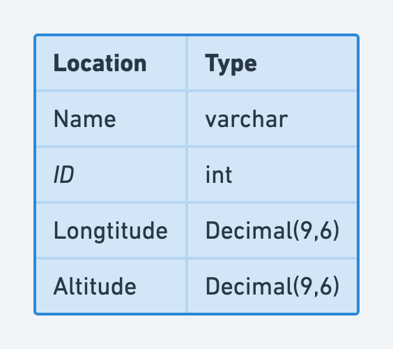
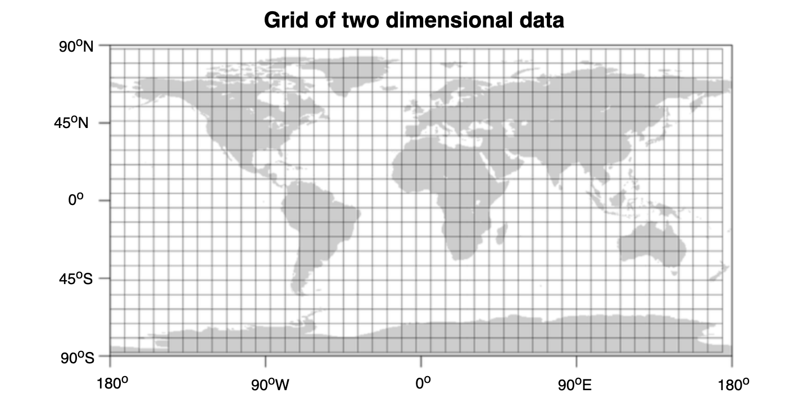

- [Use cases](#use-cases)
- [Requirements](#requirements)
  - [Functional](#functional)
  - [Non-functional](#non-functional)
- [API design](#api-design)
- [Approach 0: Store location in SQL database](#approach-0-store-location-in-sql-database)
  - [Overall flowchart](#overall-flowchart)
  - [Storage option 0: Store data as plain latitude/longtitude](#storage-option-0-store-data-as-plain-latitudelongtitude)
  - [Storage option 1: Store data as spatial data types](#storage-option-1-store-data-as-spatial-data-types)
  - [PostgreSQL spatial query - KNN](#postgresql-spatial-query---knn)
  - [Approach 1: Cache locations and search in memory](#approach-1-cache-locations-and-search-in-memory)
    - [Flowchart](#flowchart)
      - [Write path](#write-path)
      - [Read path](#read-path)
  - [Approach 2: Create partitions in memory & search partition wise](#approach-2-create-partitions-in-memory--search-partition-wise)
    - [Flowchart](#flowchart-1)
      - [Static partition managed by metadata registry](#static-partition-managed-by-metadata-registry)
      - [Get the city name](#get-the-city-name)
      - [Audit support](#audit-support)
    - [Data modeling](#data-modeling)
      - [City-based sharding](#city-based-sharding)
      - [Use logical shard to solve small / big city problems](#use-logical-shard-to-solve-small--big-city-problems)
      - [Schema example](#schema-example)
      - [Cons of city based partition](#cons-of-city-based-partition)
  - [Approach 3: Partition based on Geo-Hash & query matching hash](#approach-3-partition-based-on-geo-hash--query-matching-hash)
    - [Flowchart](#flowchart-2)
      - [Write path](#write-path-1)
      - [Read path](#read-path-1)
    - [Data modeling](#data-modeling-1)
      - [Geohash](#geohash)
      - [Geohash Categories](#geohash-categories)
        - [Static grids](#static-grids)
        - [Dynamic grids - Squad tree](#dynamic-grids---squad-tree)
        - [Size estimation](#size-estimation)
      - [Represent as Geohashes](#represent-as-geohashes)
        - [Represent as Hilbert Curves](#represent-as-hilbert-curves)
      - [Geohash based schema](#geohash-based-schema)
      - [Implement geohash in memory](#implement-geohash-in-memory)
- [Real world](#real-world)
- [References](#references)
- [Appendix](#appendix)
      - [Past chart](#past-chart)
    - [TODO](#todo)

# Use cases

* Real time cab booking service like Uber, Lyft, Bolt.
* Real time hotel / restaurant search like Yelp.
* Target shoppers nearing a certain store for a marketing promotion.
* Hyper-local delivery system — dispatch delivery agents for restaurant order like Uber Eats.

# Requirements

## Functional
* Given a location by a client or user, our service should figure out certain number of nearby locations.
  * NN: Given a location, find the nearest k points
  * Range query: Retrieve all points within a specific spatial range. 
* Update location

## Non-functional

* Our service is used world wide.
* The infrastructure should be reliable.
* The system should response ≤ 200 milliseconds. So designing for latency is a big concern here.
* We need to support 50\_000 read queries per second & 10\_000 write queries per second.
* As users grow in our system, the system should scale linearly without adding much burden.
* For the sake of simplicity, let’s assume that a location is represented by title, description, type, latitude & longitude.
* The system is not multi-tenant.
* Clients are generally mobile clients, but web clients can also be there.

# API design

```
// Get location
GET /v1/api/locations?lat=89.898&long=123.43&radius=50&max_count=30

HTTP 1.1 Response Code: 200

{
  "locations": [
    {
      "id": 7910837291,
      "title": "Toit",
      "desceription": "Best brewary in the area",
      "lat": 89.33,
      "long": 123.222
    },

    {
      "id": 1697290292,
      "title": "English Craft",
      "desceription": "Best brews hands down",
      "lat": 88.214,
      "long": 122.908
    }
  ]
}
```

* Worth clarifying whether a bulk API will be needed

```
// Create location
POST v1/api/locations

{
  "locations": [
    {
      "title": "Toit",
      "desceription": "Best brewary in the area",
      "lat": 89.33,
      "long": 123.222
    },

    {
      "title": "English Craft",
      "desceription": "Best brews hands down",
      "lat": 88.214,
      "long": 122.908
    }
  ]
}

Response: 202 ACCEPTED
```

# Approach 0: Store location in SQL database

## Overall flowchart


## Storage option 0: Store data as plain latitude/longtitude
* Use decimal to represent latitude/longtitude to avoid excessive precision (0.0001° is <11 m, 1′′ is <31 m)
* To 6 decimal places should get you to around ~10cm of accuracy on a coordinate.



```SQL
--Create schema
Create Location
(
    locationId int,
    latitude decimal(9,6),  //-180 ~ 180
    longtitude decimal(9,6), //-180 ~ 180
),

--Add location
Insert into Location (locationId, latitude, longtitude) values ("id1", 48.88, 2.31)

--Search nearby k locations within r radius
Select locationId from Location 
  where 48.88 - radius < latitude < 48.88 + radis and 2.31 + radius < longtitude < 2.31 + radius
```

## Storage option 1: Store data as spatial data types

```SQL

CREATE TABLE demo.mybranch
(
branchid SMALLINT PRIMARY KEY,
branchname VARCHAR(50) NOT NULL,
address GEOMETRY NOT NULL SRID 4326
);
```

## PostgreSQL spatial query - KNN

1. PostgreSQL supports KNN search on top using distance operator <->

```
select id, name, pos
    from pubnames
order by pos <-> point(51.516,-0.12)
    limit 3;

     id     |          name          |           pos           
------------+------------------------+-------------------------
   21593238 | All Bar One            | (51.5163499,-0.1192746)
   26848690 | The Shakespeare's Head | (51.5167871,-0.1194731)
  371049718 | The Newton Arms        | (51.5163032,-0.1209811)
(3 rows)

# evaluated on 30k rows in total
Time: 18.679 ms
```

2. The above query takes about 20 minutes, using KNN specific index (called GiST / SP-GiST) to speed up

```
> create index on pubnames using gist(pos);

> select id, name, pos
    from pubnames
order by pos <-> point(51.516,-0.12) limit 3;

     id     |          name          |           pos           
------------+------------------------+-------------------------
   21593238 | All Bar One            | (51.5163499,-0.1192746)
   26848690 | The Shakespeare's Head | (51.5167871,-0.1194731)
  371049718 | The Newton Arms        | (51.5163032,-0.1209811)
(3 rows)

# evaluated on 30k rows in total
Time: 0.849 ms
```

* [https://tapoueh.org/blog/2013/08/the-most-popular-pub-names/](https://tapoueh.org/blog/2013/08/the-most-popular-pub-names/)

## Approach 1: Cache locations and search in memory
* Assumption: Suppose the total number of locations could suit inside a single machine. 

### Flowchart


#### Write path
* Question: How will cache get loaded
  * We can have a scheduled job which will run every few minutes and load the locations since the last id or timestamp. This is not a real time process, so we can have our write path also write / update the location information when the POST location API gets called. In the following architecture the write path has 2 steps: 
    * Step 1: Write to the database, 
    * Step 2: Write to the cache. Now we can run this write sequentially since the database is our source of truth for static data, we need to make sure to write the data to our database first, then write to the cache cluster.
  * The cache loader is a background process which acts as a reconciliation process — in case the step 2 in our write path fails, our cache loader will write the data since it finds the data is missing. In case the data is already present there, depending on the timestamp of the in-memory object, the loader can decide whether to update the data or skip it — if the database has more updated data / higher timestamp, update the data in cache. 
  * Also cache loader reads the data from a “Follower machine” — it’s just a way to scale the database — all write happen on the “Leader” & read happens on the “Follower” machines. There is a trade off here — the follower may log few milliseconds to seconds than the “Leader” since most of the real life use cases, we enable asynchronous replication instead of synchronous replication since synchronous is slower.

#### Read path
* Question: How are you going to query the cache cluster?
* We can use parallel threads to query the cache machines, process their data independently, combine them & create the response. So it’s like Divide & Conquer strategy.


## Approach 2: Create partitions in memory & search partition wise

### Flowchart


#### Static partition managed by metadata registry
* Both the read & write request first talk to the metadata registry, using the IP address of the request’s origin, we determine in which city the delivery agent exactly is or from where the customer request came. Using the resolved city, shard id is identified, then using shard id, index server is identified. Finally the request is directed towards that particular index server. So we don’t need to query all the cache / index server any more. Note that, in this architecture, neither read nor write requests talk to the data store directly, this reduces the API latency even further.
* Managing static partition in a central registry is a simpler way of managing partitions. In case we see one of the cache server is getting hot, we can move some of the logical shards from that machine to other machine or completely allocate a new machine itself. Also since it’s not automated & human intervention is required to manipulate or move partitions, usually chances of operational mistake is very less. Although there is a trade off here — with increasing growth or insane growth, when there are thousands of physical machines, managing static partition can become a pain, hence automated partitioning scheme should be explored & tools to be developed when those use cases arrive.

#### Get the city name
* Google Maps provides reverse Geo-Coding API to identify current city & related location information. The API can be integrated both in Android & iOS Apps.

#### Audit support
* Also in the above architecture, we are putting the data to a queue from which a consumer picks up those location data & updates the database with proper metadata like timestamp or order id etc. This is done only for tracking the history & tracing the delivery agent’s journey in case it’s required, it’s a secondary part to our discussion though.

### Data modeling
#### City-based sharding
* We have introduced a location data sharding scheme based on city name (It could be city id as well in case there is a risk of city name collision). We divide location data into several logical shard. A server or physical machine can contain many logical shards. A logical shard contains all locations data belonging to a particular city only. 
* Motivation:
  * Well, there is no standard partitioning that can be implemented for different use cases, it depends on what kind of application we are talking about & how the data access pattern looks like.
  * Let’s consider a hyper-local food delivery application. We need to assign delivery agents efficiently to customers so that orders can be dispatched in short time. There can be different kind of parameters which will determine whether a delivery agent can be assigned to an order e.g; how far the agent is from the restaurant & customer location, is he in transit & can take another order on his way and many others. But before applying all these filters, we need to fetch a limited number of delivery agents. Now most of the delivery agents will be bound to a city if not a specific locality. A delivery agent from Bangalore won’t usually deliver any order to a customer residing at Hyderabad. Also there will be finite number of agents in a city and possibly that number can hardly touch a maximum of few thousands only. And searching through these few thousands locations for a batch of orders ( orders from a locality or city can be batched & dispatched together for better system performance ) can be a good idea. So, with this theory, we can use city name as the partition key for a hyper local system.

#### Use logical shard to solve small / big city problems
* In this allocation strategy, it might happen that a big city contains lots of locations whereas a smaller city contains less number of locations. In order to manage these shards & balance the load evenly across all possible cache servers, we are using a central metadata registry. The metadata registry contains mapping from city name to logical shard id, logical shard id to in-memory index server id mapping ( using service discovery mechanism, we can get the IP address of a server using the server id, the discussion is out of scope of this article ), something like below:

#### Schema example
```
City to shard mapping:
----------------------
city           shard_id
------------------------
Bangalore        101
Hyderabad        103
Mumbai           109
New York         908
San Francisco    834

Shard to Physical server mapping
--------------------------------
shard_id       index_server
----------------------------
101             index-1
103             index-2
109             index-1
908             index-3
834             index-2

A shard (say index-1) content (location object) looks like below:
"San Francisco": [
    {
        "agent_id": 7897894,
        "lat": 89.678,
        "long": 67.894
    }, 
    {
        "agent_id": 437833,
        "lat": 88.908,
        "long": 67.109
    }, 
    ...
 ]
```

#### Cons of city based partition
* City border problem: It’s quite possible that one of our delivery agents is currently located near the boarder of two cities — say he is at city A, an order comes from a neighbour city B & the agent’s distance from the customer at city B is quite less, but unfortunately we can’t dispatch the agent as he is not in city B. So at times, city based partitioning may not be optimal for all use cases. Also with growing demand from a city for a particular occasion like Christmas or New Year, a city based shard can become very hot. This strategy might work for hyper local systems but not for a system like Uber due to its very high scale.
* One possible solution: Use more complex sharding keys. For example, Uber uses City + Product sharding. Uber employs similar partitioning strategy but it’s not only on city/region — it’s region + product type (pool, XL or Go whatever). Uber has geographically distributed products across countries. So partitioning by a combination of product type & city works fine for them. To search for available Uber pool cabs in a region, you just go to the pool bucket for that region & retrieve all the cabs currently available there & likewise for all other use cases.

## Approach 3: Partition based on Geo-Hash & query matching hash
### Flowchart
* So how can we use Geo-Hash in our use case?
  * We need to first decide on a length of Geo-Hash which gives us a suitable area something like 30 to 50 square KM to search for. Typically, depending on the the Geo-Hash implementation, that length may be 4 to 6 — basically choose a length which can represent a reasonable search area & won’t result into hot shards. Let’s say we decide on length L. We will use this L length prefix as our shard key & distribute the current object locations to those shards for better load distribution.


#### Write path
1. Our application receives constant ping containing current location details from objects like — delivery agents or drivers etc.
2. Using the Geo-Hash library, the app server figures out the Geo-Hash of the location.
3. The Geo-Hash is trimmed down to length L whatever we decide.
4. The app server now talks to the central metadata server to decide where to put the location. The metadata server may return index server details immediately if any shard already exists for the Geo-Hash prefix or it may create an entry for a logical shard & map it to any suitable index server & returns the result.
5. In parallel, the app server writes the data to the async queue to update the location in the database.

#### Read path
1. Our application server receives a (lat, long) pair whose nearest locations we need to find.
2. The Geo-Hash is determined from the location, it’s trimmed down to length L.
3. We find out the neighbouring Geo-Hash for the prefix. Typically all 8-neighbours. When you query for neighbours of a Geo-Hash, depending on implementation, you may get 8 sample points each belonging to the different 8-neighbours. Why do we need to figure out neighbours? It may happen that the location that we received in the API request resides near a border or an edge of the region represented by the Geo-Hash. Some points might be there which exist in the neighbouring regions but are very close to our point, also the prefix of the neighbour regions may not at all match with the prefix of our point. So, we need to find Geo-Hash prefix of all 8-neighbours as well to find out all nearby points properly.
4. Now we have total 9 prefixes of length L. One for the region where our point belongs to, another 8 for neighbours. We can fire 9 parallel queries to retrieve all the points belonging to all these regions. This will make our system more efficient and less latent.
5. Once we have received all the data, our application server can rank them based on distance from our point & return appropriate response.

### Data modeling
#### Geohash 
* Motivation: We have seen that if we have a very high scale like millions of queries per second ( for services like Uber, Lyft ), only region / city based partitioning can not save us. We need to find a strategy where we can minimize the search area even more or have a flexibility to increase or decrease the search area as per our need may be based on radius.
* There is something called Geo-Hash, it’s an encoding mechanism for a given location ( lat, long pair ). The core concept is to imagine the earth as a flattened surface & keep on dividing the surface into multiple grids (squares or rectangles, depends on implementation). 
* So conceptually, the more grids we add, the region area keeps on getting smaller — the precision of the area becomes very high & the length of the string representing the ares increases e.g; string "02" represents an ares of 20\_000 KM x 20\_000 KM, string "021201" may represent an area of 50 KM x 50 KM. Please note: these figures mentioned are not mathematically accurate, these are just for building our understanding about the core concepts of Geo-Hash. In short:

#### Geohash Categories
##### Static grids
* Divide the world into a set of fixed size grids. 
* Then each grid could have a unique grid id based on its coordinate. 
* Cons: Some grid will be much denser than others. How to choose the optimal grid size. 
* Pros: When having the grid Id as a query dimension, the SQL query will be much faster. 

```
Select * from Places where 
Latitude between X-D and X+D 
and Longitude between Y-D and Y+D 
and GridID in (GridID, GridID1, GridID2, ..., GridID8)
```



##### Dynamic grids - Squad tree
* A squad tree is similar to a trie. 


```
def insertInTree(root, data):
    """Pseudo code for inserting a point in a Quadtree"""
    if not root
        createLeafAndInsertNode(root, data) 
    elif root.isLeaf() and root.size() < BUCKET_SIZE:
        root.addNode(data)
    elif root.isLeaf(): # Leaf node must be full
        root.decomposeLeafNodeAndInsert(data)
    # Find the appropriate sub-tree to insert node
    elif root.northwest.isValidParent(data)
        insertInTree(root.northwest, data)  
    elif root.southwest.isValidParent(data)
        insertInTree(root.southwest, data)  
    elif root.southeast.isValidParent(data)
        insertInTree(root.southeast, data)  
    else   
        insertInTree(root.northeast, data)

def getPointsInRange(root, range):
    points = []
    # If there is no intersection with the area, return
    if not root.intersect(range):
        return points
    # Return all data points on a leaf node
    if root.isLeaf():
        points.append(root.getNodes())
        return points
    # Recursively append the points from the 4 quadrants
    points.append(getPointsInRange(root.northwest, range))
    points.append(getPointsInRange(root.northeast, range))
    points.append(getPointsInRange(root.southeast, range))
    points.append(getPointsInRange(root.southwest, range))
    return points
```

##### Size estimation

* Static grid 
  * Size of world earth 200 M square mile
  * Size of grid = 10 square mile
  * Number of grids = 200 M / 10 = 20M Grids
  * Each grid has maximum 500 places
  * Each location has 24 bytes (string as location Id + double as longtitude + double as latitude). 
  * In total 2M _ 2^3 _ 3 \* 500 = 240GB
* Dynamic grid
  * Total number of locations is 500M. 
  * Each grid holds most 500 places.
  * Then there are in total 1M leaf nodes. 
  * There are roughly 0.5M internal nodes. A squad tree will have roughly 1/2 internal nodes
  * Leaf nodes space usage = 1M _ 24 _ 500 = 12000M = 1.2 GB
  * Internal nodes space usage 32 bytes \* 0.5M = 16 MB 
* Reference: [https://medium.com/@waleoyediran/spatial-indexing-with-quadtrees-b998ae49336](https://medium.com/@waleoyediran/spatial-indexing-with-quadtrees-b998ae49336)

#### Represent as Geohashes

##### Represent as Hilbert Curves

#### Geohash based schema
* Do we need to make any change to our low level design to support this technique?
  * We need to add Geo-Hash prefix to our database just in case in future we need to shard the db layer, we can do the same using hash prefix of length L as the shard key. Our new schema looks like below:

```
Collection Name: Locations
--------------------------
Fields:
-------
id - int (4+ bytes)
title - char (100 bytes)
type - char (1 byte)
description - char (1000 bytes)
lat - double (8 bytes)
long - double (8 bytes)
geo_hash - char(10 bytes)
geo_hash_prefix - char(6 bytes)
timestamp - int (4-8 bytes)
metadata - JSON (2000 bytes)

City to shard mapping:
----------------------
geo_hash_prefix (length = L)     shard_id
------------------------------------------
a89b3                             101
ab56e                             103
fy78a                             109
c78ab                             908
a78cd                             834

Shard to Physical server mapping
--------------------------------
shard_id       index_server
----------------------------
101             index-1
103             index-2
109             index-1
908             index-3
834             index-2
```

#### Implement geohash in memory

* How can we implement such index in our system? We need three basic things to implement such an index:
  1. Current location of an object (drivers in case of Uber, delivery agent’s location in case of a food delivery app).
  2. Mapping from a Geo-Hash prefix to the objects
  3. Proper expiry of the dynamic location data since in this use case, we are dealing with dynamic objects.
* We can use Redis to model all the above requirements:
  1. We can represent the current location of an object as a normal key value pair where key is the object id & value is the location information. When we get a location pinged from a device, we identify the Geo-Hash of that location, take hash prefix of length L , find out the shard & index machine where it lies from the central metadata registry & add or update the location information in that machine. The location keeps getting updated every 10 or 30 seconds whatever we decide. As you remember, these locations will keep on getting updated always. We can set the expiry to few minutes for this kind of key & with every update, we can increase the expiry time.     "7619": {"lat": "89.93", "long": 52.134, "metadata": {...}}
  2. For requirements 2 & 3 above, we can implement Redis sorted set (priority queue). The key of the sorted set will be the Geo-Hash prefix of length L. The member is objects’s id which are currently sharing the Geo-Hash prefix (basically they are withing the region represented by the Geo-Hash). And the score is current timestamp, we use the score to delete older data.

```
// This is how we set Redis sorted set for a given object location belonging to a Geo-Hash prefix:
$ ZADD key member score 
$ ZADD geo_hash_prefix object_id current_timestamp

Example:
$ ZADD 6e10h 7619 1603013034
$ ZADD 6e10h 2781 1603013050
$ ZADD a72b8 9082 1603013089

// Let's say our expiry time is 30 seconds, so just before retrieving current objects for a request belonging to a Geo-Hash prefix, we can delete all data older than current timestamp - 30 seconds, this way, expiration will happen gradually over time:

$ ZREMRANGEBYSCORE geo_hash_prefix -INF current_timestamp - 30 seconds
// -INF = Redis understands it as the lowest value
```

* How to reduce the latency even further as our requirements says the system needs to be very responsive?
  * We can have replica of index servers across countries in case our data is static. For dynamic data like cab location, these are very region specific. So we can have geographically distributed index servers which are indexed only with data from the concerned region or country. Example: If we get data from China, only index servers from China will index that data. For fault tolerance purpose, we can have replica of index servers across country or different regions in a country. We can use DNS level load balancing to redirect the users from different country to the nearest available server.

# Real world

* [Unique GeoId in Twitter](https://blog.twitter.com/engineering/en_us/a/2010/woeids-in-twitters-trends.html)
* [TODO: Uber Marketplace: Location Serving & Storage in the Uber Marketplace](https://www.youtube.com/watch?v=AzptiVdUJXg\&ab_channel=UberEngineering)

# References

* [R tree / KD - tree](https://blog.mapbox.com/a-dive-into-spatial-search-algorithms-ebd0c5e39d2a)
* [Geohash vs S2 vs H3](https://dev.to/phm200/the-problem-of-nearness-part-2-a-solution-with-s2-23gm)
* [Redis data model based basic algorithm for finding available drivers](https://www.youtube.com/watch?v=cSFWlF96Sds)
* [四火唠嗑](https://www.raychase.net/6312)
* [Indepth system design discussion](https://kousiknath.medium.com/system-design-design-a-geo-spatial-index-for-real-time-location-search-10968fe62b9c)

# Appendix
  * A great percentage of the below post comes from this blog [https://kousiknath.medium.com/system-design-design-a-geo-spatial-index-for-real-time-location-search-10968fe62b9c](https://kousiknath.medium.com/system-design-design-a-geo-spatial-index-for-real-time-location-search-10968fe62b9c)


#### Past chart


### TODO

* Uber architecture and system design: [https://medium.com/nerd-for-tech/uber-architecture-and-system-design-e8ac26690dfc](https://medium.com/nerd-for-tech/uber-architecture-and-system-design-e8ac26690dfc)
