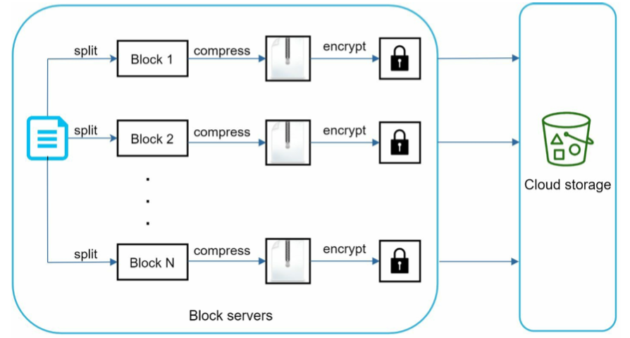
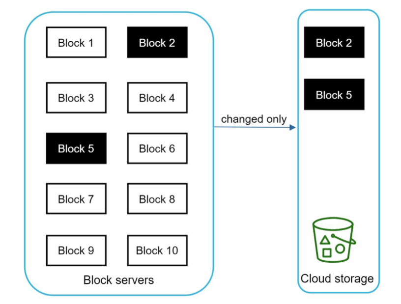

- [Component chart](#component-chart)
- [Upload/Edit flow](#uploadedit-flow)
  - [Upload file metadata](#upload-file-metadata)
  - [Upload file](#upload-file)
  - [Notify other clients](#notify-other-clients)
- [Download flow](#download-flow)
  - 
- [Notification flow](#notification-flow)
  - [Block servers](#block-servers)

# Component chart

* Overall chart

# Upload/Edit flow

Two requests are sent in parallel: add file metadata and upload the file to cloud storage. Both requests originate from client 1.

## Upload file metadata
1. Client app computes the file metadata to be uploaded.
   * File name, file content MD5
   * Number of blocks (assume each block is 4MB) and MD5 values for each block. 
2. Client app sends the metadata to web server. 
3. Web server computes globally unique block IDs for each block. 
4. Web server sends metadata and block IDs to metadata DB change the file upload status to “pending.”
5. Web server returns the block IDs to client app. 

## Upload file
6. Client app request block servers to upload blocks. 
7. Block servers connect to metadata DB to verify permissions.
8. Block servers verify correctness of MD5 values for each block
9. Block servers store blocks inside object storage. 

## Notify other clients
10. Web servers notify notification service that a new file is being added.
11. The notification service notifies relevant clients (client 2) that a file is being uploaded.

# Download flow
* Download flow is triggered by
  * A file is added or edited elsewhere. 
  * User proactively request to sync files

## 
1. Notification service informs client 2 that a file is changed somewhere else.
2. Once client 2 knows that new updates are available, it sends a request to fetch metadata.
3. API servers call metadata DB to fetch metadata of the changes.
4. Metadata is returned to the API servers.
5. Client 2 gets the metadata.
6. Once the client receives the metadata, it sends requests to block servers to download blocks.
7. Block servers first download blocks from cloud storage.
8. Cloud storage returns blocks to the block servers.
9. Client 2 downloads all the new blocks to reconstruct the file.

# Notification flow

* How does a client know if a file is added or edited by another client? There are two ways a client can know:
  * If client A is online while a file is changed by another client, notification service will inform client A that changes are made somewhere so it needs to pull the latest data.
  * If client A is offline while a file is changed by another client, data will be saved to the cache. When the offline client is online again, it pulls the latest changes.
* Here are a few options:
  * Long polling. Dropbox uses long polling \[10].
  * WebSocket. WebSocket provides a persistent connection between the client and the server. Communication is bi-directional.
* Even though both options work well, we opt for long polling for the following two reasons:
  * Communication for notification service is not bi-directional. The server sends information about file changes to the client, but not vice versa.
  * WebSocket is suited for real-time bi-directional communication such as a chat app. 

## Block servers
* Block servers overall chart

* Block servers enable delta sync

