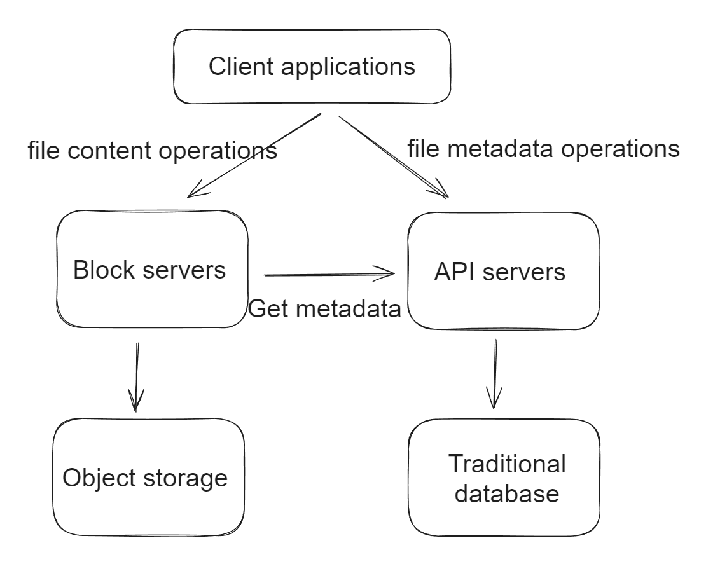
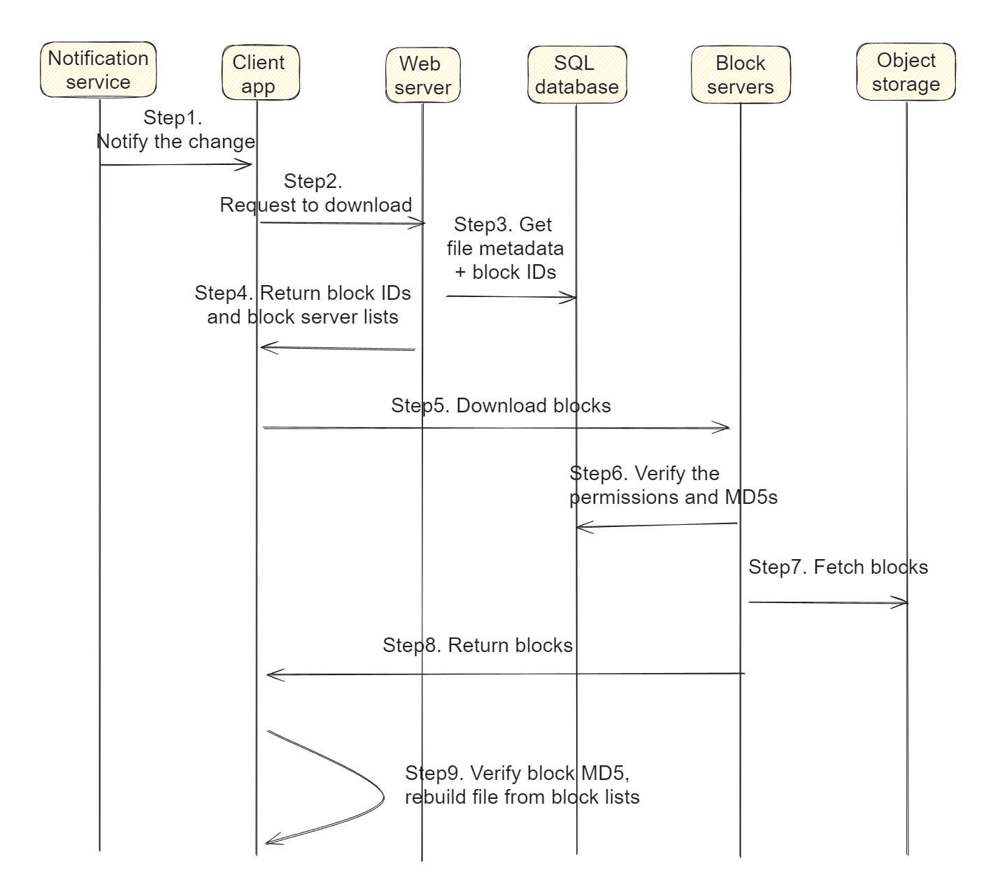

- [Component chart](#component-chart)
- [Upload/Edit flow](#uploadedit-flow)
  - [Upload file metadata](#upload-file-metadata)
  - [Upload file](#upload-file)
  - [Notify other clients (Optional)](#notify-other-clients-optional)
- [Download flow](#download-flow)
  - [Get notified about updates(Optional)](#get-notified-about-updatesoptional)
  - [Fetch metadata](#fetch-metadata)
  - [Fetch files](#fetch-files)
- [Notification flow](#notification-flow)
  - [Notify online and offline client](#notify-online-and-offline-client)
  - [Long polling vs websockets](#long-polling-vs-websockets)

# Component chart

* Overall chart

# Upload/Edit flow

Two requests are sent in parallel: add file metadata and upload the file to cloud storage. Both requests originate from client 1.

## Upload file metadata
1. Client app computes the file metadata to be uploaded.
   * File name, file content MD5
   * Number of blocks (assume each block is 4MB) and MD5 values for each block. 
2. Client app sends the metadata to web server. 
3. Web server computes globally unique block IDs for each block. 
4. Web server sends metadata and block IDs to metadata DB change the file upload status to “pending.”
5. Web server returns the block IDs to client app. 

## Upload file
6. Client app request block servers to upload blocks. 
7. Block servers connect to metadata DB to verify permissions.
8. Block servers verify correctness of MD5 values for each block
9. Block servers store blocks inside object storage. 

## Notify other clients (Optional)
10. Web servers notify notification service that a new file is being added.
11. The notification service notifies relevant clients (client 2) that a file is being uploaded.

# Download flow
* Download flow is triggered by
  * A file is added or edited elsewhere. 
  * User proactively request to sync files

## Get notified about updates(Optional)
1. Notification service informs client app that a file is changed somewhere else.

## Fetch metadata
2. Client app send requests to web servers to download files.
3. Web servers call metadata DB to fetch metadata of changes and block IDs. 
4. Web servers return block IDs and block servers to client apps.

## Fetch files
5. Client app sends requests to block servers to download blocks.
6. Block servers fetch metadata from metadata DB and verify permissions. 
7. Block servers fetch blocks from object storage. 
8. Block servers return blocks to client app.
9. Client app verify MD5 and build the entire file.

# Notification flow

* How does a client know if a file is added or edited by another client? 

## Notify online and offline client
* Client online: Notification service will inform client A that changes are made somewhere so it needs to pull the latest data.
* Client offline: while a file is changed by another client, data will be saved to the cache. When the offline client is online again, it pulls the latest changes.

## Long polling vs websockets
* Even though both options work well, we opt for long polling for the following two reasons:
  * Communication for notification service is not bi-directional. The server sends information about file changes to the client, but not vice versa.
  * WebSocket is suited for real-time bi-directional communication such as a chat app. 
