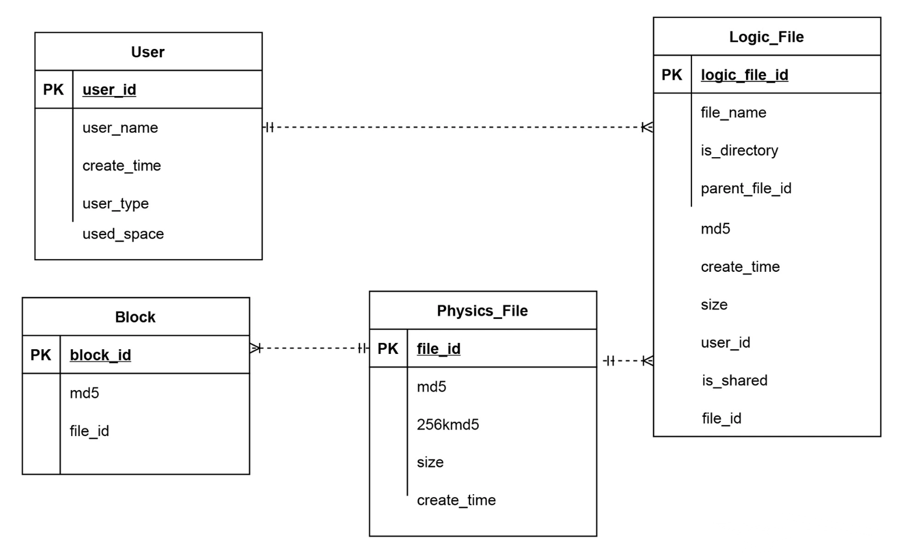

# Problem
* What if the same file should not be uploaded twice? 

# Solution
* Before a file is uploaded, its MD5 value will be computed. 
* For the same MD5 value, there is a chance of collision. So further verification including file size and MD5 value of file beginning 256KB data will also be computed. 
* Only when the following three metadata are completely the same, it will skip uploading.
  * Same MD5 value of the file to be uploaded
  * Same MD5 value of the file beginning 256KB data
  * Same file size

## Improved schema
* The original file table needs to be split into Logic_File and Physics_File. 
* Logic_File stores the metadata and maps to multiple physical files. 

