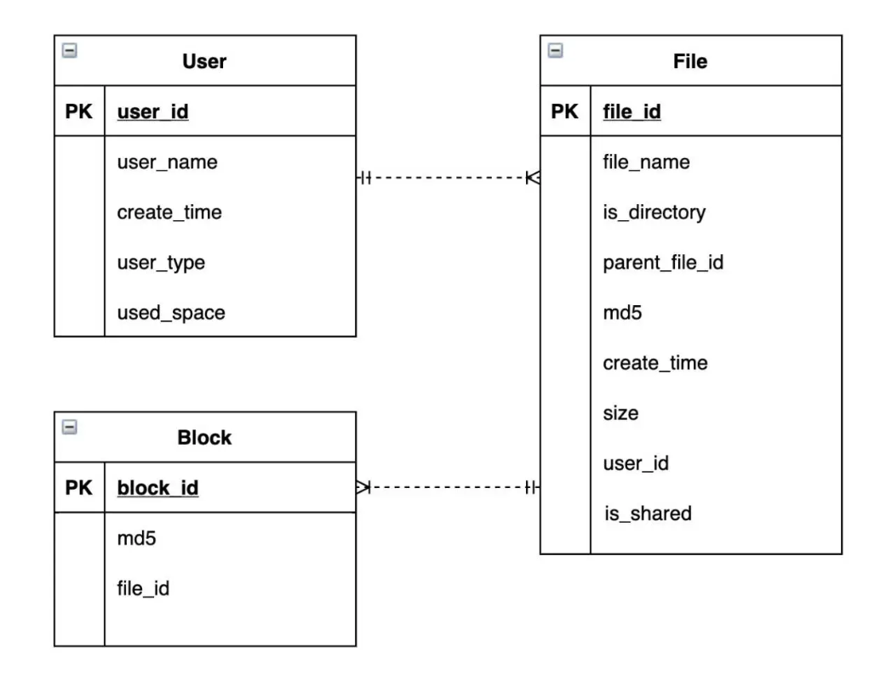

- [Metadata DB schema](#metadata-db-schema)
- [Object storage](#object-storage)

# Metadata DB schema
* User_id will be used as primary key for USER and FILE table. 
* block_id will be used as primary key for BLOCK table. 

# Object storage
* Object storage vs HDFS
  * Object storage is suitable for small sized files
  * HDFS is suitable for big files. 