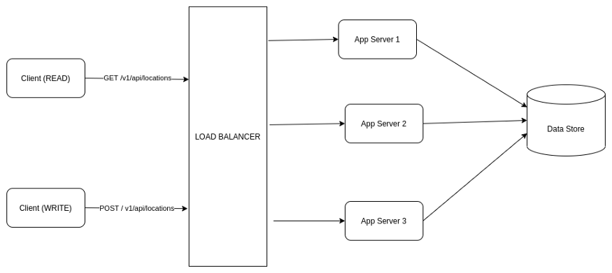

# Approach 3: Partition based on Geo-Hash & query matching hash
## Flowchart
* So how can we use Geo-Hash in our use case?
  * We need to first decide on a length of Geo-Hash which gives us a suitable area something like 30 to 50 square KM to search for. Typically, depending on the the Geo-Hash implementation, that length may be 4 to 6 — basically choose a length which can represent a reasonable search area & won’t result into hot shards. Let’s say we decide on length L. We will use this L length prefix as our shard key & distribute the current object locations to those shards for better load distribution.


### Write path
1. Our application receives constant ping containing current location details from objects like — delivery agents or drivers etc.
2. Using the Geo-Hash library, the app server figures out the Geo-Hash of the location.
3. The Geo-Hash is trimmed down to length L whatever we decide.
4. The app server now talks to the central metadata server to decide where to put the location. The metadata server may return index server details immediately if any shard already exists for the Geo-Hash prefix or it may create an entry for a logical shard & map it to any suitable index server & returns the result.
5. In parallel, the app server writes the data to the async queue to update the location in the database.

### Read path
1. Our application server receives a (lat, long) pair whose nearest locations we need to find.
2. The Geo-Hash is determined from the location, it’s trimmed down to length L.
3. We find out the neighbouring Geo-Hash for the prefix. Typically all 8-neighbours. When you query for neighbours of a Geo-Hash, depending on implementation, you may get 8 sample points each belonging to the different 8-neighbours. Why do we need to figure out neighbours? It may happen that the location that we received in the API request resides near a border or an edge of the region represented by the Geo-Hash. Some points might be there which exist in the neighbouring regions but are very close to our point, also the prefix of the neighbour regions may not at all match with the prefix of our point. So, we need to find Geo-Hash prefix of all 8-neighbours as well to find out all nearby points properly.
4. Now we have total 9 prefixes of length L. One for the region where our point belongs to, another 8 for neighbours. We can fire 9 parallel queries to retrieve all the points belonging to all these regions. This will make our system more efficient and less latent.
5. Once we have received all the data, our application server can rank them based on distance from our point & return appropriate response.

## Data modeling
### Geohash based schema
* Do we need to make any change to our low level design to support this technique?
  * We need to add Geo-Hash prefix to our database just in case in future we need to shard the db layer, we can do the same using hash prefix of length L as the shard key. Our new schema looks like below:

```
Collection Name: Locations
--------------------------
Fields:
-------
id - int (4+ bytes)
title - char (100 bytes)
type - char (1 byte)
description - char (1000 bytes)
lat - double (8 bytes)
long - double (8 bytes)
geo_hash - char(10 bytes)
geo_hash_prefix - char(6 bytes)
timestamp - int (4-8 bytes)
metadata - JSON (2000 bytes)

City to shard mapping:
----------------------
geo_hash_prefix (length = L)     shard_id
------------------------------------------
a89b3                             101
ab56e                             103
fy78a                             109
c78ab                             908
a78cd                             834

Shard to Physical server mapping
--------------------------------
shard_id       index_server
----------------------------
101             index-1
103             index-2
109             index-1
908             index-3
834             index-2
```

### Implement geohash in memory

* How can we implement such index in our system? We need three basic things to implement such an index:
  1. Current location of an object (drivers in case of Uber, delivery agent’s location in case of a food delivery app).
  2. Mapping from a Geo-Hash prefix to the objects
  3. Proper expiry of the dynamic location data since in this use case, we are dealing with dynamic objects.
* We can use Redis to model all the above requirements:
  1. We can represent the current location of an object as a normal key value pair where key is the object id & value is the location information. When we get a location pinged from a device, we identify the Geo-Hash of that location, take hash prefix of length L , find out the shard & index machine where it lies from the central metadata registry & add or update the location information in that machine. The location keeps getting updated every 10 or 30 seconds whatever we decide. As you remember, these locations will keep on getting updated always. We can set the expiry to few minutes for this kind of key & with every update, we can increase the expiry time.     "7619": {"lat": "89.93", "long": 52.134, "metadata": {...}}
  2. For requirements 2 & 3 above, we can implement Redis sorted set (priority queue). The key of the sorted set will be the Geo-Hash prefix of length L. The member is objects’s id which are currently sharing the Geo-Hash prefix (basically they are withing the region represented by the Geo-Hash). And the score is current timestamp, we use the score to delete older data.

```
// This is how we set Redis sorted set for a given object location belonging to a Geo-Hash prefix:
$ ZADD key member score 
$ ZADD geo_hash_prefix object_id current_timestamp

Example:
$ ZADD 6e10h 7619 1603013034
$ ZADD 6e10h 2781 1603013050
$ ZADD a72b8 9082 1603013089

// Let's say our expiry time is 30 seconds, so just before retrieving current objects for a request belonging to a Geo-Hash prefix, we can delete all data older than current timestamp - 30 seconds, this way, expiration will happen gradually over time:

$ ZREMRANGEBYSCORE geo_hash_prefix -INF current_timestamp - 30 seconds
// -INF = Redis understands it as the lowest value
```

* How to reduce the latency even further as our requirements says the system needs to be very responsive?
  * We can have replica of index servers across countries in case our data is static. For dynamic data like cab location, these are very region specific. So we can have geographically distributed index servers which are indexed only with data from the concerned region or country. Example: If we get data from China, only index servers from China will index that data. For fault tolerance purpose, we can have replica of index servers across country or different regions in a country. We can use DNS level load balancing to redirect the users from different country to the nearest available server.


# Approach 0: Store location in SQL database

## Overall flowchart



## Storage option 0: Store data as plain latitude/longtitude
* Use decimal to represent latitude/longtitude to avoid excessive precision (0.0001° is <11 m, 1′′ is <31 m)
* To 6 decimal places should get you to around ~10cm of accuracy on a coordinate.


```SQL
--Add location
Insert into Location (locationId, latitude, longtitude) values ("id1", 48.88, 2.31)

--Search nearby k locations within r radius
Select locationId from Location 
  where 48.88 - radius < latitude < 48.88 + radis and 2.31 - radius < longtitude < 2.31 + radius
```

## Storage option 1: Store data as spatial data types


```SQL
--select top distance results
SELECT locationId,locationName,st_distance_sphere(ST_GeomFromText('POINT(39.994671 116.330788)',4326),address) AS distance
    -> FROM location;

--find all locations within a poly
SET @poly =
     'Polygon((
    '40.016712 116.319618',
    '40.016712 116.412773',
    '39.907024 116.412773',
    '39.907024 116.319618',
    '40.016712 116.319618'))';

SELECT locationId,locationName FROM Location
WHERE MBRContains(ST_GeomFromText(@poly,4326),address);
```

## Storage option 2: PostgreSQL spatial query - KNN

1. PostgreSQL supports KNN search on top using distance operator <->

```SQL
select locationId,locationName, address
    from Location
order by pos <-> point(51.516,-0.12)
    limit 3;
/*
   locationId   |    locationName        |           address           
------------+------------------------+-------------------------
   21593238 | All Bar One            | (51.5163499,-0.1192746)
   26848690 | The Shakespeare's Head | (51.5167871,-0.1194731)
  371049718 | The Newton Arms        | (51.5163032,-0.1209811)
(3 rows)

# evaluated on 30k rows in total
Time: 18.679 ms
*/
```

2. The above query takes about 20 minutes, using KNN specific index (called GiST / SP-GiST) to speed up

```SQL
create index on Location using gist(address);
select locationId,locationName, address
    from Location
order by address <-> point(51.516,-0.12) limit 3;

/*
   locationId   |    locationName        |           address           
------------+------------------------+-------------------------
   21593238 | All Bar One            | (51.5163499,-0.1192746)
   26848690 | The Shakespeare's Head | (51.5167871,-0.1194731)
  371049718 | The Newton Arms        | (51.5163032,-0.1209811)
(3 rows)

# evaluated on 30k rows in total
Time: 0.849 ms
*/
```

* [https://tapoueh.org/blog/2013/08/the-most-popular-pub-names/](https://tapoueh.org/blog/2013/08/the-most-popular-pub-names/)
