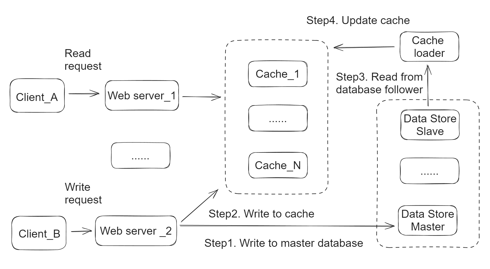
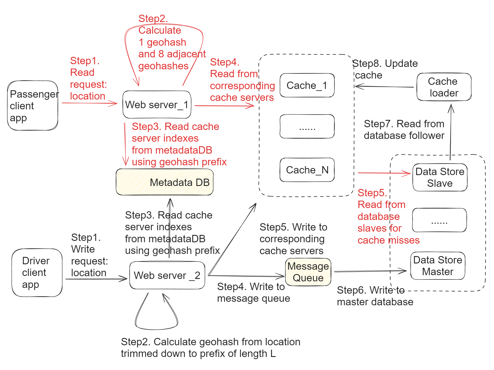

- [Single machine solution](#single-machine-solution)
- [Distributed solution](#distributed-solution)
  - [Write path (Black color)](#write-path-black-color)
  - [Read path (Red color)](#read-path-red-color)
  - [City-based partition scheme](#city-based-partition-scheme)
      - [Get the city name](#get-the-city-name)
      - [Cons: City border problem](#cons-city-border-problem)
  - [GeoHash based partition scheme](#geohash-based-partition-scheme)

# Single machine solution
* Assumption: If the total number of locations fits in memory of a single machine 
* Write path
  1. Client_B request will write to master database through web servers. 
  2. Client_B will write to cache. This needs to happen after step1 because database is the source of truth.
  3. Every few minutes, cache loader will load entries after the last timestamp/id from the database follower. 
     * Cache loader reads the data from a “Follower machine” to avoid adding overhead to master database.  
  4. Cache loader will update the cache entries if needed. 
     * In case the data is already present there, depending on the timestamp of the in-memory object, the loader can decide whether to update the data or skip it — if the database has more updated data / higher timestamp, update the data in cache. 



# Distributed solution



## Write path (Black color)
1. Web servers receive constant ping from uber driver client app containing current drivers' location details. 
2. Web servers calculate geohashes from requests' location (latitude, longtitude), and trim down to prefix of length L.
3. Web servers query the metadata DB to get the indexes of cache servers. The metadata server may return index server details immediately if any shard already exists for the Geo-Hash prefix or it may create an entry for a logical shard & map it to any suitable index server & returns the result.
4. Web servers send write/update request to message queue. 
5. Web servers send write/update request to corresponding cache servers.
6. Master database pull the write/update message from message queue. 
7. Cache loaders read the write request from database followers. 
8. Cache loaders update the corresponding cache servers. 

## Read path (Red color)
1. Passenger sends a (lat, long) pair to web servers of which nearest locations we need to find.
2. Web servers calculate geohashes from requests' location (latitude, longtitude), and trim down to prefix of length L. And then web servers calculate 8 adjacent geohashes. 
3. Web server queries cache servers for 9 geohash prefixes of length L. One for the region where our point belongs to, another 8 for neighbours. We can fire 9 parallel queries to retrieve all the points belonging to all these regions. This will make our system more efficient and less latent.
4. Web servers query cache servers about neighboring drivers. 
5. In case there is a cache miss, the result will come from web servers. 

## City-based partition scheme
* IP address of incoming request => City => ShardId => Cache Index Server
* Each city is divided into several logical shards. 

``` json
City to shard mapping:
----------------------
city           shard_id
------------------------
Bangalore        101
Hyderabad        103
Mumbai           109
New York         908
San Francisco    834

Shard to Physical server mapping
--------------------------------
shard_id       index_cache_server
----------------------------
101             index-1
103             index-2
109             index-1
908             index-3
834             index-2

A shard (say index-1) content (location object) looks like below:
"San Francisco": [
    {
        "agent_id": 7897894,
        "lat": 89.678,
        "long": 67.894
    }, 
    {
        "agent_id": 437833,
        "lat": 88.908,
        "long": 67.109
    }, 
    ...
 ]
```

#### Get the city name
* Google Maps provides reverse Geo-Coding API to identify current city & related location information. The API can be integrated both in Android & iOS Apps.

#### Cons: City border problem
* City border problem: It’s quite possible that one of our delivery agents is currently located near the boarder of two cities — say he is at city A, an order comes from a neighbour city B & the agent’s distance from the customer at city B is quite less, but unfortunately we can’t dispatch the agent as he is not in city B. So at times, city based partitioning may not be optimal for all use cases. Also with growing demand from a city for a particular occasion like Christmas or New Year, a city based shard can become very hot. This strategy might work for hyper local systems but not for a system like Uber due to its very high scale.
* One possible solution: Use more complex sharding keys. For example, Uber uses City + Product sharding. Uber employs similar partitioning strategy but it’s not only on city/region — it’s region + product type (pool, XL or Go whatever). Uber has geographically distributed products across countries. So partitioning by a combination of product type & city works fine for them. To search for available Uber pool cabs in a region, you just go to the pool bucket for that region & retrieve all the cabs currently available there & likewise for all other use cases.

## GeoHash based partition scheme

```json
Collection Name: Locations
--------------------------
Fields:
-------
id - int (4+ bytes)
title - char (100 bytes)
type - char (1 byte)
description - char (1000 bytes)
lat - double (8 bytes)
long - double (8 bytes)
geo_hash - char(10 bytes)
geo_hash_prefix - char(6 bytes)
timestamp - int (4-8 bytes)
metadata - JSON (2000 bytes)

geohash_prefix to shard mapping:
----------------------
geo_hash_prefix (length = L)     shard_id
------------------------------------------
a89b3                             101
ab56e                             103
fy78a                             109
c78ab                             908
a78cd                             834

Shard to Physical server mapping
--------------------------------
shard_id       index_server
----------------------------
101             index-1
103             index-2
109             index-1
908             index-3
834             index-2
```
