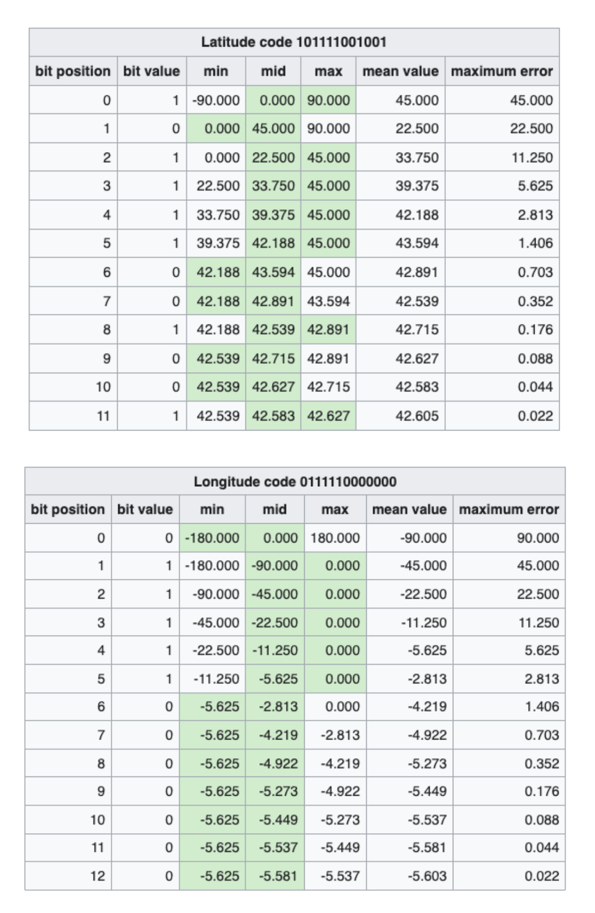

- [SQL based nearest algorithm](#sql-based-nearest-algorithm)
  - [Pros \& Cons](#pros--cons)
  - [Size estimation](#size-estimation)
  - [SQL spatial datatypes](#sql-spatial-datatypes)
  - [Implementation in SQL](#implementation-in-sql)
    - [Storage option 1: Store data as spatial data types](#storage-option-1-store-data-as-spatial-data-types)
    - [Storage option 2: PostgreSQL spatial query - KNN](#storage-option-2-postgresql-spatial-query---knn)
- [Dynamic grids - Squad tree](#dynamic-grids---squad-tree)
  - [Pros \& Cons](#pros--cons-1)
  - [Size estimation](#size-estimation-1)
- [Geohashes](#geohashes)
  - [Steps](#steps)
  - [Redis impl](#redis-impl)
- [Hilbert Curves](#hilbert-curves)

# SQL based nearest algorithm

```sql
Select * from Places 
where Latitude between X-D and X+D 
and Longitude between Y-D and Y+D 

-- Between queries will create large amounts of intermediate data and create high costs on servers.
-- GridID will greatly reduce the amount of intermediate data size.

select * from Places 
where latitude between X-D and X+D 
and longitude between Y-D and Y+D 
and gridID in (gridIDx0,gridIDx1,gridIDx2,gridIDx3,gridIDx4,gridIDx5,gridIDx6,gridIDx7,gridIDx8);
```


## Pros & Cons
* Pros: Simple and straightforward
* Cons: Some grid will be much denser than others. How to choose the optimal grid size. 

## Size estimation

```
# Size of world earth 200 M square mile
# Size of grid = 10 square mile
# Number of grids:
200 M / 10 = 20M Grids

# Each grid has maximum 500 places
# Each location has 24 bytes (string as location Id + double as longtitude + double as latitude). 
# In total it will take
20 M * 500 * 24 = 24 * 10^10 = 240GB
```


## SQL spatial datatypes
* Use decimal to represent latitude/longtitude to avoid excessive precision (0.0001° is <11 m, 1′′ is <31 m)
* To 6 decimal places should get you to around ~10cm of accuracy on a coordinate.


```SQL
--Add location
Insert into Location (locationId, latitude, longtitude) values ("id1", 48.88, 2.31)

--Search nearby k locations within r radius
Select locationId from Location 
  where 48.88 - radius < latitude < 48.88 + radis and 2.31 - radius < longtitude < 2.31 + radius
```

## Implementation in SQL
### Storage option 1: Store data as spatial data types


```SQL
--select top distance results
SELECT locationId,locationName,st_distance_sphere(ST_GeomFromText('POINT(39.994671 116.330788)',4326),address) AS distance
    -> FROM location;

--find all locations within a poly
SET @poly =
     'Polygon((
    '40.016712 116.319618',
    '40.016712 116.412773',
    '39.907024 116.412773',
    '39.907024 116.319618',
    '40.016712 116.319618'))';

SELECT locationId,locationName FROM Location
WHERE MBRContains(ST_GeomFromText(@poly,4326),address);
```

### Storage option 2: PostgreSQL spatial query - KNN

1. PostgreSQL supports KNN search on top using distance operator <->

```SQL
select locationId,locationName, address
    from Location
order by pos <-> point(51.516,-0.12)
    limit 3;
/*
   locationId   |    locationName        |           address           
------------+------------------------+-------------------------
   21593238 | All Bar One            | (51.5163499,-0.1192746)
   26848690 | The Shakespeare's Head | (51.5167871,-0.1194731)
  371049718 | The Newton Arms        | (51.5163032,-0.1209811)
(3 rows)

# evaluated on 30k rows in total
Time: 18.679 ms
*/
```

2. The above query takes about 20 minutes, using KNN specific index (called GiST / SP-GiST) to speed up

```SQL
create index on Location using gist(address);
select locationId,locationName, address
    from Location
order by address <-> point(51.516,-0.12) limit 3;

/*
   locationId   |    locationName        |           address           
------------+------------------------+-------------------------
   21593238 | All Bar One            | (51.5163499,-0.1192746)
   26848690 | The Shakespeare's Head | (51.5167871,-0.1194731)
  371049718 | The Newton Arms        | (51.5163032,-0.1209811)
(3 rows)

# evaluated on 30k rows in total
Time: 0.849 ms
*/
```

* [https://tapoueh.org/blog/2013/08/the-most-popular-pub-names/](https://tapoueh.org/blog/2013/08/the-most-popular-pub-names/)


# Dynamic grids - Squad tree
* A squad tree is similar to a trie. 


```python
def insertInTree(root, data):
    """Pseudo code for inserting a point in a Quadtree"""
    if not root
        createLeafAndInsertNode(root, data) 
    elif root.isLeaf() and root.size() < BUCKET_SIZE:
        root.addNode(data)
    elif root.isLeaf(): # Leaf node must be full
        root.decomposeLeafNodeAndInsert(data)
    # Find the appropriate sub-tree to insert node
    elif root.northwest.isValidParent(data)
        insertInTree(root.northwest, data)  
    elif root.southwest.isValidParent(data)
        insertInTree(root.southwest, data)  
    elif root.southeast.isValidParent(data)
        insertInTree(root.southeast, data)  
    else   
        insertInTree(root.northeast, data)

def getPointsInRange(root, range):
    points = []
    # If there is no intersection with the area, return
    if not root.intersect(range):
        return points
    # Return all data points on a leaf node
    if root.isLeaf():
        points.append(root.getNodes())
        return points
    # Recursively append the points from the 4 quadrants
    points.append(getPointsInRange(root.northwest, range))
    points.append(getPointsInRange(root.northeast, range))
    points.append(getPointsInRange(root.southeast, range))
    points.append(getPointsInRange(root.southwest, range))
    return points
```

## Pros & Cons
* Pros:
  * It suit well for unevenly distributed users. 
* Cons:
  * Sometimes the tree could be too high and result in low performance. 

## Size estimation

```
# Total number of locations is 500M. 
# Each grid holds most 500 places.
* Then there are in total 1M leaf nodes. 

# There are roughly 0.5M internal nodes. A squad tree will have roughly 1/2 internal nodes
* Leaf nodes space usage = 1M _ 24 _ 500 = 12000M = 1.2 GB
* Internal nodes space usage 32 bytes \* 0.5M = 16 MB 
```

* Reference: [https://medium.com/@waleoyediran/spatial-indexing-with-quadtrees-b998ae49336](https://medium.com/@waleoyediran/spatial-indexing-with-quadtrees-b998ae49336)

# Geohashes
## Steps
1. For latitude range [-90, 90] and longtitude range [-180, 180], it will be divided into section: below the average value and bigger than average value. 

* For example, 42.60411 will be encoded as "101111001001" and -5.59041 will be encoded as "011111000000"



2. After getting two binary values, they are concatenated together as a 25 bit value "01101 11111 11000 00100 00010". This 32 bit value will be encoded as "ezs42". Typically the precision of a 25 bit value is 4.9KM. 
  * And this 5 bit value will be divided into 5 sections. 
  * Each section corresponds to 0-31 in decimal value. 


## Redis impl
* Redis uses a 52 bit Geohash encode, and it has a precision value of 0.6m. 
* Redis will SkipList to store geoHashes for faster neighbor search. 


# Hilbert Curves
