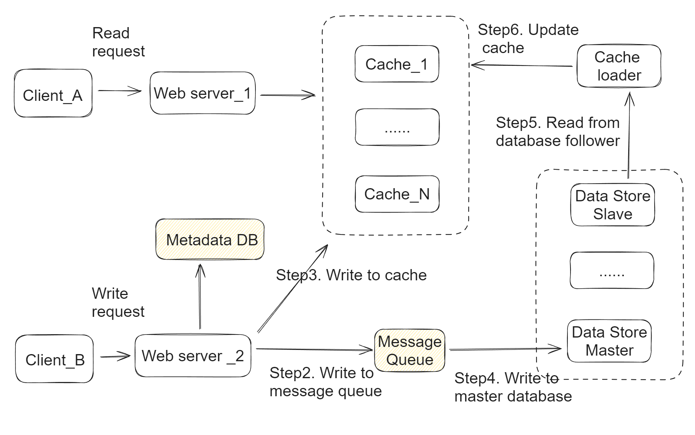

- [Single machine solution](#single-machine-solution)
- [Distributed solution](#distributed-solution)
  - [Locate partition](#locate-partition)
    - [Example](#example)
  - [Get the city name](#get-the-city-name)
    - [Cons: City border problem](#cons-city-border-problem)

# Single machine solution
* Assumption: If the total number of locations fits in memory of a single machine 
* Write path
  1. Client_B request will write to master database through web servers. 
  2. Client_B will write to cache. This needs to happen after step1 because database is the source of truth.
  3. Every few minutes, cache loader will load entries after the last timestamp/id from the database follower. 
     * Cache loader reads the data from a “Follower machine” to avoid adding overhead to master database.  
  4. Cache loader will update the cache entries if needed. 
     * In case the data is already present there, depending on the timestamp of the in-memory object, the loader can decide whether to update the data or skip it — if the database has more updated data / higher timestamp, update the data in cache. 


# Distributed solution
* Write path
  1. Write request first comes to the metadata registry. using the IP address of the request’s origin, we determine in which city the delivery agent exactly is or from where the customer request came. 
  2. Using the resolved city, shard id is identified, then using shard id, 
  3. index server is identified. 
  4. Finally the request is directed towards that particular index server. So we don’t need to query all the cache / index server any more. Note that, in this architecture, neither read nor write requests talk to the data store directly, this reduces the API latency even further.



## Locate partition

* IP address of incoming request => City => ShardId => Cache Index Server
* Each city is divided into several logical shards. 

### Example
``` json
City to shard mapping:
----------------------
city           shard_id
------------------------
Bangalore        101
Hyderabad        103
Mumbai           109
New York         908
San Francisco    834

Shard to Physical server mapping
--------------------------------
shard_id       index_cache_server
----------------------------
101             index-1
103             index-2
109             index-1
908             index-3
834             index-2

A shard (say index-1) content (location object) looks like below:
"San Francisco": [
    {
        "agent_id": 7897894,
        "lat": 89.678,
        "long": 67.894
    }, 
    {
        "agent_id": 437833,
        "lat": 88.908,
        "long": 67.109
    }, 
    ...
 ]
```

## Get the city name
* Google Maps provides reverse Geo-Coding API to identify current city & related location information. The API can be integrated both in Android & iOS Apps.

### Cons: City border problem
* City border problem: It’s quite possible that one of our delivery agents is currently located near the boarder of two cities — say he is at city A, an order comes from a neighbour city B & the agent’s distance from the customer at city B is quite less, but unfortunately we can’t dispatch the agent as he is not in city B. So at times, city based partitioning may not be optimal for all use cases. Also with growing demand from a city for a particular occasion like Christmas or New Year, a city based shard can become very hot. This strategy might work for hyper local systems but not for a system like Uber due to its very high scale.
* One possible solution: Use more complex sharding keys. For example, Uber uses City + Product sharding. Uber employs similar partitioning strategy but it’s not only on city/region — it’s region + product type (pool, XL or Go whatever). Uber has geographically distributed products across countries. So partitioning by a combination of product type & city works fine for them. To search for available Uber pool cabs in a region, you just go to the pool bucket for that region & retrieve all the cabs currently available there & likewise for all other use cases.
