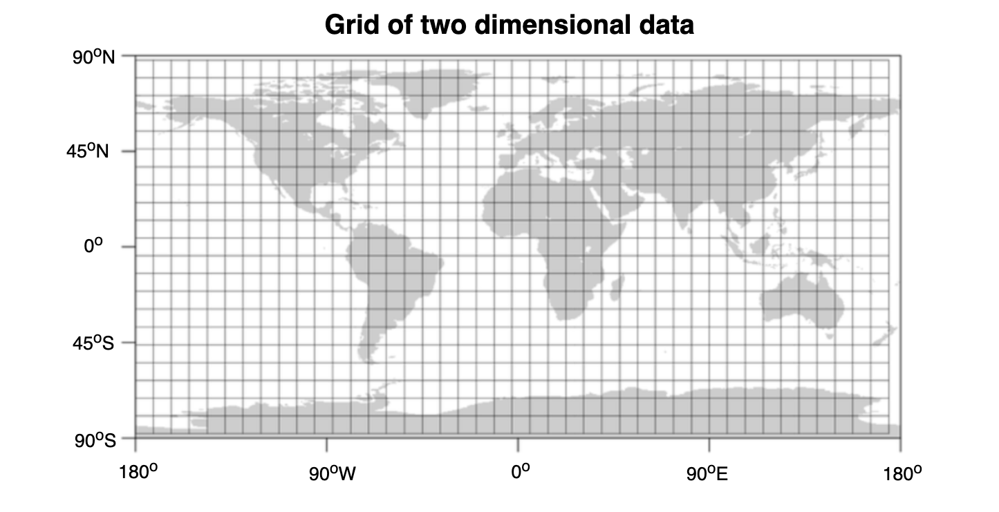
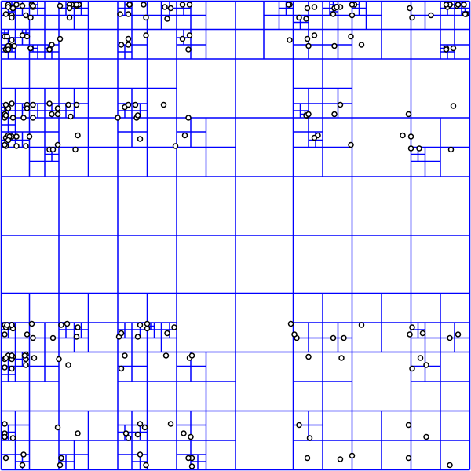

- [Motivation](#motivation)
- [Geohash Categories](#geohash-categories)
  - [Static grids](#static-grids)
  - [Dynamic grids - Squad tree](#dynamic-grids---squad-tree)
  - [Size estimation](#size-estimation)
- [Represent as Geohashes](#represent-as-geohashes)
  - [Represent as Hilbert Curves](#represent-as-hilbert-curves)

# Motivation
* We have seen that if we have a very high scale like millions of queries per second ( for services like Uber, Lyft ), only region / city based partitioning can not save us. We need to find a strategy where we can minimize the search area even more or have a flexibility to increase or decrease the search area as per our need may be based on radius.
* There is something called Geo-Hash, it’s an encoding mechanism for a given location ( lat, long pair ). The core concept is to imagine the earth as a flattened surface & keep on dividing the surface into multiple grids (squares or rectangles, depends on implementation). 
* So conceptually, the more grids we add, the region area keeps on getting smaller — the precision of the area becomes very high & the length of the string representing the ares increases e.g; string "02" represents an ares of 20\_000 KM x 20\_000 KM, string "021201" may represent an area of 50 KM x 50 KM. Please note: these figures mentioned are not mathematically accurate, these are just for building our understanding about the core concepts of Geo-Hash. In short:

# Geohash Categories
## Static grids
* Divide the world into a set of fixed size grids. 
* Then each grid could have a unique grid id based on its coordinate. 
* Cons: Some grid will be much denser than others. How to choose the optimal grid size. 
* Pros: When having the grid Id as a query dimension, the SQL query will be much faster. 

```
Select * from Places where 
Latitude between X-D and X+D 
and Longitude between Y-D and Y+D 
and GridID in (GridID, GridID1, GridID2, ..., GridID8)
```



## Dynamic grids - Squad tree
* A squad tree is similar to a trie. 



```
def insertInTree(root, data):
    """Pseudo code for inserting a point in a Quadtree"""
    if not root
        createLeafAndInsertNode(root, data) 
    elif root.isLeaf() and root.size() < BUCKET_SIZE:
        root.addNode(data)
    elif root.isLeaf(): # Leaf node must be full
        root.decomposeLeafNodeAndInsert(data)
    # Find the appropriate sub-tree to insert node
    elif root.northwest.isValidParent(data)
        insertInTree(root.northwest, data)  
    elif root.southwest.isValidParent(data)
        insertInTree(root.southwest, data)  
    elif root.southeast.isValidParent(data)
        insertInTree(root.southeast, data)  
    else   
        insertInTree(root.northeast, data)

def getPointsInRange(root, range):
    points = []
    # If there is no intersection with the area, return
    if not root.intersect(range):
        return points
    # Return all data points on a leaf node
    if root.isLeaf():
        points.append(root.getNodes())
        return points
    # Recursively append the points from the 4 quadrants
    points.append(getPointsInRange(root.northwest, range))
    points.append(getPointsInRange(root.northeast, range))
    points.append(getPointsInRange(root.southeast, range))
    points.append(getPointsInRange(root.southwest, range))
    return points
```

## Size estimation

* Static grid 
  * Size of world earth 200 M square mile
  * Size of grid = 10 square mile
  * Number of grids = 200 M / 10 = 20M Grids
  * Each grid has maximum 500 places
  * Each location has 24 bytes (string as location Id + double as longtitude + double as latitude). 
  * In total 2M _ 2^3 _ 3 \* 500 = 240GB
* Dynamic grid
  * Total number of locations is 500M. 
  * Each grid holds most 500 places.
  * Then there are in total 1M leaf nodes. 
  * There are roughly 0.5M internal nodes. A squad tree will have roughly 1/2 internal nodes
  * Leaf nodes space usage = 1M _ 24 _ 500 = 12000M = 1.2 GB
  * Internal nodes space usage 32 bytes \* 0.5M = 16 MB 
* Reference: [https://medium.com/@waleoyediran/spatial-indexing-with-quadtrees-b998ae49336](https://medium.com/@waleoyediran/spatial-indexing-with-quadtrees-b998ae49336)

# Represent as Geohashes

## Represent as Hilbert Curves
