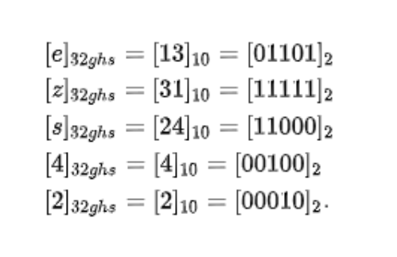

- [SQL based nearest algorithm](#sql-based-nearest-algorithm)
  - [Pros \& Cons](#pros--cons)
  - [Size estimation](#size-estimation)
- [Dynamic grids - Squad tree](#dynamic-grids---squad-tree)
  - [Pros \& Cons](#pros--cons-1)
  - [Size estimation](#size-estimation-1)
- [Geohashes](#geohashes)
  - [Steps](#steps)
  - [Redis impl](#redis-impl)
- [Hilbert Curves](#hilbert-curves)

# SQL based nearest algorithm

```sql
Select * from Places 
where Latitude between X-D and X+D 
and Longitude between Y-D and Y+D 

-- Between queries will create large amounts of intermediate data and create high costs on servers.
-- GridID will greatly reduce the amount of intermediate data size.

select * from Places 
where latitude between X-D and X+D 
and longitude between Y-D and Y+D 
and gridID in (gridIDx0,gridIDx1,gridIDx2,gridIDx3,gridIDx4,gridIDx5,gridIDx6,gridIDx7,gridIDx8);
```


## Pros & Cons
* Pros: Simple and straightforward
* Cons: Some grid will be much denser than others. How to choose the optimal grid size. 

## Size estimation

```
# Size of world earth 200 M square mile
# Size of grid = 10 square mile
# Number of grids:
200 M / 10 = 20M Grids

# Each grid has maximum 500 places
# Each location has 24 bytes (string as location Id + double as longtitude + double as latitude). 
# In total it will take
20 M * 500 * 24 = 24 * 10^10 = 240GB
```

# Dynamic grids - Squad tree
* A squad tree is similar to a trie. 


```python
def insertInTree(root, data):
    """Pseudo code for inserting a point in a Quadtree"""
    if not root
        createLeafAndInsertNode(root, data) 
    elif root.isLeaf() and root.size() < BUCKET_SIZE:
        root.addNode(data)
    elif root.isLeaf(): # Leaf node must be full
        root.decomposeLeafNodeAndInsert(data)
    # Find the appropriate sub-tree to insert node
    elif root.northwest.isValidParent(data)
        insertInTree(root.northwest, data)  
    elif root.southwest.isValidParent(data)
        insertInTree(root.southwest, data)  
    elif root.southeast.isValidParent(data)
        insertInTree(root.southeast, data)  
    else   
        insertInTree(root.northeast, data)

def getPointsInRange(root, range):
    points = []
    # If there is no intersection with the area, return
    if not root.intersect(range):
        return points
    # Return all data points on a leaf node
    if root.isLeaf():
        points.append(root.getNodes())
        return points
    # Recursively append the points from the 4 quadrants
    points.append(getPointsInRange(root.northwest, range))
    points.append(getPointsInRange(root.northeast, range))
    points.append(getPointsInRange(root.southeast, range))
    points.append(getPointsInRange(root.southwest, range))
    return points
```

## Pros & Cons
* Pros:
  * It suit well for unevenly distributed users. 
* Cons:
  * Sometimes the tree could be too high and result in low performance. 

## Size estimation

```
# Total number of locations is 500M. 
# Each grid holds most 500 places.
* Then there are in total 1M leaf nodes. 

# There are roughly 0.5M internal nodes. A squad tree will have roughly 1/2 internal nodes
* Leaf nodes space usage = 1M _ 24 _ 500 = 12000M = 1.2 GB
* Internal nodes space usage 32 bytes \* 0.5M = 16 MB 
```

* Reference: [https://medium.com/@waleoyediran/spatial-indexing-with-quadtrees-b998ae49336](https://medium.com/@waleoyediran/spatial-indexing-with-quadtrees-b998ae49336)

# Geohashes
## Steps
1. For latitude range [-90, 90] and longtitude range [-180, 180], it will be divided into section: below the average value and bigger than average value. 

* For example, 42.60411 will be encoded as "101111001001" and -5.59041 will be encoded as "011111000000"


2. After getting two binary values, they are concatenated together as a 25 bit value "01101 11111 11000 00100 00010". This 32 bit value will be encoded as "ezs42". Typically the precision of a 25 bit value is 4.9KM. 
  * And this 5 bit value will be divided into 5 sections. 
  * Each section corresponds to 0-31 in decimal value. 




## Redis impl
* Redis uses a 52 bit Geohash encode, and it has a precision value of 0.6m. 
* Redis will SkipList to store geoHashes for faster neighbor search. 


# Hilbert Curves
