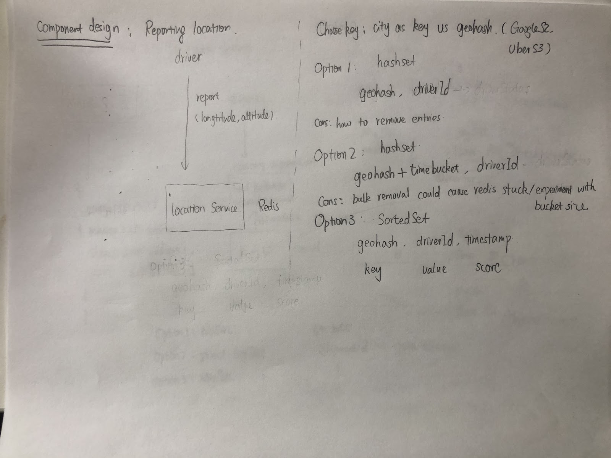
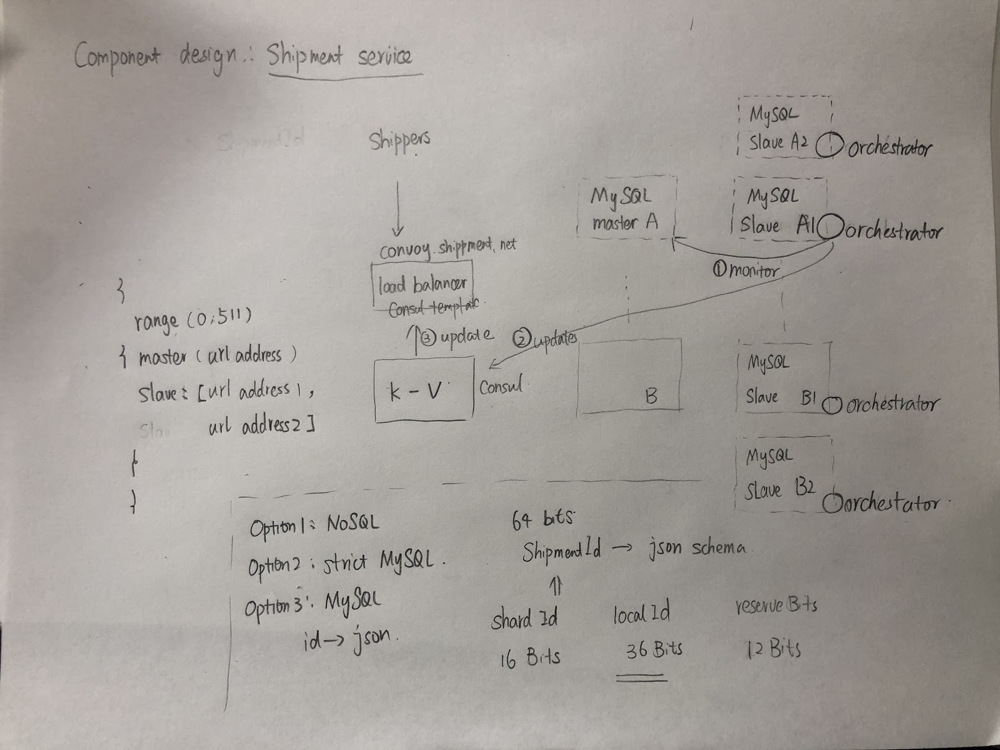

- [Use cases](#use-cases)
- [Functional requirements](#functional-requirements)
- [Non-functional requirements](#non-functional-requirements)
  - [High performance](#high-performance)
  - [Scalable](#scalable)
- [Real world](#real-world)
- [References](#references)
- [Appendix](#appendix)
      - [Past chart](#past-chart)
    - [TODO](#todo)

# Use cases

* Real time cab booking service like Uber, Lyft, Bolt.
* Real time hotel / restaurant search like Yelp.
* Target shoppers nearing a certain store for a marketing promotion.
* Hyper-local delivery system — dispatch delivery agents for restaurant order like Uber Eats.

# Functional requirements
* Given a location by a client or user, our service should figure out certain number of nearby locations.
  * NN: Given a location, find the nearest k points
  * Range query: Retrieve all points within a specific spatial range. 
* Update location

# Non-functional requirements
## High performance
* The location should be accurate so that the delay in update should response ≤ 200 milliseconds. 
* We need to support 50000 read queries per second & 10000 write queries per second.

## Scalable
* Our service is used world wide.
* As users grow in our system, the system should scale linearly without adding much burden.

# Real world

* [Unique GeoId in Twitter](https://blog.twitter.com/engineering/en_us/a/2010/woeids-in-twitters-trends.html)
* [TODO: Uber Marketplace: Location Serving & Storage in the Uber Marketplace](https://www.youtube.com/watch?v=AzptiVdUJXg\&ab_channel=UberEngineering)

# References

* [R tree / KD - tree](https://blog.mapbox.com/a-dive-into-spatial-search-algorithms-ebd0c5e39d2a)
* [Geohash vs S2 vs H3](https://dev.to/phm200/the-problem-of-nearness-part-2-a-solution-with-s2-23gm)
* [Redis data model based basic algorithm for finding available drivers](https://www.youtube.com/watch?v=cSFWlF96Sds)
* [四火唠嗑](https://www.raychase.net/6312)
* [Indepth system design discussion](https://kousiknath.medium.com/system-design-design-a-geo-spatial-index-for-real-time-location-search-10968fe62b9c)

# Appendix
  * A great percentage of the below post comes from this blog [https://kousiknath.medium.com/system-design-design-a-geo-spatial-index-for-real-time-location-search-10968fe62b9c](https://kousiknath.medium.com/system-design-design-a-geo-spatial-index-for-real-time-location-search-10968fe62b9c)

#### Past chart

### TODO

* Uber architecture and system design: [https://medium.com/nerd-for-tech/uber-architecture-and-system-design-e8ac26690dfc](https://medium.com/nerd-for-tech/uber-architecture-and-system-design-e8ac26690dfc)
