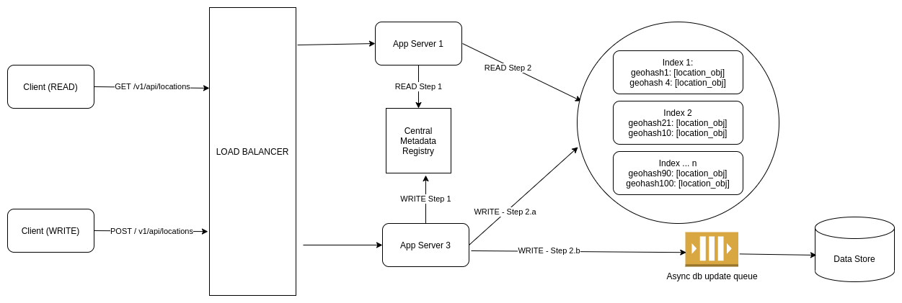

# Partition based on Geo-Hash & query matching hash
## Flowchart
* So how can we use Geo-Hash in our use case?
  * We need to first decide on a length of Geo-Hash which gives us a suitable area something like 30 to 50 square KM to search for. Typically, depending on the the Geo-Hash implementation, that length may be 4 to 6 — basically choose a length which can represent a reasonable search area & won’t result into hot shards. Let’s say we decide on length L. We will use this L length prefix as our shard key & distribute the current object locations to those shards for better load distribution.



## Data modeling
### Geohash based schema
* Do we need to make any change to our low level design to support this technique?
  * We need to add Geo-Hash prefix to our database just in case in future we need to shard the db layer, we can do the same using hash prefix of length L as the shard key. Our new schema looks like below:

### Implement geohash in memory

* How can we implement such index in our system? We need three basic things to implement such an index:
  1. Current location of an object (drivers in case of Uber, delivery agent’s location in case of a food delivery app).
  2. Mapping from a Geo-Hash prefix to the objects
  3. Proper expiry of the dynamic location data since in this use case, we are dealing with dynamic objects.
* We can use Redis to model all the above requirements:
  1. We can represent the current location of an object as a normal key value pair where key is the object id & value is the location information. When we get a location pinged from a device, we identify the Geo-Hash of that location, take hash prefix of length L , find out the shard & index machine where it lies from the central metadata registry & add or update the location information in that machine. The location keeps getting updated every 10 or 30 seconds whatever we decide. As you remember, these locations will keep on getting updated always. We can set the expiry to few minutes for this kind of key & with every update, we can increase the expiry time.     "7619": {"lat": "89.93", "long": 52.134, "metadata": {...}}
  2. For requirements 2 & 3 above, we can implement Redis sorted set (priority queue). The key of the sorted set will be the Geo-Hash prefix of length L. The member is objects’s id which are currently sharing the Geo-Hash prefix (basically they are withing the region represented by the Geo-Hash). And the score is current timestamp, we use the score to delete older data.

```
// This is how we set Redis sorted set for a given object location belonging to a Geo-Hash prefix:
$ ZADD key score member
$ ZADD geo_hash_prefix current_timestamp object_id

Example:
$ ZADD 6e10h 1603013034 7619
$ ZADD 6e10h 1603013050 2781
$ ZADD a72b8 1603013089 9082

// Let's say our expiry time is 30 seconds, so just before retrieving current objects for a request belonging to a Geo-Hash prefix, we can delete all data older than current timestamp - 30 seconds, this way, expiration will happen gradually over time:

$ ZREMRANGEBYSCORE geo_hash_prefix -INF current_timestamp - 30 seconds
// -INF = Redis understands it as the lowest value
```

* How to reduce the latency even further as our requirements says the system needs to be very responsive?
  * We can have replica of index servers across countries in case our data is static. For dynamic data like cab location, these are very region specific. So we can have geographically distributed index servers which are indexed only with data from the concerned region or country. Example: If we get data from China, only index servers from China will index that data. For fault tolerance purpose, we can have replica of index servers across country or different regions in a country. We can use DNS level load balancing to redirect the users from different country to the nearest available server.
