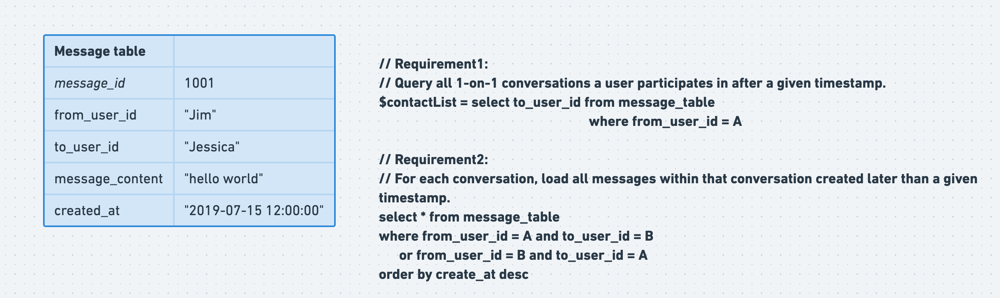

- [One-to-One recent contact storage](#one-to-one-recent-contact-storage)
  - [Storage requirements](#storage-requirements)
  - [Initial schema](#initial-schema)
  - [Improved schema: Decouple msg content from sender and receiver](#improved-schema-decouple-msg-content-from-sender-and-receiver)
- [Group recent contact storage](#group-recent-contact-storage)
  - [Storage requirements](#storage-requirements-1)
  - [Storage model](#storage-model)
  - [Read amplification](#read-amplification)
  - [Write amplication: Improved by querying message table only with primary key](#write-amplication-improved-by-querying-message-table-only-with-primary-key)
    - [Improved by only storing the lastest message id in User Message table](#improved-by-only-storing-the-lastest-message-id-in-user-message-table)

# One-to-One recent contact storage
## Storage requirements
* Requirement1: Query all 1-on-1 conversations a user participates in after a given timestamp.
* Requirement2: For each conversation, load all messages within that conversation created later than a given timestamp.

## Initial schema



## Improved schema: Decouple msg content from sender and receiver
* Intuition:
  * Even if sender A deletes the message on his machine, the receiver B should still be able to see it
  * Create a message\_content table and message\_index table


# Group recent contact storage
## Storage requirements
* Requirement1: Query all group conversations a user participates in after a given timestamp.
* Requirement2: For each conversation, load all messages within that conversation created later than a given timestamp.
* Requirement3: For each conversation, load all participates inside it. 

## Storage model
* In group chat scenario (Except for those extremely big 100K+ groups -_-), typically read write ratio will be 100:1. So the storage model should better balance this factor to something like 50:50 or more evenly. So typically write amplification is used. 


## Read amplification


## Write amplication: Improved by querying message table only with primary key


### Improved by only storing the lastest message id in User Message table
* In the context of group chat, IM servers don't need to store user chat messages forever. Once the user has seen messages since timestamp T1, then all messages after T1 could be deleted. 

* This means actually UserMessageTable could only store a single record for each user per thread. 


* When optimized further, actually UserMessageTable could be avoided. 


```sql
-- Requirement1: 
-- Query all group conversations a user participates in after a given timestamp
$threadId_list = select thread_Id, last_acknowledge_msgId from threadToUser
                       where from_user_id == “Jim”
                       distinct

-- Requirement2: 
-- For each conversation, load all messages within that conversation
-- created after a given timestamp.
select * from message_table 
               where message_id in 
               where created_at > last_acknowledge_msgId
               order by create_at desc

-- Requirement3: For each conversation, load all participates inside it. 
$participantsId_list = select user_id from threadToUser
                                      where thread_id == A
```