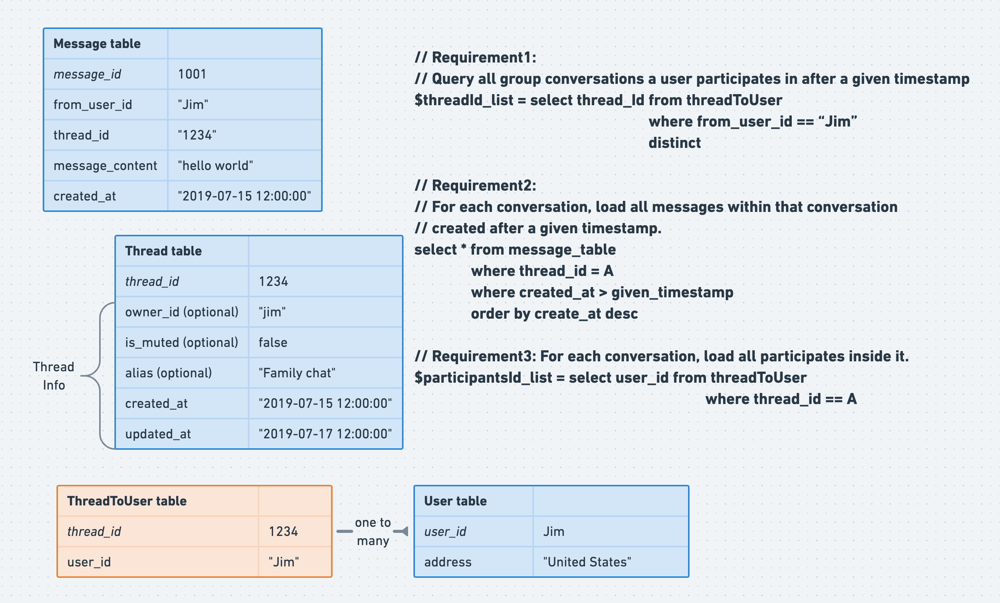

- [One-to-One recent contact storage](#one-to-one-recent-contact-storage)
  - [Storage requirements](#storage-requirements)
  - [Initial schema](#initial-schema)
  - [Improved schema: Decouple msg content from sender and receiver](#improved-schema-decouple-msg-content-from-sender-and-receiver)
- [Group recent contact storage](#group-recent-contact-storage)
  - [Storage requirements](#storage-requirements-1)
  - [Initial schema](#initial-schema-1)
  - [Improved by extracting participates into separate table](#improved-by-extracting-participates-into-separate-table)
  - [Improved by querying message table only with primary key](#improved-by-querying-message-table-only-with-primary-key)
  - [Improved by only storing the lastest message id in User Message table](#improved-by-only-storing-the-lastest-message-id-in-user-message-table)

# One-to-One recent contact storage
## Storage requirements
* Requirement1: Query all 1-on-1 conversations a user participates in after a given timestamp.
* Requirement2: For each conversation, load all messages within that conversation created later than a given timestamp.

## Initial schema


## Improved schema: Decouple msg content from sender and receiver
* Intuition:
  * Even if sender A deletes the message on his machine, the receiver B should still be able to see it
  * Create a message\_content table and message\_index table


# Group recent contact storage
## Storage requirements
* Requirement1: Query all group conversations a user participates in after a given timestamp.
* Requirement2: For each conversation, load all messages within that conversation created later than a given timestamp.
* Requirement3: For each conversation, load all participates inside it. 

## Initial schema
* Cons of the schema:
  * Participants stored as json string, not easy to filter on. 
  * Message table will be super big. The query for requirement 1 will perfom read query for all threads the user is in. 


```sql
-- Requirement1: 
-- Query all group conversations a user participates in after a given timestamp
$threadId_list = select thread_id from message_table
                                  where from_user_id == “Jim”

-- Requirement2: 
-- For each conversation, load all messages within that conversation
-- created after a given timestamp.
select * from message_table 
               where thread_id = A
               where created_at > given_timestamp
               order by create_at desc

-- Requirement3: For each conversation, load all participates inside it. 
$participantsId_list = select participants from thread_table
                                           where thread_id in $threadId_list
                                           order by updated_at // order threads
```

## Improved by extracting participates into separate table 
* Cons of the schema: 
  * Message table is really big. Each time when querying message table, need to rely on thread id which relies on secondary index. It won't be really efficient. 



```sql
-- Requirement1: 
-- Query all group conversations a user participates in after a given timestamp
$threadId_list = select thread_Id from threadToUser
                                  where from_user_id == “Jim”
                                  distinct

-- Requirement2: 
-- For each conversation, load all messages within that conversation
-- created after a given timestamp.
select * from message_table 
               where thread_id = A
               where created_at > given_timestamp
               order by create_at desc

-- Requirement3: For each conversation, load all participates inside it. 
$participantsId_list = select user_id from threadToUser
                                      where thread_id == A
```

## Improved by querying message table only with primary key
* Cons of the schema:
  * For each user in each thread, many different message_ids need to be stored


```sql
-- Requirement1: 
-- Query all group conversations a user participates in after a given timestamp
$threadId_list = select thread_Id from threadToUser
                                  where from_user_id == “Jim”
                                  distinct

-- Requirement2: 
-- For each conversation, load all messages within that conversation
-- created after a given timestamp.
select * from message_table 
               where message_id in 
                    (select message_id from UserMessageTable 
                                       where user_id == ”Jim”)
               where created_at > given_timestamp
               order by create_at desc

-- Requirement3: For each conversation, load all participates inside it. 
$participantsId_list = select user_id from threadToUser
                                      where thread_id == A
```

## Improved by only storing the lastest message id in User Message table
* In the context of group chat, IM servers don't need to store user chat messages forever. Once the user has seen messages since timestamp T1, then all messages after T1 could be deleted. 

* This means actually UserMessageTable could only store a single record for each user per thread. 


* When optimized further, actually UserMessageTable could be avoided. 


```sql
-- Requirement1: 
-- Query all group conversations a user participates in after a given timestamp
$threadId_list = select thread_Id, last_acknowledge_msgId from threadToUser
                       where from_user_id == “Jim”
                       distinct

-- Requirement2: 
-- For each conversation, load all messages within that conversation
-- created after a given timestamp.
select * from message_table 
               where message_id in 
               where created_at > last_acknowledge_msgId
               order by create_at desc

-- Requirement3: For each conversation, load all participates inside it. 
$participantsId_list = select user_id from threadToUser
                                      where thread_id == A
```