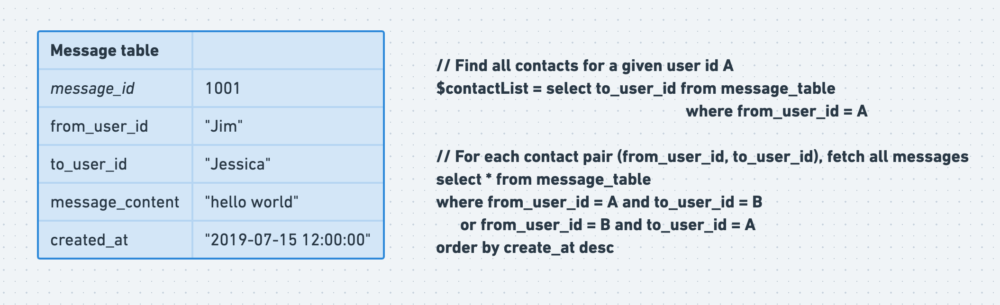
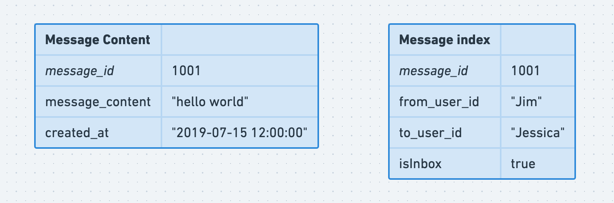
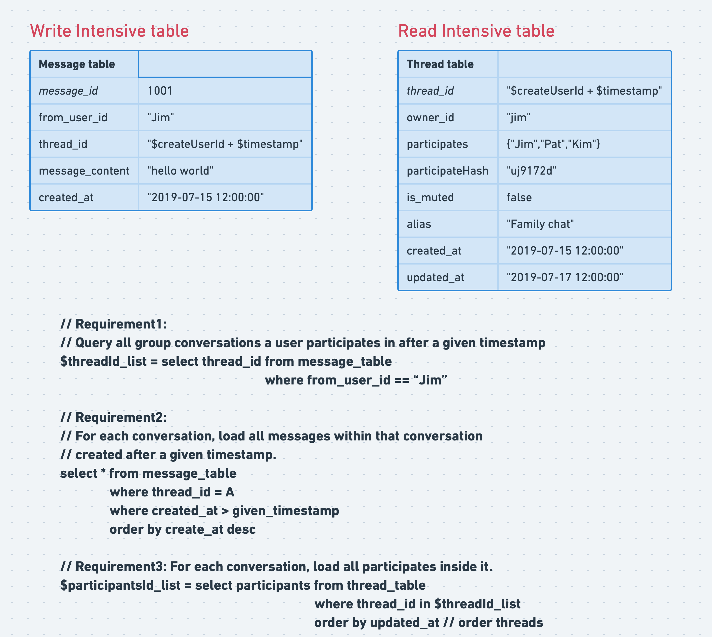
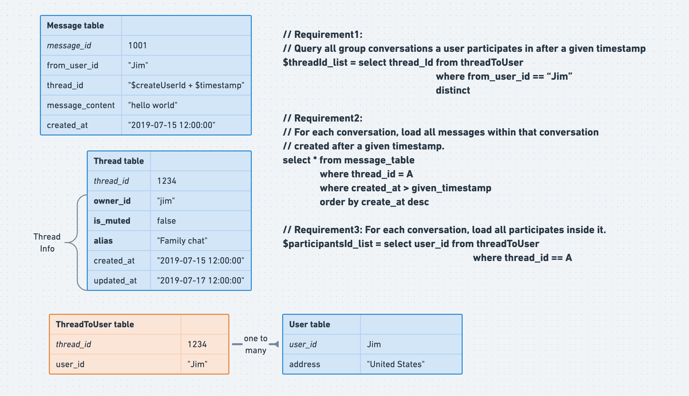

- [One-to-One recent contact storage](#one-to-one-recent-contact-storage)
  - [Storage requirements](#storage-requirements)
  - [Initial schema](#initial-schema)
  - [Improved schema: Decouple msg content from sender and receiver](#improved-schema-decouple-msg-content-from-sender-and-receiver)
- [Group recent contact storage](#group-recent-contact-storage)
  - [Storage requirements](#storage-requirements-1)
  - [Initial schema](#initial-schema-1)
  - [Normalization](#normalization)

# One-to-One recent contact storage
## Storage requirements
* Requirement1: Query all 1-on-1 conversations a user participates in after a given timestamp.
* Requirement2: For each conversation, load all messages within that conversation created later than a given timestamp.

## Initial schema

## Improved schema: Decouple msg content from sender and receiver
* Intuition:
  * Even if sender A deletes the message on his machine, the receiver B should still be able to see it
  * Create a message\_content table and message\_index table

# Group recent contact storage
## Storage requirements
* Requirement1: Query all group conversations a user participates in after a given timestamp.
* Requirement2: For each conversation, load all messages within that conversation created later than a given timestamp.
* Requirement3: For each conversation, load all participates inside it. 

## Initial schema
* Cons of the schema:
  * Participants stored as json string, not easy to filter on. 
  * Message table will be super big. The query for requirement 1 will perfom read query for all threads the user is in. 

## Normalization

