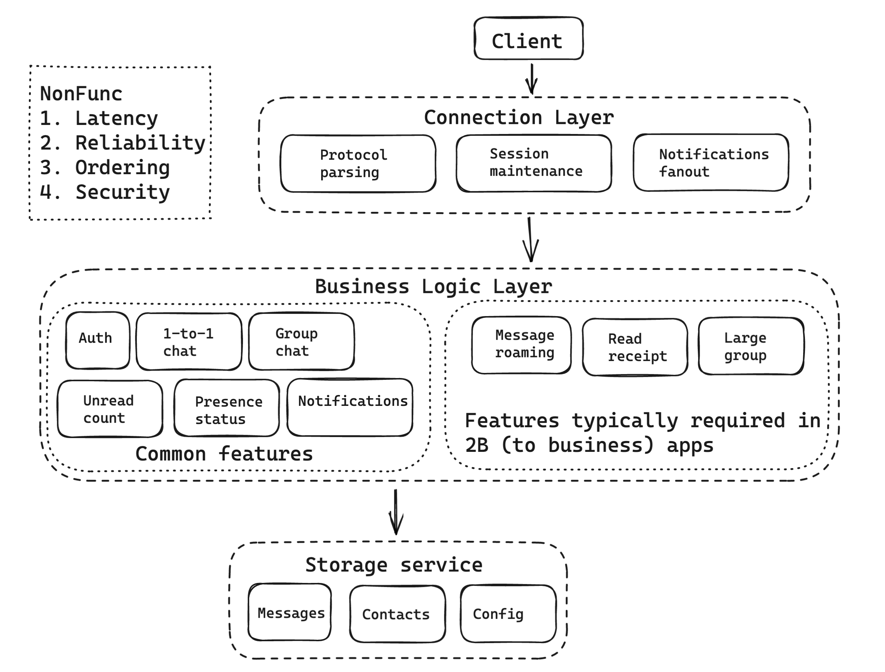
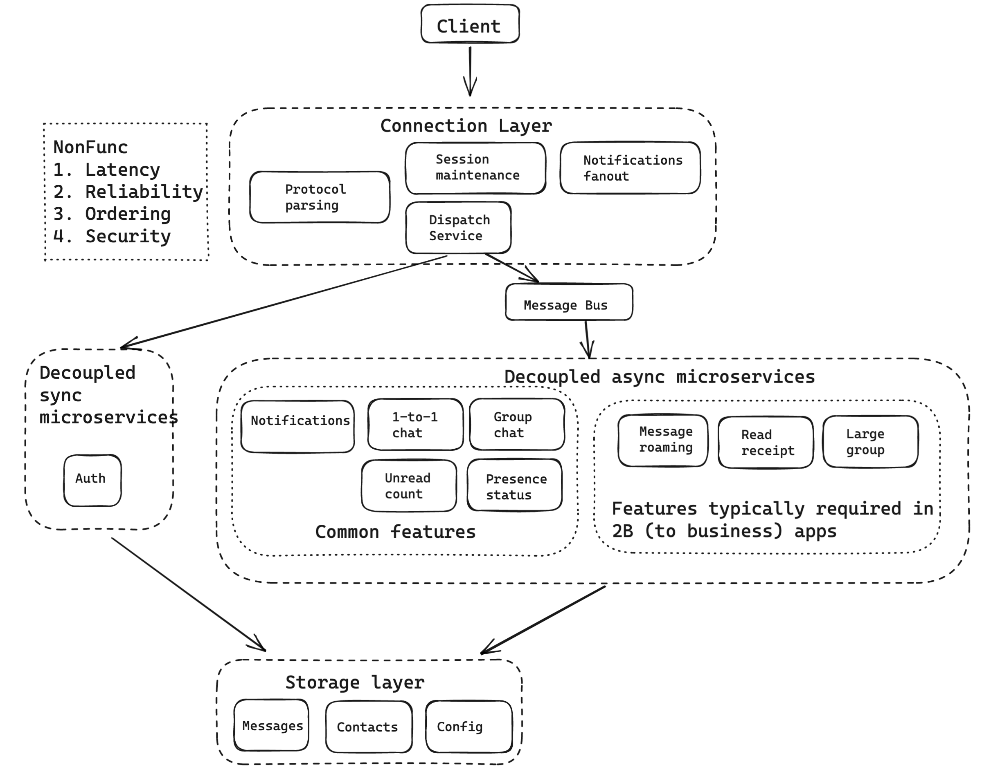
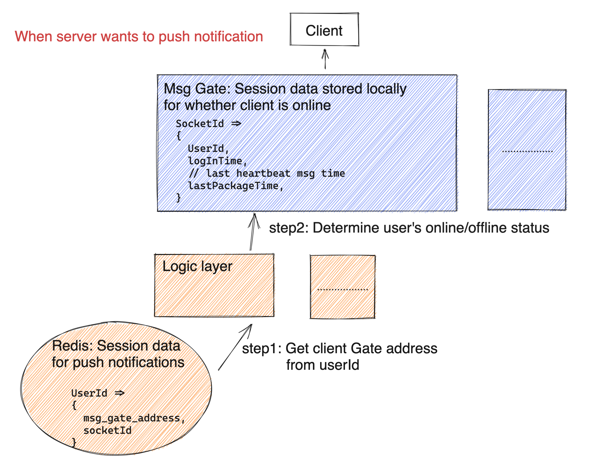

- [Architecture](#architecture)
  - [Initial architecture:](#initial-architecture)
  - [Improved with message bus](#improved-with-message-bus)
  - [Connection layer](#connection-layer)
    - [Components](#components)
    - [Responsibilities](#responsibilities)
    - [Motivation for separation from business logic layer](#motivation-for-separation-from-business-logic-layer)
  - [Session data](#session-data)

# Architecture
## Initial architecture:
* Cons:
  * Hard to maintain and extend. All logics are centralized in a single app. 
  * Perf bottleneck. All communications between connection and logic layer are synchronous. Different components within logic layer might have different performance. 

## Improved with message bus

* When the size of group is big, connection service will become a bottleneck because:
  * When users become online/offline, write pressure to connection service
  * When messages need to be pushed down from the server, it needs to check the online status within the connection service
* Optimization
  * Each connection service cluster doesn't need to maintain a global user online/offline status storage. Only maintain the online/offline users connected to the connection service cluster.
  * Subscribe to a message queue

## Connection layer
### Components
* Please refer to [load balancer architecture section](https://eric-zhang-seattle.gitbook.io/mess-around/network/loadbalancer#multi-layer)

### Responsibilities
* Keep the connection
* Interpret the protocol. e.g. Protobuf
* Maintain the session. e.g. which user is at which TCP connection
* Forward the message.

### Motivation for separation from business logic layer
* This layer is only responsible for keeping the connection with client. It doesn't need to be changed on as often as business logic pieces.
* If the connection is not on a stable basis, then clients need to reconnect on a constant basis, which will result in message sent failure, notification push delay.
* From management perspective, developers working on core business logic no longer needs to consider network protocols (encoding/decoding)

## Session data

