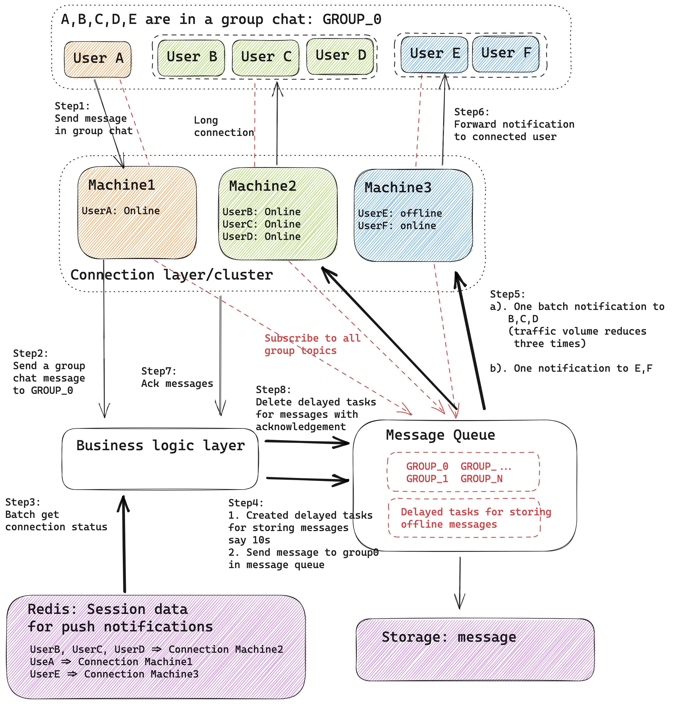
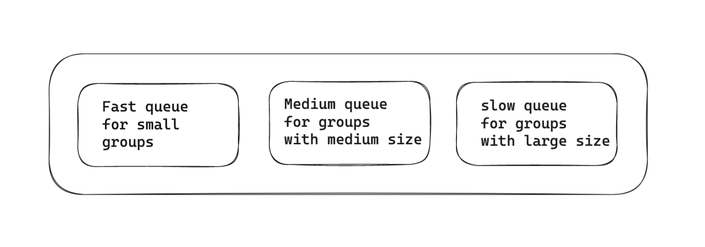

- [Differences between livecast room vs 10K group chat](#differences-between-livecast-room-vs-10k-group-chat)
  - [Number of participants](#number-of-participants)
  - [Relationship between user and group](#relationship-between-user-and-group)
  - [Duration of groups](#duration-of-groups)
- [Challenges of livecast room](#challenges-of-livecast-room)
- [Bottleneck of large group chat](#bottleneck-of-large-group-chat)
  - [Batch requests to get presence status](#batch-requests-to-get-presence-status)
  - [Batch requests to the same client gateway](#batch-requests-to-the-same-client-gateway)
  - [Handle online users separately from offline users](#handle-online-users-separately-from-offline-users)
  - [Save offline messages asynchrnously](#save-offline-messages-asynchrnously)
  - [Different queue speed for different group](#different-queue-speed-for-different-group)
- [References](#references)

# Differences between livecast room vs 10K group chat 
## Number of participants
* For pure 10K group chat scenarios, 10K is already super big group
* For livecast room scenarios, 10K is pretty common, and it could be as high as million or 10 millions of participates. 
  * 1M or 10M participates

## Relationship between user and group
* For pure 10K group chat scenarios, the frequency of joining/leaving groups are pretty low. 
* For livecast room scenarios, the frequency of joining/leaving livecast rooms are pretty high.
  * 10K/s-20K/s joining/leaving livecast room per second.

## Duration of groups
* For pure 10K group chat scenarios, group memberships could last at least for months or years. 
* For livecast room scenarios, group memberships could only last a few hours. 

# Challenges of livecast room
* Latency: Livecast room requires realtime interactions and low latency in APIs. 
* End user experience: From end user perspective, each screen could fit 10-20 messages. If there are more than 20 messages per second pushed down to user device, the screen will stuck in a refreshing loop, resulting in bad user experience. 

# Bottleneck of large group chat
## Batch requests to get presence status 
## Batch requests to the same client gateway
## Handle online users separately from offline users
## Save offline messages asynchrnously

## Different queue speed for different group

# References
* [大规模群消息推送如何保证实时性?](https://mp.weixin.qq.com/s?__biz=MzI1ODY0NjAwMA==&mid=2247483830&idx=1&sn=b049558916512f4e1d4f34c5489a1d46&chksm=ea044b29dd73c23fae4508d555446a57c517dcc0c0b1ad47ad0003bb8df44cf04b8d6f1be3ad&scene=21#wechat_redirect)
* [IM技术分享：万人群聊消息投递方案的思考和实践](https://cloud.tencent.com/developer/article/1869748)