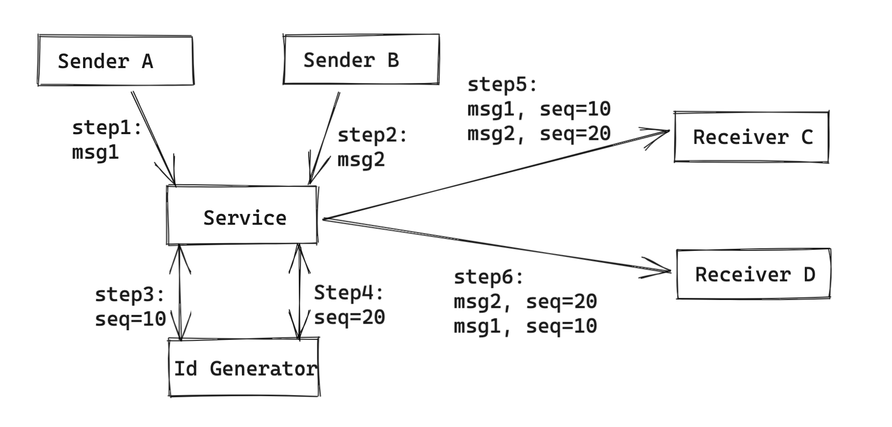
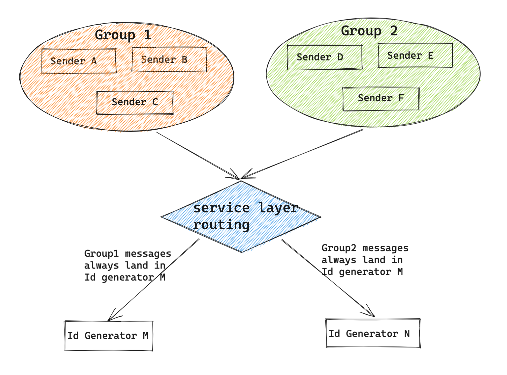

- [Goal](#goal)
- [Difficulties in distributed systems](#difficulties-in-distributed-systems)
- [Message ID](#message-id)
- [Group chat](#group-chat)
  - [Attemp1: Sender's local timestamp/sequence number?](#attemp1-senders-local-timestampsequence-number)
  - [Attempt2: IM server's timestamp?](#attempt2-im-servers-timestamp)
  - [Attempt3: Distributed unique id generator](#attempt3-distributed-unique-id-generator)
  - [Attempt4: Relax global order constraints: Only need to guarantee order in each group](#attempt4-relax-global-order-constraints-only-need-to-guarantee-order-in-each-group)
  - [Edge case special handling: Offline messages](#edge-case-special-handling-offline-messages)
    - [Edge case description](#edge-case-description)
    - [Reorder](#reorder)
- [Todo](#todo)

# Goal
* One-to-One chat: Order is consistent between sender and receiver. 
* Group chat: Order is consistent among all receivers. 
* Operational messages: The same users' requests are handled by servers in the same order.

# Difficulties in distributed systems
* No global timestamp: Different timestamps between client, server, db, etc. 
* Multiple senders
  * When two client app A and B send messages to server. 
  * Client app A first sends msg1, and then client app B sends msg2. 
  * Both of these msgs arrive at server C. 
  * It could not be guaranteed that msg1 comes before msg2 in server C. 
  * As a result, could not use receiver - server C's timestamp. 
* Multiple receivers
  * When one client app A send messages to server B and C. 
  * Client app A first sends msg1 to server B, and then sends msg2 to server C. 
  * It could not be guaranteed that msg1 comes before msg2 in final receiver's perspective. 
  * As a result, could not use sender - client app A's timestamp. 
* Multi-thread

# Message ID

# Group chat
## Attemp1: Sender's local timestamp/sequence number?
* Sender sends its local timestamp/sequence number along with message to the receiver. Receiver reorders all messages according to sender's local timestamp/sequence number
  * First order according to timestamp
  * Then order by sequence number
* No because
  * Senders' could reset its timestamp to a specific value
  * Sender's sequence number could be reset to 0 after a operation like reinstall
  * In a scenario like group chat, participants' clock might not be synced; Or in a scenario where the same user logs in from multiple devices, different devices' timestamp might not be synced.

## Attempt2: IM server's timestamp?
* Sender sends the message to the IM server. IM server sends its server timestamp/sequence number to the receiver. Receiver reorders all messages according to IM servers' local timestamp/sequence number
* No because
  * Usually IM server will be a cluster and the clock is synced using NTP
  * When the cluster size is really big, it is challenging to maintain uniqueness

## Attempt3: Distributed unique id generator
* Please refer to this [doc](https://eric-zhang-seattle.gitbook.io/mess-around/product-scenario/scenario_idgenerator)
* Cons: 
  * ID generator will become a bottleneck. 

## Attempt4: Relax global order constraints: Only need to guarantee order in each group
* From the product's perspective, there is no need for a global unique sequence number.
  * For scenario like group chat and logging from multiple devices, as long as there is a unique global sequence number per messaging group, it will be good enough.
  * It is best practices adopted by industry standards like Wechat/Weibo.
* Cons:
  * Some scenarios could not relax order constraints

## Edge case special handling: Offline messages
### Edge case description
* In offline messages push scenario where there will be a large number of messages to send to clients, to guarantee that these messages are sent/received by clients in a consistent order, some ordering operation could be applied in the service / client layer. 
* Even have the global order defined, it is still not enough because
  * IM servers are deployed on a cluster basis. Every machine's performance will be different and different IM servers could be in different states, such as in GC. A message with bigger sequence number could be sent later than another message smaller sequence number.
  * For a single IM server receiving a msg, the processing will be based on multi-thread basis. It could not be guaranteed that a message with bigger sequence number will be sent to receiver earlier than a message with lower sequence number.

### Reorder
* Reorder messages on server side / client side

# Todo
* Add in attempt4: https://mp.weixin.qq.com/s?__biz=MjM5ODYxMDA5OQ==&mid=404202261&idx=1&sn=1b8254ba5013952923bdc21e0579108e&scene=21#wechat_redirect