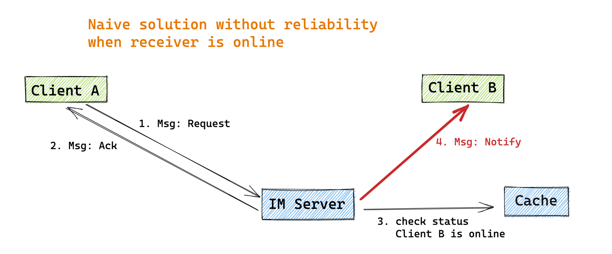
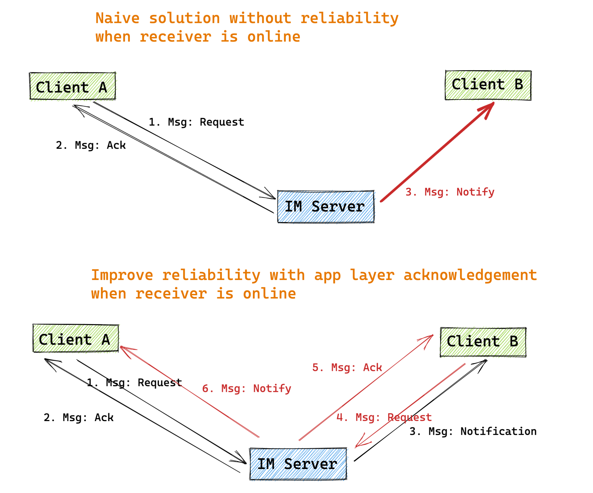
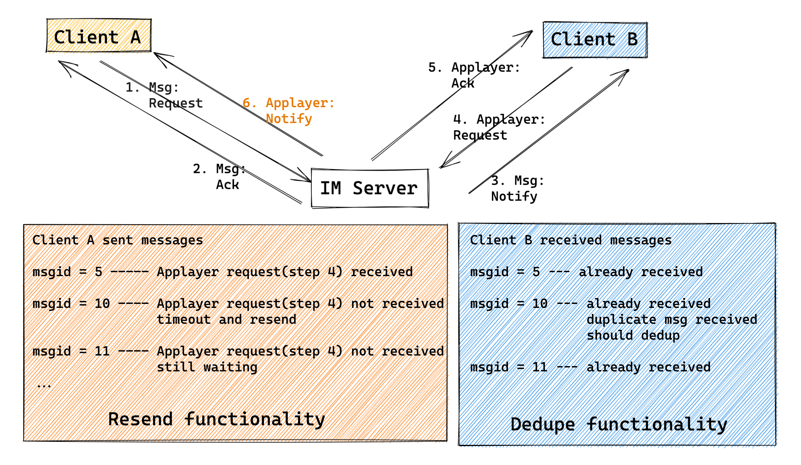
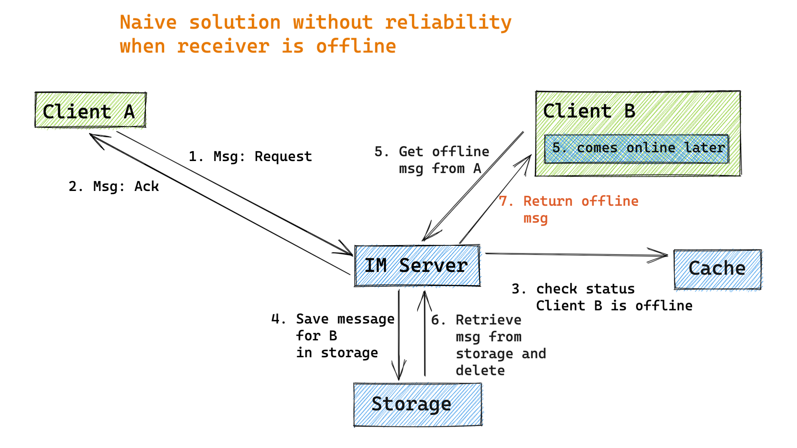
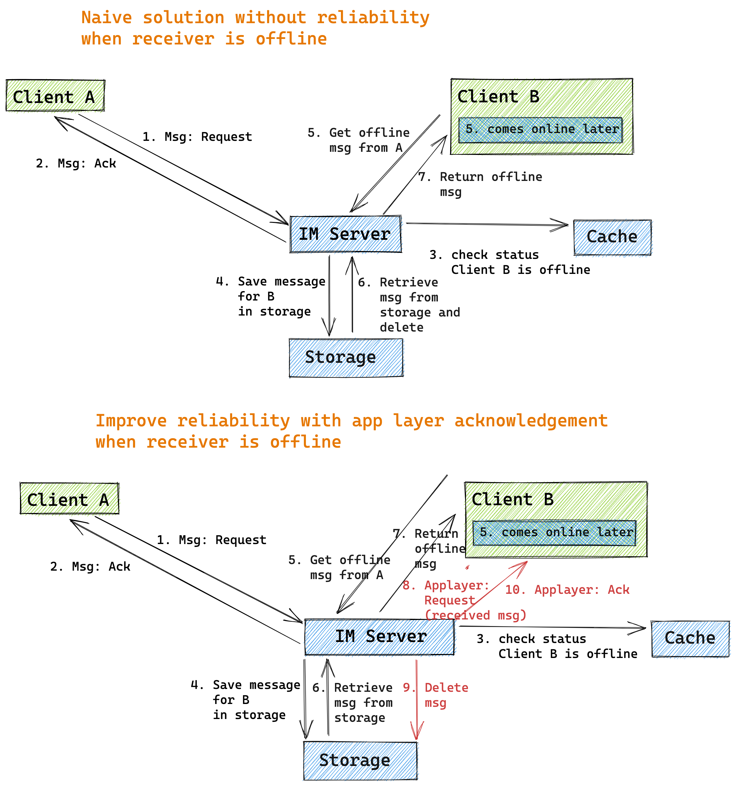
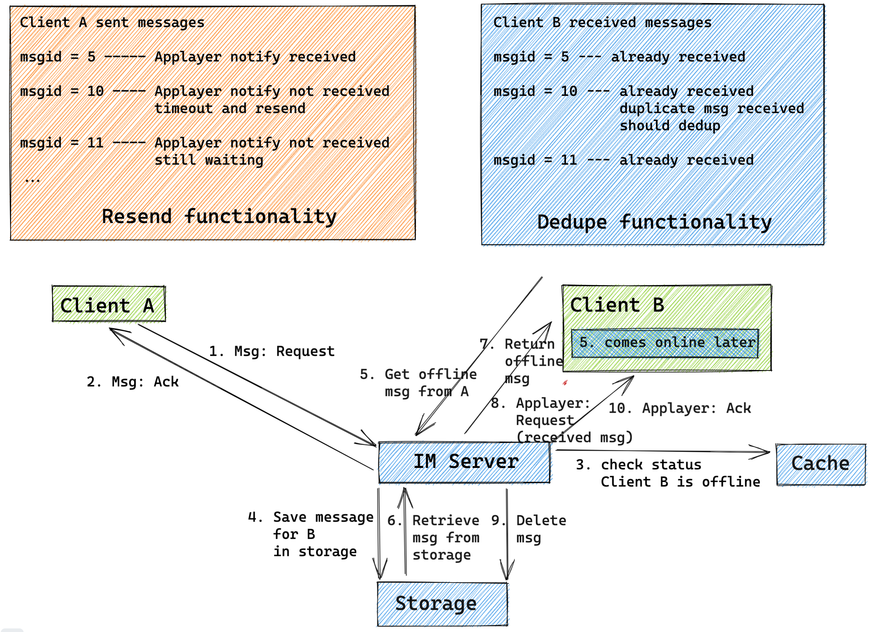
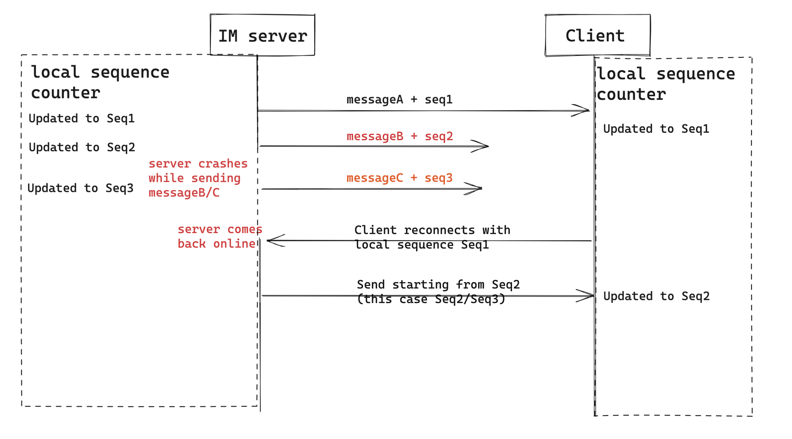

- [Goal](#goal)
- [When user is online](#when-user-is-online)
  - [Naive solution](#naive-solution)
  - [Step4 reliability with business logic layer ack](#step4-reliability-with-business-logic-layer-ack)
    - [Potential issues](#potential-issues)
    - [Flowchart](#flowchart)
    - [What if not receiving ack ?? Resend and dedupe](#what-if-not-receiving-ack--resend-and-dedupe)
    - [What if IM server crash?? Completeness check](#what-if-im-server-crash-completeness-check)
- [When user is offline](#when-user-is-offline)
  - [Naive solution](#naive-solution-1)
  - [Step7 reliability with business logic layer ack](#step7-reliability-with-business-logic-layer-ack)
    - [Potential issues](#potential-issues-1)
    - [Flowchart](#flowchart-1)
    - [What if not receiving ack ?? Resend and dedupe](#what-if-not-receiving-ack--resend-and-dedupe-1)
    - [What if IM server crash?? Completeness check](#what-if-im-server-crash-completeness-check-1)
  - [Step5/7 perf: Reduce the roundtrip between client and server](#step57-perf-reduce-the-roundtrip-between-client-and-server)

# Goal
* No missing 
* No duplication

# When user is online

## Naive solution



## Step4 reliability with business logic layer ack
### Potential issues
* For step4, it may fail (client A think that client B has received response but actually it does not.)

### Flowchart
* Many things could go wrong even if client A successfully receives message from IM but client B does not receive message at all:
  1. IM server crashes and fails to send 3
  2. Network jitter and package get lost
  3. Client B crashes
* Client B sends a confirmation request after it successfully processed the message. Its flow will be symmetric to the naive solution.



### What if not receiving ack ?? Resend and dedupe
* Potential issues
  * Any of packages (Msg: Request / Msg: Ack) is lost: 
    * Client A could simply resend will solve the problem. 
  * Any of packages (Msg: Notify / Applayer: Request / Applayer: Ack / Applayer: Notify) is lost:
    * The reason could be server crash, network jitter, client crash.



### What if IM server crash?? Completeness check
* Please see the completeness check in offline section. The principles are the same. 

# When user is offline

## Naive solution



## Step7 reliability with business logic layer ack
### Potential issues
* IM server sends the message in step 7, but does not actually know whether client B successfully receive it.

### Flowchart



### What if not receiving ack ?? Resend and dedupe



### What if IM server crash?? Completeness check



## Step5/7 perf: Reduce the roundtrip between client and server
* Problem:
  * In the above flowchart, client B retrieves offline message from client A. And this process will repeat for each of its contact

```java
// When client B becomes online
for(all senderId in B’s friend-list)
{ 
     // Get offline message sent to B from uid
     get_offline_msg(B,senderId);   
}
```

* Optimization ways:
  1. Only fetch the number of offline messages for each friend. Only when the user enters the conversation, load actual messages. 
  2. Pull all offline messages sent to client B at once. Then dedupe and categorize by senderId. 
     * In practice, this solution is preferred over 1 because it reduces number of round trips. 
     * If there are too many messages to pull for offline users, then could separate messages into different pages. 
     * When use paging, to avoid too many applayer acknowledgement packages, the next page could be used as the acknowledge for previous page. 
