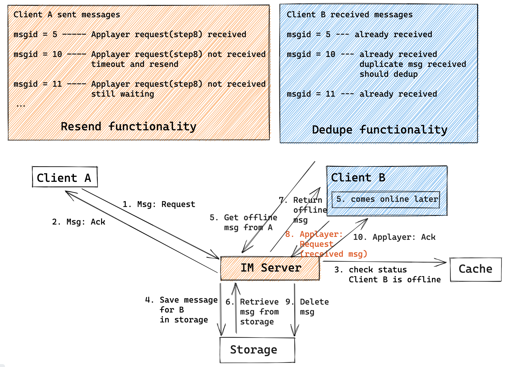

- [Goal](#goal)
- [Question1: Whether to save messages for online users](#question1-whether-to-save-messages-for-online-users)
  - [Initial design: Directly forwarding](#initial-design-directly-forwarding)
  - [Prefer to save message first for reliability](#prefer-to-save-message-first-for-reliability)
- [Question2: Is network layer realiability enough?](#question2-is-network-layer-realiability-enough)
  - [Why TCP not enough](#why-tcp-not-enough)
  - [Flowchart with business logic layer ack](#flowchart-with-business-logic-layer-ack)
    - [Online user (Not considering message roaming)](#online-user-not-considering-message-roaming)
    - [Offline user (Not considering message roaming)](#offline-user-not-considering-message-roaming)
    - [What if not receiving ack ?? Resend and dedupe](#what-if-not-receiving-ack--resend-and-dedupe)
    - [What if IM server crash?? Completeness check](#what-if-im-server-crash-completeness-check)
- [Question3: Will offline syncing plenty of msgs become bottleneck](#question3-will-offline-syncing-plenty-of-msgs-become-bottleneck)
  - [Step5/7 perf: Reduce the roundtrip between client and server](#step57-perf-reduce-the-roundtrip-between-client-and-server)

# Goal
* No missing 
* No duplication

# Question1: Whether to save messages for online users
## Initial design: Directly forwarding


## Prefer to save message first for reliability
* Limitations: Suppose that after step3 and confirm that the user is online, the user becomes offline, or the network between user and server becomes disconnected. In these cases, the server would either get stuck in a resending loop. 
* From reliability perspective, it is always better to save the message first. 

# Question2: Is network layer realiability enough?
## Why TCP not enough
* IM server sends the message in step 7, but does not actually know whether client B successfully receive it.

## Flowchart with business logic layer ack
### Online user (Not considering message roaming)


### Offline user (Not considering message roaming)


### What if not receiving ack ?? Resend and dedupe



### What if IM server crash?? Completeness check
* Cons:
  * Here completeness check actually assume that the sequence id is continuously increasing, which is hard to achieve in a distributed system setting. 
  * The continuously increasing id could be replaced with two ids (the later id contains a reference to a previous id). 


# Question3: Will offline syncing plenty of msgs become bottleneck
## Step5/7 perf: Reduce the roundtrip between client and server
* Problem:
  * In the above flowchart, client B retrieves offline message from client A. And this process will repeat for each of its contact

```java
// When client B becomes online
for(all senderId in B’s friend-list)
{ 
     // Get offline message sent to B from uid
     get_offline_msg(B,senderId);   
}
```

* Optimization ways:
  1. Only fetch the number of offline messages for each friend. Only when the user enters the conversation, load actual messages. 
  2. Pull all offline messages sent to client B at once. Then dedupe and categorize by senderId. 
     * In practice, this solution is preferred over 1 because it reduces number of round trips. 
     * If there are too many messages to pull for offline users, then could separate messages into different pages. 
     * When use paging, to avoid too many applayer acknowledgement packages, the next page could be used as the acknowledge for previous page. 
