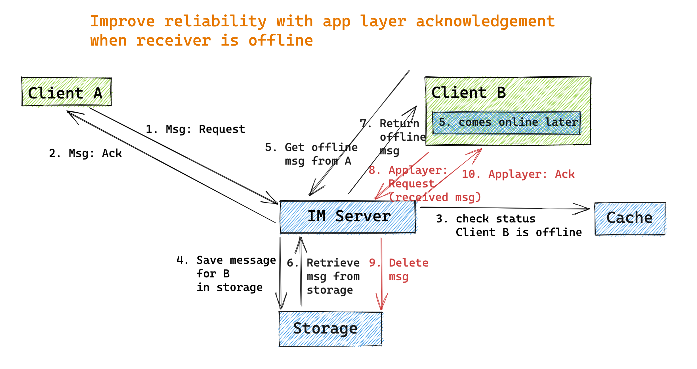

- [Goal](#goal)
- [When user is online](#when-user-is-online)
  - [Naive solution](#naive-solution)
  - [Step4 reliability with business logic layer acknowledgement](#step4-reliability-with-business-logic-layer-acknowledgement)
    - [Flowchart](#flowchart)
    - [Resend and dedupe in Enhance business logic layer acknowledgement](#resend-and-dedupe-in-enhance-business-logic-layer-acknowledgement)
- [When user is offline](#when-user-is-offline)
  - [Naive solution](#naive-solution-1)
  - [Step6 reliability with app layer acknowledgement before deleting msg](#step6-reliability-with-app-layer-acknowledgement-before-deleting-msg)
    - [Flowchart](#flowchart-1)
    - [Improve with resend and dedupe](#improve-with-resend-and-dedupe)
    - [Completeness check](#completeness-check)
  - [Step5/7 perf: Reduce the roundtrip between client and server](#step57-perf-reduce-the-roundtrip-between-client-and-server)

# Goal
* No missing 
* No duplication

# When user is online

## Naive solution
* Potential issues:
  * For step1/Step2, they may fail (msg lost, server crash, client crash, etc.)
  * For step4, it may fail (client A think that client B has received response but actually it does not.)


## Step4 reliability with business logic layer acknowledgement
### Flowchart
* Many things could go wrong even if client A successfully receives message from IM but client B does not receive message at all:
  1. IM server crashes and fails to send 3
  2. Network jitter and package get lost
  3. Client B crashes
* Client B sends a confirmation request after it successfully processed the message. Its flow will be symmetric to the naive solution.


### Resend and dedupe in Enhance business logic layer acknowledgement
* Potential issues
  * Any of packages (Msg: Request / Msg: Ack) is lost: 
    * Client A could simply resend will solve the problem. 
  * Any of packages (Msg: Notify / Applayer: Request / Applayer: Ack / Applayer: Notify) is lost:
    * The reason could be server crash, network jitter, client crash.


# When user is offline

## Naive solution


## Step6 reliability with app layer acknowledgement before deleting msg
### Flowchart



### Improve with resend and dedupe

* The resend and dedupe design will be similar to the online user case. 


### Completeness check


* What if the IM gets corrupted when it is resending the msg: Unique msg sequence id for guaranteeing the completeness
  1. IM server forwards a msg MESSAGE to User B, it carries a unique sequence id SEQ1.
  2. When user B gets the msg MESSAGE, it update its local msg sequence id to SEQ1.
  3. IM server gets the acknowledge.
  4. User B becomes offline.
  5. IM server forwards another msg MESSAGE to User B, it carries another unique sequence id SEQ2 and message gets lost.
  6. User B reconnects online, carrying the latest local msg sequence id SEQ1 to IM server.
  7. IM server detects that User B needs more msgs, so it delivers all of msgs with sequence id between SEQ1 and SEQ2.
  8. User B receives the msg and update the local sequence id to SEQ2.
* Why needs an acknowledgement even if TCP layer already acknowledges msg:
  * These acknowledgement are at different layers. TCP acknowledgement is at network layer. App layer acknowledgement happens at acknowledge layer. There could be some error happening during the process from network layer to app layer.


## Step5/7 perf: Reduce the roundtrip between client and server
* Problem:
  * In the above flowchart, client B retrieves offline message from client A. And this process will repeat for each of its contact

```java
// When client B becomes online
for(all senderId in B’s friend-list)
{ 
     // Get offline message sent to B from uid
     get_offline_msg(B,senderId);   
}
```

* Optimization ways:
  1. Only fetch the number of offline messages for each friend. Only when the user enters the conversation, load actual messages. 
  2. Pull all offline messages sent to client B at once. Then dedupe and categorize by senderId. 
     * In practice, this solution is preferred over 1 because it reduces number of round trips. 
     * If there are too many messages to pull for offline users, then could separate messages into different pages. 
     * When use paging, to avoid too many applayer acknowledgement packages, the next page could be used as the acknowledge for previous page. 
