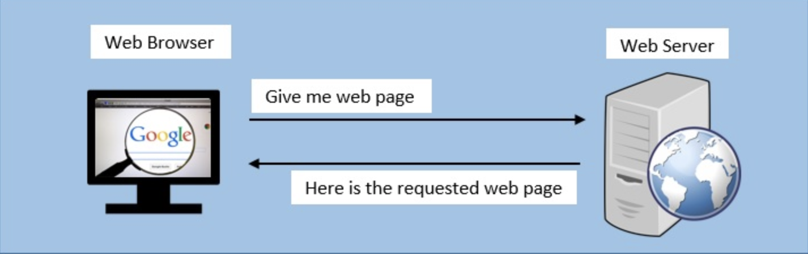
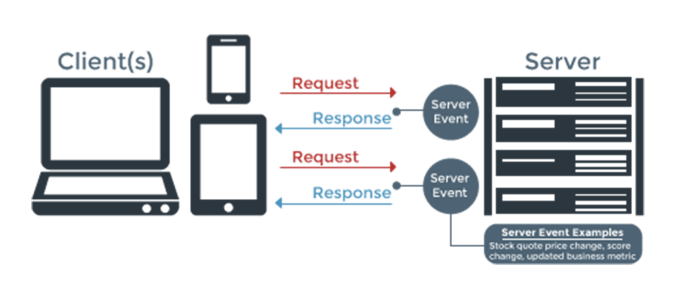
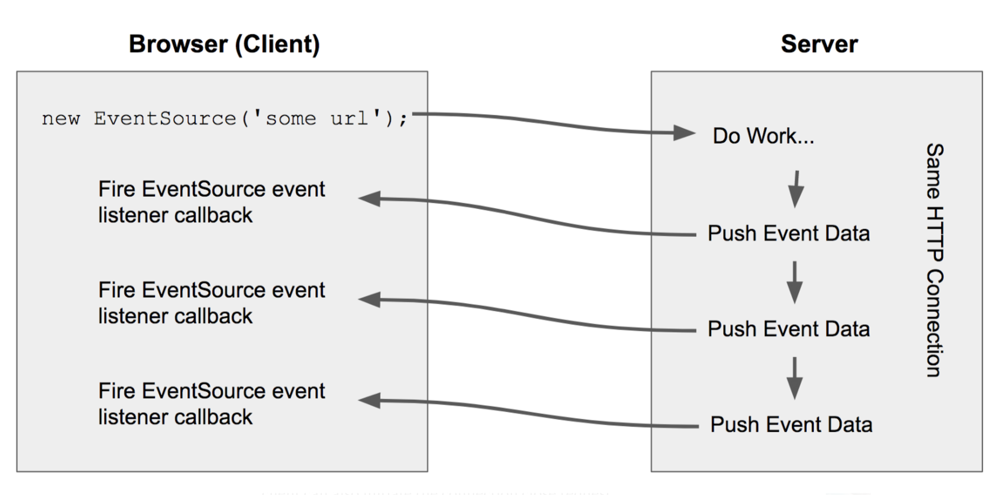

- [Notification flows](#notification-flows)
  - [Pull model (Periodical short pull)](#pull-model-periodical-short-pull)
    - [Flowchart](#flowchart)
    - [Cons](#cons)
  - [Pull model (Periodical long pull)](#pull-model-periodical-long-pull)
    - [Flowchart](#flowchart-1)
    - [Cons](#cons-1)
    - [Pros](#pros)
  - [Pull model XMPP/MQTT](#pull-model-xmppmqtt)
  - [Push model SSE](#push-model-sse)
    - [Flowchart](#flowchart-2)
    - [Pros](#pros-1)
    - [Cons](#cons-2)
  - [Push model (WebSocket)](#push-model-websocket)
    - [Flowchart](#flowchart-3)
    - [Pros](#pros-2)
- [Heartbeat](#heartbeat)
  - [Flowchart: For both online and offline notifications](#flowchart-for-both-online-and-offline-notifications)
    - [Online](#online)
    - [Offline notification](#offline-notification)

# Notification flows
## Pull model (Periodical short pull)
* User periodically ask for new messages from server
* Use case:
  * Used on reconnection

### Flowchart
1. A client makes an HTTP request requesting a web page from a server.
2. The server calculates the response
3. The server sends the response to the client

### Cons
* Cons if used for messaging:
  * High latency if pulling on a low frequency
  * High resource consumption if pulling on a high frequency.
    * It wastes client devices' electricity because most polling are useless.
    * It puts high pressure on server resources and implies a high QPS.

## Pull model (Periodical long pull)
### Flowchart
* The difference with short poll is that the client request does not return immediately after the request reaches the server. Instead, it hangs on the connection for a certain period of time. If there is any incoming messages during the hanging period, it could be returned immediately.
  1. The client makes a request to the server.
  2. The server receives the request and delays sending anything to the client until the requested data is available or there is any other update related to data.
  3. When the data is available, the response is sent to the client.
  4. The client receives the response.
  5. The client usually makes a new request right away or after some defined interval so that the connection with the server is established again.

### Cons
* Hanging on the server for a period reduces the QPS but does not really reduce the pressure on server resources such as thread pool. (If there are 1000 connections, server side still needs to have 1000 threads handling the connection.)
* Long pull will return if not getting a response after a long time. There will still be many waste of connections.
* Performance degradation: server needs to do more jobs such as holding the connection open, establishing what pieces of data are already sent to the client in the previous connections and what more needs to be sent. Also, a lot of time is lost in the process of setting up connections itself.
* Message ordering: there is a possibility that the same data will be written multiple times in the client’s local storage. That can happen when the client sends more than one request for the same data in parallel.
* Maximal Latency: because of the way Long-Polling works, once the server sends a response to the client, it can not send anything else and it needs to wait until a new request is made. There are some methods that can reduce latency such as HTTP pipelining, but they are not always available.

### Pros
* Since there are probably a lot of devices that do not support newer methods such as SSEs and WebSockets, Long-Polling can be useful in such situations. Also, Long-Polling can be used as a fallback option.

## Pull model XMPP/MQTT
* Many other protocols based on TCP long connection such as XMPP/MQTT.
  * XMPP is mature and easy to extend. But the XML based transfer schema consumes a lot of network bandwidth and has a complicated design.
  * MQTT is based on pub/sub mode, reserve network bandwidth, easy to extend. But it is not a protocol for IM so does not support many IM features such as group chatting, offline messages.

## Push model SSE
* Unlike WebSockets, Server-Sent Events are a one-way communication channel where events flow from server to client only. Server-Sent Events allows browser clients to receive a stream of events from a server over an HTTP connection without polling.
* A client subscribes to a “stream” from a server and the server will send messages (“event-stream”) to the client until the server or the client closes the stream. It is up to the server to decide when and what to send the client, for instance as soon as data changes.

### Flowchart
* A flow for server send events will be as follows:
  1. Browser client creates a connection using an EventSource API with a server endpoint which is expected to return a stream of events over time. This essentially makes an HTTP request at given URL.
  2. The server receives a regular HTTP request from the client and opens the connection and keeps it open. The server can now send the event data as long as it wants or it can close the connection if there are no data.
  3. The client receives each event from the server and process it. If it receives a close signal from the server it can close the connection. The client can also initiate the connection close request.

### Pros
* Simple to implement and use, both on the client and the server side.
* You can use built-in events or create custom ones.
* It is supported by most of the commonly used web browsers such as Chrome, Mozilla Firefox and Safari but it is not supported by Internet Explorer.

### Cons
* An example where it is not good to use SSE is some chat application where messages are sent and received constantly.
* Unidirectional nature can cause a problem if the connection is lost. In this situation, the server may not immediately realize that the connection is lost since the client cannot notify the server about it.
* Limitation related to the number of connections that can be opened between the client and server at the same time.

## Push model (WebSocket)
### Flowchart
* Websocket: Client and server need one-time handshake for bi-directional data transfer. When server side has a new notification, it could push to the client via the websocket connection.
  * Websocket is a duplex protocol based on a single TCP connection.

### Pros
* Support bidirectional communication, client no longer needs to pull periodically.
* Reduce the setup time. A new TCP connection does not need to be established.
* Support natively by the web after HTML5 appears.
* TODO: HOW DOES WEBSOCKET WORK INTERNALLy

# Heartbeat
* Approaches to maintain connection (heartbeat)
  * TCP keepalive heartbeat
    * Pros:
      * Supported by TCP/IP protocol. Disabled by default. Three parameters to be configured: heart beat cycle (default 2 hour), number of retries (retry 9 time), timeout period (75s).
      * No extra development work.
      * Used in industry. For example, WhatsApp uses 10 seconds duration TCP keepalive.
    * Cons:
      * Low flexibility in tuning the heartbeat cycle period (always fixed cycle period);
      * Network layer available does not mean application layer available. For example, application is stuck in a dead cycle.
  * Application layer heartbeat
    * To overcome the cons of network layer TCP keep-alive, application layer heartbeat messages are used.
    * Strategies:
      * Only send hearbeat messages when application has additional bandwidth
      * Based on a fixed frequency
    * Pros:
      * More flexibility in tuning the heartbeat cycle period
      * Reflect whether the application is avaialble.
      * Used in industry. For example, WhatsApp use 30 seconds or 1 minutes app level heartbeat; Wechat use 4.5 minutes and twitter uses 2 minutes.
    * Cons:
      * Will have some additional data transmission cost because not supported natively by TCP/IP protocol.
* Benefits
  * This long connection is a virtual connection. There will be cases that the connection could be broken. For example:
    * The user enters an area where the network connection is bad.
    * Or even without any network errors on client and server side, there will be a NAT process happening within network operators. For optimizing the performance and reduce the resource consumption on network operator devices, some network operators will clear the mapping within NAT if there isn't any msg being sent on the connection.
      * The NAT process is to transform the internal IP address to external IP address because there are only limited IPv4 addresses.
  * Reduce the connection resource consumption on IM server side
    * Server will maintain a mapping between user device and network connection
    * Server will cache some client info such as app version, os version so that client does not need to pass those information every time
    * If no exception are detected, server will try to push notifications along these corrupted long connection channels, wasting a lot of resources.
  * Notify the client to reconnect if not receiving the ack of heartbeat msgs after timeout.

## Flowchart: For both online and offline notifications
### Online
* User online: Push message via long poll connection
  * How does long poll find user's connection among so many long polls? There will be a user sign-in process
    1. A TCP connection is set after three time hand shake.
    2. Client sends a request based on the connection.
    3. Server interprets the connection. If valid, it will save the mapping between uid and tcp connection socket descriptor.
    4. This descriptor will be saved on local cache or distributed cache.

### Offline notification

* User offline: Push message via APNs
  * To make sure that users could still receive notifications when the app is running in the background or not openned, third party notification (Apple Push Notification Service / Google Cloud Messaging) will be used.
* Offline message push
  * When many offline messages need to be pushed to the end-user, there is a need to resort msgs.
  * The entire process for sending offline msgs
    1. The connection layer (network gateway) will subscribe to the redis topic for offline msgs.
    2. User goes online.
    3. The connection layer (network gateway) will notify business layer that the user is online.
    4. The business layer will publish msgs to redis topic for offline msgs.
    5. Redis will fan out the offline messages to the connection layer. (The rearrangement happens on this layer)
    6. The conneciton layer will push the message to clients.

