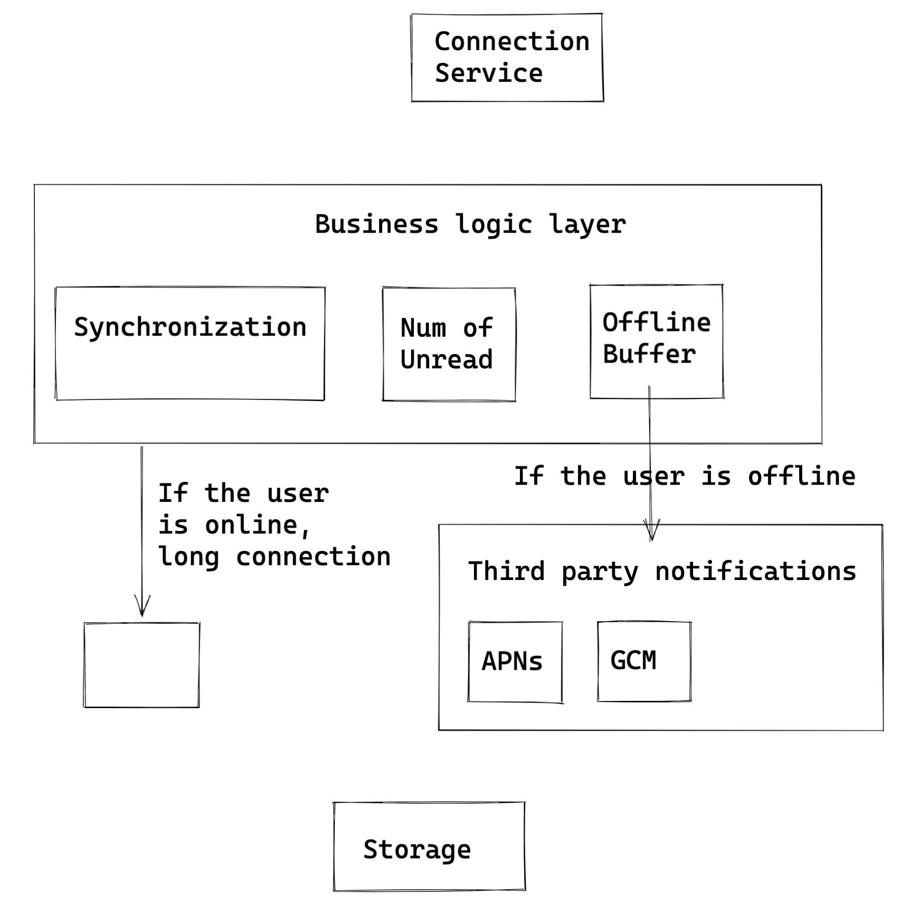

- [Online status](#online-status)
  - [Flowchart](#flowchart)
  - [Responsibilities](#responsibilities)
  - [Motivation for separation from business logic layer](#motivation-for-separation-from-business-logic-layer)
  - [Scale the long connection storage](#scale-the-long-connection-storage)

# Online status

## Flowchart
* Online status pull
  * When users become online, send a heartbeat msg to the server every 3-5 seconds.
  * The server sends its online status to friends every 3-5 seconds.
  * If after 1 min, the server does not receive the heartbeat msg, considers the user is already offline.
* Performance bottleneck
  * A central connection service for maintaining user online status and network gateway the user resides in
    * Instead, use a message queue, ask all connection service to subscribe to this message queue. \[STILL SOME QUESTIONS 存储和并发：万人群聊系统设计中的几个难点]
    * This mechanism shifts the pressure from business logic layer to connection service layer.

## Responsibilities
* Keep the connection
* Interpret the protocol. e.g. Protobuf
* Maintain the session. e.g. which user is at which TCP connection
* Forward the message.

## Motivation for separation from business logic layer
* This layer is only responsible for keeping the connection with client. It doesn't need to be changed on as often as business logic pieces.
* If the connection is not on a stable basis, then clients need to reconnect on a constant basis, which will result in message sent failure, notification push delay.
* From management perspective, developers working on core business logic no longer needs to consider network protocols (encoding/decoding)

## Scale the long connection storage
* When the size of group is big, connection service will become a bottleneck because:
  * When users become online/offline, write pressure to connection service
  * When messages need to be pushed down from the server, it needs to check the online status within the connection service
* Optimization
  * Each connection service cluster doesn't need to maintain a global user online/offline status storage. Only maintain the online/offline users connected to the connection service cluster.
  * Subscribe to a message queue

