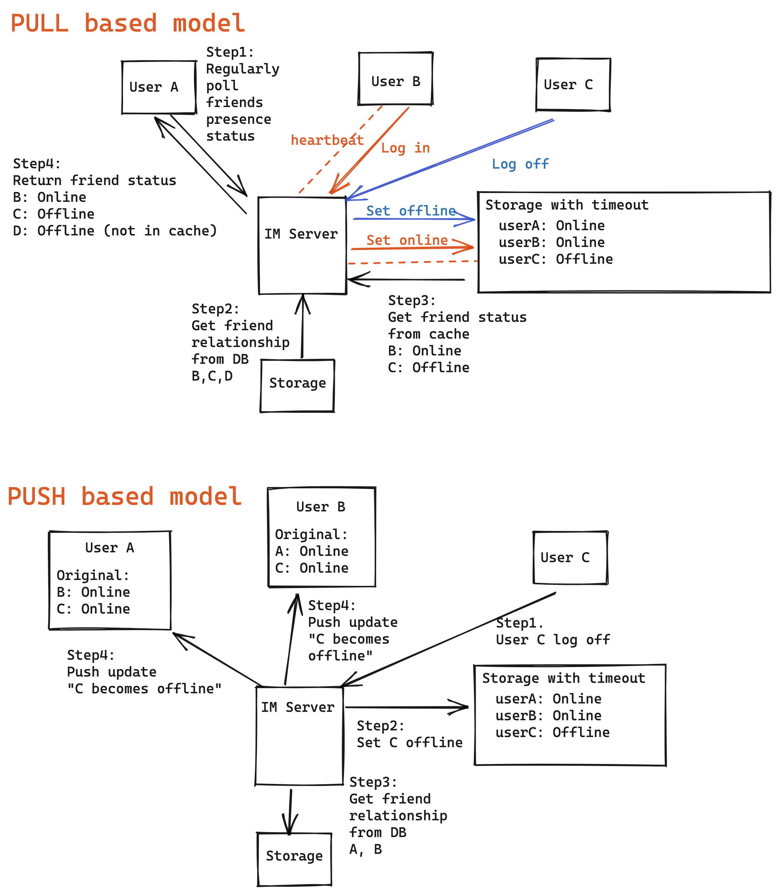

- [Heartbeat](#heartbeat)
  - [Motivations - Jittery connections](#motivations---jittery-connections)
    - [Uncertainty in network intermediate devices](#uncertainty-in-network-intermediate-devices)
    - [Unstability in mobile networks](#unstability-in-mobile-networks)
  - [Why TCP keepalive heartbeat not enough](#why-tcp-keepalive-heartbeat-not-enough)
  - [App layer heartbeat](#app-layer-heartbeat)
    - [Frequency](#frequency)
    - [Direction](#direction)
    - [Possible improvements](#possible-improvements)
    - [Pros](#pros)
    - [Cons](#cons)
- [Initial design](#initial-design)
- [Improved design](#improved-design)
- [References](#references)

# Heartbeat
## Motivations - Jittery connections
### Uncertainty in network intermediate devices
* Usually there exists multiple network devices(firewall, routers and exchange machines) between client and server. If any of these routers/exchange machines has a problem and does not recover, then it will result in the disconnection between client and server. For IM software, both client / server could not detect whether the connection is still normal. 
  * After establishing connection with server, a client does not connect server for a long time. Then this connection might be closed by the firewall. For IM software, if the connection is closed, even when there is new message coming, client / serer could no longer receive it in time.
  * There will be a NAT process happening within network operators. For optimizing the performance and reduce the resource consumption on network operator devices, some network operators will clear the mapping within NAT if there isn't any msg being sent on the connection.
      * The NAT process is to transform the internal IP address to external IP address because there are only limited IPv4 addresses.

### Unstability in mobile networks
* Members on mobile devices are often on lossy networks and regularly get disconnected and reconnected haphazardly. They could simply be on a bad network or experiencing temporary network interruption, such as passing through a tunnel or a parking garage. 
* If not handled properly, it would also result in a massive amount of avoidable traffic through our backend systems to distribute all these fluctuations in presence status to the connections of that member.

## Why TCP keepalive heartbeat not enough
* Configuration of TCP keep-alive is not designed for IM heartbeat
  * Keep-alive by TCP/IP protocol. Disabled by default. Three parameters to be configured: heart beat cycle (default 2 hour), number of retries (retry 9 time), timeout period (75s).
  * Low flexibility in tuning the heartbeat cycle period (always fixed cycle period);
* Network layer available does not mean application layer available. For example, application is stuck in a dead cycle.

## App layer heartbeat
* A dedicated heartbeat message. Or it could also carry additional business layer information. 
* Notify the client to reconnect if not receiving the ack of heartbeat msgs after timeout.

### Frequency
* Fixed heartbeat message: Once per 30s. If still has not received msg after 15s, then considered connection deprecated. 
  * Suppose each heartbeat msg is 5 bytes, then every day send 2880 heartbeat package. 
  * One month cost in total 5 * 2 * 2880* 30 = 0.8 M 
* Improvement1: Increase the duration of heartbeat message: 30s -> 5min.
* Improvement2: Only after n (n > 1)  heartbeat messages, consider connection deprecated

### Direction
* Usually it is from client to server because server won't limit itself to certain clients. 

### Possible improvements
* Dynamic heartbeat

### Pros
* More flexibility in tuning the heartbeat cycle period
* Reflect whether the application is avaialble.
* Used in industry. For example, WhatsApp use 30 seconds or 1 minutes app level heartbeat; Wechat use 4.5 minutes and twitter uses 2 minutes.

### Cons
* Will have some additional data transmission cost because not supported natively by TCP/IP protocol.

# Initial design

# Improved design

# References
* https://engineering.linkedin.com/blog/2018/01/now-you-see-me--now-you-dont--linkedins-real-time-presence-platf