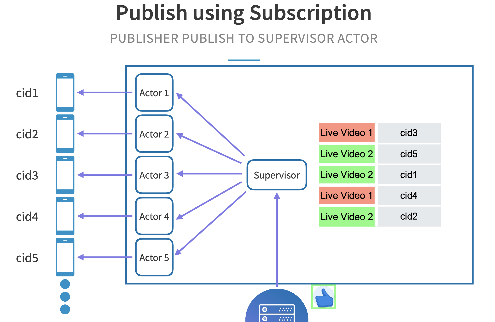

- [Online status](#online-status)
  - [Flowchart](#flowchart)
  - [Responsibilities](#responsibilities)
  - [Motivation for separation from business logic layer](#motivation-for-separation-from-business-logic-layer)
  - [Scale the long connection storage](#scale-the-long-connection-storage)
- [Manage the number of connections](#manage-the-number-of-connections)
  - [Akka Actors](#akka-actors)
  - [Apply Akka actors concept in connection](#apply-akka-actors-concept-in-connection)
  - [Akka actors and event source](#akka-actors-and-event-source)
  - [Manage multiple connections](#manage-multiple-connections)
- [Multiple live videos](#multiple-live-videos)
  - [Problem](#problem)
  - [ConnectionId => Subscription topic mapping](#connectionid--subscription-topic-mapping)
    - [In memory mapping](#in-memory-mapping)
    - [Example flow](#example-flow)
  - [10K concurrent viewers](#10k-concurrent-viewers)
    - [Front end and dispatches](#front-end-and-dispatches)
    - [Comm between dispatcher and frontend nodes](#comm-between-dispatcher-and-frontend-nodes)
    - [Example flow](#example-flow-1)
  - [Dispatcher bottleneck](#dispatcher-bottleneck)
- [Heartbeat](#heartbeat)

# Online status

## Flowchart
* Online status pull
  * When users become online, send a heartbeat msg to the server every 3-5 seconds.
  * The server sends its online status to friends every 3-5 seconds.
  * If after 1 min, the server does not receive the heartbeat msg, considers the user is already offline.
* Performance bottleneck
  * A central connection service for maintaining user online status and network gateway the user resides in
    * Instead, use a message queue, ask all connection service to subscribe to this message queue. \[STILL SOME QUESTIONS 存储和并发：万人群聊系统设计中的几个难点]
    * This mechanism shifts the pressure from business logic layer to connection service layer.

## Responsibilities
* Keep the connection
* Interpret the protocol. e.g. Protobuf
* Maintain the session. e.g. which user is at which TCP connection
* Forward the message.

## Motivation for separation from business logic layer
* This layer is only responsible for keeping the connection with client. It doesn't need to be changed on as often as business logic pieces.
* If the connection is not on a stable basis, then clients need to reconnect on a constant basis, which will result in message sent failure, notification push delay.
* From management perspective, developers working on core business logic no longer needs to consider network protocols (encoding/decoding)

## Scale the long connection storage
* When the size of group is big, connection service will become a bottleneck because:
  * When users become online/offline, write pressure to connection service
  * When messages need to be pushed down from the server, it needs to check the online status within the connection service
* Optimization
  * Each connection service cluster doesn't need to maintain a global user online/offline status storage. Only maintain the online/offline users connected to the connection service cluster.
  * Subscribe to a message queue


# Manage the number of connections
* Akka is a toolkit for building highly confident, message-driven applications. 

## Akka Actors
* Akka Actors are objects which have some state, and they have some behavior. 
  * Each actor has a mailbox, and they communicate exclusively by exchanging messages.
  * An actor is assigned a lightweight thread every time there is a message to be processed. 
    * The behavior defines how the state should be modified when they receive   certain messages. 
    * That thread will look at the behavior that is defined for the message and modify the state of the Akka Actor based on that definition. 
    * Then, once that is done this thread is actually free to be assigned to the next actor. 
  * Roles of actors
    * Since actors are so lightweight, there can be millions of them in the system, and each can have their own state and their own behavior. 
    * A relatively small number of threads, which is proportionate to the number of cores, can be serving these millions of actors all on the same time, because a thread is assigned to an actor only when there is something to process.

## Apply Akka actors concept in connection
* State: Each actor is managing one persistent connection, that's the state that it is managing. 
* Behavior: As it receives an event, the behavior here is defining how to publish that event to the EventSource connection. 
* Those many connections can be managed by the same machine using this concept of Akka Actors. 


## Akka actors and event source
* Let's look at how Akka Actors are assigned to an EventSource connetion. Almost every major server frame will support the EventSource interface natively. At LinkedIn we use the Play Framework, and if you're familiar with Play, we just use a regular Play controller to accept the incoming connection.

* Then, we use the Play EventSource API to convert it into a persistent connection, and assign it a random connectionId. Now we need something to manage the lifecycle of these connections, and this is where Akka Actors fit in. This is where we create an Akka Actor to manage this connection, and we instantiate an Akka Actor with the connectionId, and the handle to the EventSource connection that it is supposed to manage. 

```java
// Client A connects to the server and is assigned connectionIdA
public Result listen() 
{
  return ok(EventSource.whenConnected(
                          eventSource -> 
  {
    String connectionId = UUID.randomUUID().toString();

    // construct an Akka Actor to manage connection
    _actorSystem.actorOf(
        ClientConnectionActor.props(connectionId, eventSource),
        connectionId);
  }));
}
```


## Manage multiple connections
* Each client connection here is managed by its own Akka Actor, and each Akka actor in turn, all of them, are managed by an Akka supervisor actor. 
* Let's see how a like can be distributed to all these clients using this concept. 
  1. The likes backend publishes the like object to the supervisor Akka Actor over a regular HTTP request. 
  2. The supervisor Akka Actor simply broadcasts the like object to all of its child Akka Actors here. 
  3. Then, these Akka Actors have a very simple thing to do. They just need to take the handle of the EventSource connection that they have and send the event down through that connection. For that, it looks something very simple. It's eventSource.send, and the like object that they need to send. They will use that to send the like objects down to the clients.  "eventSource.send(<like object>);"
  4. What does this look like on the client side? The client sees a new chunk of data, as you saw before, and will simply use that to render the like on the screen. It's as simple as that.


# Multiple live videos
## Problem
We don't know how to make sure that a like for, let's say, the red live video goes to the red client, and the green live video goes to the green client. Let's assume that this client here with connection id3 is watching the red live video, and this client here with connection id5 is watching the green live video. What we need is a concept of subscription, so the client can inform the server that this is the particular live video that they're currently watching.


## ConnectionId => Subscription topic mapping
* When client 3 starts watching the red live video, all it does is it sends a simple subscription request using a simple HTTP request to our server. The server will store the subscription in an in-memory subscriptions table. Now the server knows that the client with connection id3 is watching the red live video. 
* Similarly, client 5 also subscribes to live video 2, which is the green live video. Once all the subscriptions are done, this is the state of the front end of the real-time delivery system. The server knows which clients are watching which live videos.


### In memory mapping
* Why does in-memory work? There are two reasons. 
  * The subscription table is completely local. It is only for the clients that are connected to this machine.
  * Secondly, the connections are strongly tied to the lifecycle of this machine. If the machine dies, the connection is also lost, and therefore, you can actually store these subscriptions in-memory inside these frontend nodes. We'll talk a little bit more about this later.

### Example flow 
1. When the backend publishes a like for the green live video this time, all that the supervisor actor has to do is figure out which are all the clients that are subscribed to the green live video, which in this case is clients 1, 2, and 5. 
2. The corresponding Akka Actors are able to send the likes to just those client devices.
3. Similarly, when a like happens on the red live video these these actors are able to decide that it is designed only for connection ids 3 and 4, and is able to send them the likes for the videos that they're currently watching.





## 10K concurrent viewers
### Front end and dispatches
* We added a machine. We add a machine and we start calling these frontend servers. 
* We introduce a real-time dispatcher whose job is to dispatch a published event between the newly introduced frontend machines, because now we have more than one.


### Comm between dispatcher and frontend nodes
Now, can the dispatcher node simply send a published event to all the frontend nodes? Yes, it can. It's not that hard. It can, but it turns out that it's not really efficient if you have a small live video with only a few viewers that are connected to just a few frontend machines. There's a second reason which I'll come back to a little later, but for now, let's assume that the dispatcher can't simply send a like to all the frontend machines blindly.

### Example flow
* Given that the dispatcher now needs to know which frontend machine has connections that are subscribed to a particular live video. We need these frontend machines to tell the dispatcher whether it has connections that are subscribed to a particular live video. 
  * Let's assume that frontend node1 here has connections that are subscribed to the red live video, and frontend node 2 here has connections that are subscribed to both the red and the green live video. 
  * Frontend node1 would then send a simple subscription request, just like the clients were sending to the frontend servers, and tell the real-time dispatcher that it has connections that are watching the red live video. 
  * The dispatcher will create an entry in its own subscriptions table to figure out which frontend nodes are subscribed to which live videos. Similarly, node2 here subscribes to both the red live video and the green live video.


* Let's look at what happens when an event is published. After a few subscriptions, let's assume that this is the state of the subscriptions in the real-time dispatcher, and note that a single frontend node could be subscribed to more than one live videos. 
  * Now it can have connections that are watching multiple live videos at the same time. In this case, for example, node2 is subscribed to both the red live video and the green live video.
  * This time the likes backend publishes a like on the green live video to the real-time dispatcher, and the dispatcher is able to look up its local subscriptions table to know that nodes 2, 3, and 5 have connections that are subscribed to the green live video. It will dispatch them to those frontend nodes over a regular HTTP request. 
  * What happens next? That you've already seen. These frontend nodes will look up their own in-memory subscriptions table that is inside them to figure out which of their connections are watching the green live video and dispatch the likes to just those ones.


## Dispatcher bottleneck
We now have this beautiful system where the system was able to dispatch between multiple frontend nodes, which are then able to dispatch to many, many clients that are connected to them. We can scale to almost any number of connections, but what is the bottleneck in the system? The dispatcher is the bottleneck in the system. It never ends. The next challenge is that we have this one node, which is what we're calling the dispatcher, and if it gets a very high published rate of events then it may not be able to cope up.

That takes us to challenge number 5, which is a very high rate of likes being published per second. Once again, how do we solve scaling challenges? You add a machine. Engineers just do the most lazy thing and it usually works out pretty well. We add another dispatcher node to handle the high rate of likes being published. Something about it to note here, the dispatcher nodes are completely independent of the frontend nodes. Any frontend node can subscribe to any dispatcher node, and any dispatcher node can publish to any frontend node. There is no persistent connections here. The persistent connections are only between frontend nodes and the clients, not here.

This results in another challenge, the subscriptions table can no longer be local to just one dispatcher load. Any dispatcher node should be able to access that subscriptions table to figure out which frontend node a particular published event is destined for. Secondly, I tricked you a little bit before. This subscriptions table can't really live in-memory in the dispatcher node. It can live in-memory in the frontend node, but not in the dispatcher node. Why? Because even if a dispatcher node is lost, let's say this one just dies, then we can't afford to lose this entire subscriptions data. For both of these reasons we pull out their subscriptions table into its own key value store which is accessible by any dispatcher node at any time.

Now, when a like is published by the likes backend for the red live video on a random dispatcher node, and the green live video on some other random dispatcher node, each of them are able to independently query the subscriptions table that is residing in the key value store. They're able to do that because the subscriptions table is completely independent of these dispatcher nodes, and the data is safe there. Our dispatcher nodes dispatch the likes based on what is in the subscriptions table, or with regular HTTP requests to the frontend nodes.


# Heartbeat
* Approaches to maintain connection (heartbeat)
  * TCP keepalive heartbeat
    * Pros:
      * Supported by TCP/IP protocol. Disabled by default. Three parameters to be configured: heart beat cycle (default 2 hour), number of retries (retry 9 time), timeout period (75s).
      * No extra development work.
      * Used in industry. For example, WhatsApp uses 10 seconds duration TCP keepalive.
    * Cons:
      * Low flexibility in tuning the heartbeat cycle period (always fixed cycle period);
      * Network layer available does not mean application layer available. For example, application is stuck in a dead cycle.
  * Application layer heartbeat
    * To overcome the cons of network layer TCP keep-alive, application layer heartbeat messages are used.
    * Strategies:
      * Only send hearbeat messages when application has additional bandwidth
      * Based on a fixed frequency
    * Pros:
      * More flexibility in tuning the heartbeat cycle period
      * Reflect whether the application is avaialble.
      * Used in industry. For example, WhatsApp use 30 seconds or 1 minutes app level heartbeat; Wechat use 4.5 minutes and twitter uses 2 minutes.
    * Cons:
      * Will have some additional data transmission cost because not supported natively by TCP/IP protocol.
* Benefits
  * This long connection is a virtual connection. There will be cases that the connection could be broken. For example:
    * The user enters an area where the network connection is bad.
    * Or even without any network errors on client and server side, there will be a NAT process happening within network operators. For optimizing the performance and reduce the resource consumption on network operator devices, some network operators will clear the mapping within NAT if there isn't any msg being sent on the connection.
      * The NAT process is to transform the internal IP address to external IP address because there are only limited IPv4 addresses.
  * Reduce the connection resource consumption on IM server side
    * Server will maintain a mapping between user device and network connection
    * Server will cache some client info such as app version, os version so that client does not need to pass those information every time
    * If no exception are detected, server will try to push notifications along these corrupted long connection channels, wasting a lot of resources.
  * Notify the client to reconnect if not receiving the ack of heartbeat msgs after timeout.
