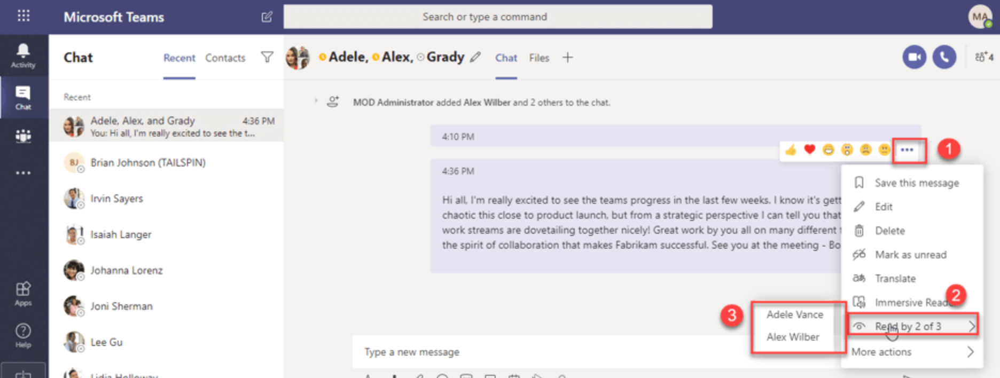
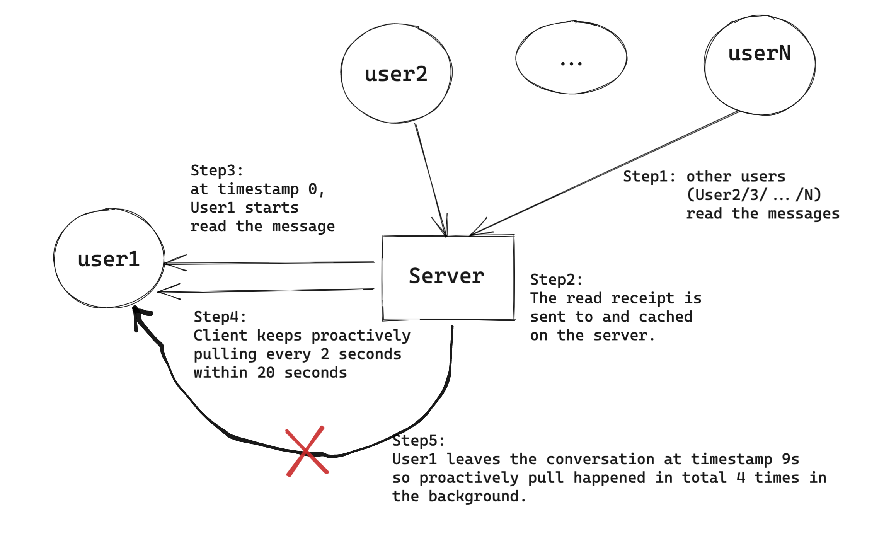

## Group chat read receipt

### Attempt1: Naive pull and push strategy
* Using push is not appropriate due to the following:
  * If a group chat has over thousands of members (e.g. 2K), there will be 2K read receipts messages being sent. Sending 2K separate messages is high consumption for device battery and network bandwidth. 
  * Sender only cares about read receipt when the sender is reading the message inside conversation. If the sender is doing other things on app, he does not care about read receipt. 
* Using pull is not appropriate due to the following: 
  * If the pull interval is too big, update for read receipt will have high latency.
  * If the pull interval is too small, cost much bandwidth and power.

### Attempt2: Combine pull and push
* Combined approach
  1. When a client opens a conversation and read the message with read receipt, it could start pulling read receipt from server. 
  2. At the same time, client subscribe to the message's read receipt.
  3. Server receives the subscription request and start pushing. 
* Cons: Requires huge amount of resources on the server to support subscription. 

### Attempt3: Proactive pull within certain period
* Key observation: User only cares about read receipt 
* Approach
  1. User1 send a message with read receipt. After other users (User2/3/.../N) read the messages, the read receipt is sent to and cached on the server. 
  2. When User1 reads the message with read receipt, client will proactively pull read receipt by:
     * When the user is reading the message with read receipt, within 20 seconds client pulls every two second. 
     * If the user is no longer reading the message, then stop pulling. 

# References
* [别人读没读你的消息，你如何知道？](https://mp.weixin.qq.com/s?__biz=MzI1ODY0NjAwMA==&mid=2247483840&idx=1&sn=aa631873ce3e010cddaad4ee2b97e6d2&chksm=ea044b5fdd73c249c68ab7c98d81f65e358cf3765b653ac1454834c7fba714d6ef55e66fac0b&scene=21#wechat_redirect)
* [IM群聊消息的已读回执功能该怎么实现？](http://www.52im.net/thread-1611-1-1.html)
* 