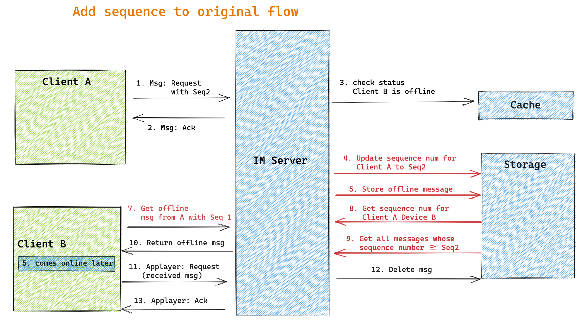

- [Goal](#goal)
- [Differences between message roaming and normal offline handling](#differences-between-message-roaming-and-normal-offline-handling)
  - [Scenario](#scenario)
  - [Flow chart](#flow-chart)
  - [How to avoid too many offline acknowledgement](#how-to-avoid-too-many-offline-acknowledgement)
- [TODO](#todo)

# Goal
* Whatever device a user logs in, he could access past messaging history. 
* For example, Telegram/QQ could support it but WeChat does not support it. 

# Differences between message roaming and normal offline handling
* Offline msgs should not be stored together with normal online msgs because
  * Offline msgs will contain operation instructions which will not be persisted in online cases. For example, client A deletes a message in device A. When syncing from Client A's device B, the message should still be deleted. 

## Scenario
* Pull offline message: 

* Message roaming: 

1、拉取离线消息
每个用户打开App就需要拉取离线，网络中断重连后要拉取离线，收到消息序列号不连续也要拉取离线，拉取离线消息是一个高频操作 。离线消息包括单聊、群聊、控制类等消息，消息类型类型众多。因此离线消息需要以用户ID（多端情况下需要以端）为检索维度。说的直白一点，就是每个人（端）都需要一个收件箱，拉离线消息就是把个人（端）收件箱里的消息取到客户端。

2、消息漫游
消息漫游的典型使用场景是，打开某个会话（单聊、群聊、公众号），下拉界面，客户端向服务端请求这个会话的聊天数据。消息漫游需要以会话为检索维度。消息漫游拉取数据的频率相对较低。我们把这类获取消息的方式成为拉取历史消息。

* The offline messages only have a certain retention period (1 week) or upper limit (1000 messages). Since the number of users' devices is unknown, offline messages could not stored forever. It should be stored in a FIFO basis.

## Flow chart

## How to avoid too many offline acknowledgement
* When a client syncs offline messages, it is usually a large amount of original and acknowledgement package. 
* Could adopt something similar to TCP's Delay Ack to accept ack packages in batch, meaning acknownledging a batch of packages at once. 

# TODO
* http://www.52im.net/forum.php?mod=collection&action=view&ctid=29&fromop=all
