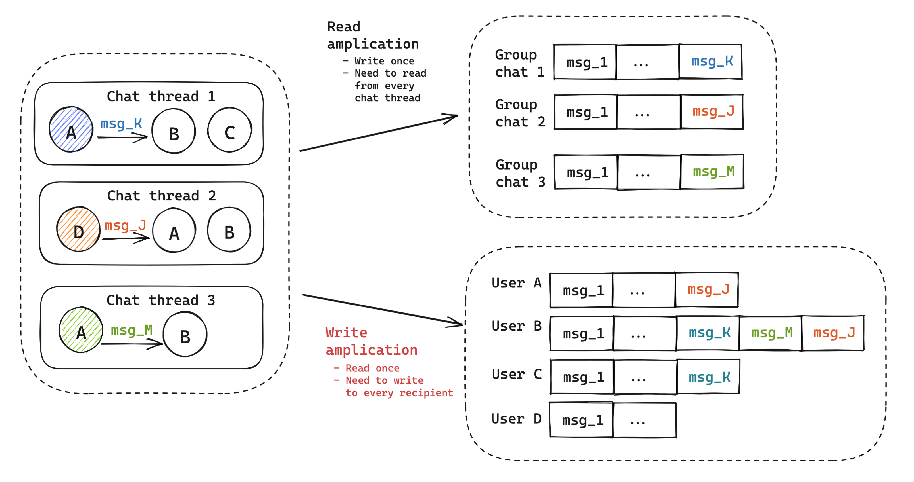
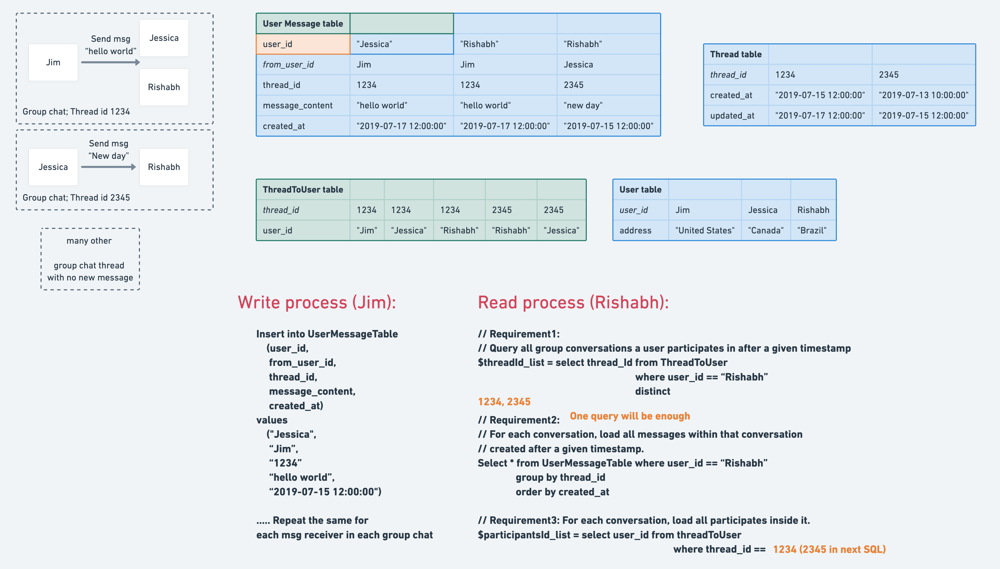
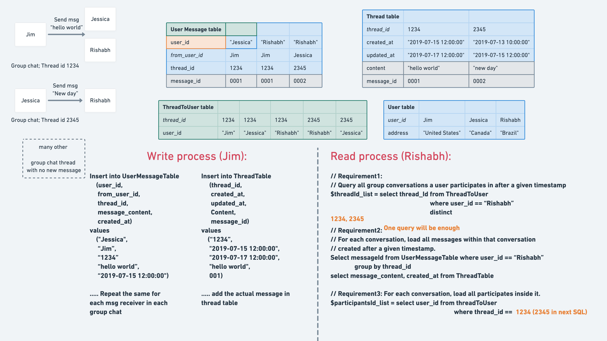

- [Storage requirements](#storage-requirements)
- [Storage model](#storage-model)
  - [Read amplification](#read-amplification)
  - [Write amplication](#write-amplication)
    - [Improve by only storing message id](#improve-by-only-storing-message-id)
    - [Improve by only storing last message id](#improve-by-only-storing-last-message-id)

# Storage requirements
* Requirement1: Query all group conversations a user participates in after a given timestamp.
* Requirement2: For each conversation, load all messages within that conversation created later than a given timestamp.
* Requirement3: For each conversation, load all participates inside it. 

# Storage model
* In group chat scenario (Except for those extremely big 100K+ groups -_-), typically read write ratio will be 100:1. So the storage model should better balance this factor to something like 50:50 or more evenly. So typically write amplification is used. 

## Read amplification

## Write amplication

### Improve by only storing message id

### Improve by only storing last message id

