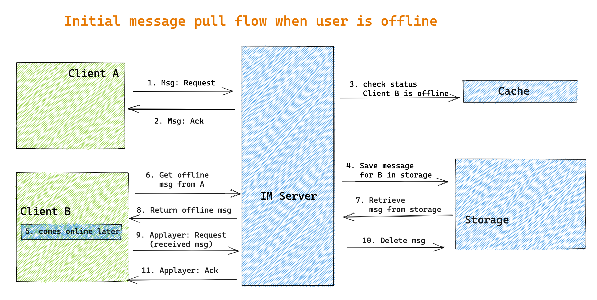

- [Flowchart](#flowchart)
  - [Initial design](#initial-design)
  - [Improve with sequence num](#improve-with-sequence-num)
- [Storage requirements](#storage-requirements)
  - [Initial schema](#initial-schema)
  - [Improved schema: Decouple msg content from sender and receiver](#improved-schema-decouple-msg-content-from-sender-and-receiver)

# Flowchart
## Initial design

## Improve with sequence num

# Storage requirements
* Requirement1: Query all 1-on-1 conversations a user participates in after a given timestamp.
* Requirement2: For each conversation, load all messages within that conversation created later than a given timestamp.

## Initial schema

## Improved schema: Decouple msg content from sender and receiver
* Intuition:
  * Even if sender A deletes the message on his machine, the receiver B should still be able to see it
  * Create a message\_content table and message\_index table

