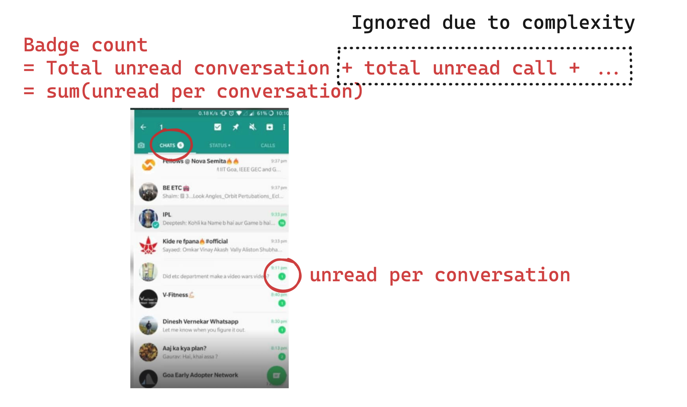
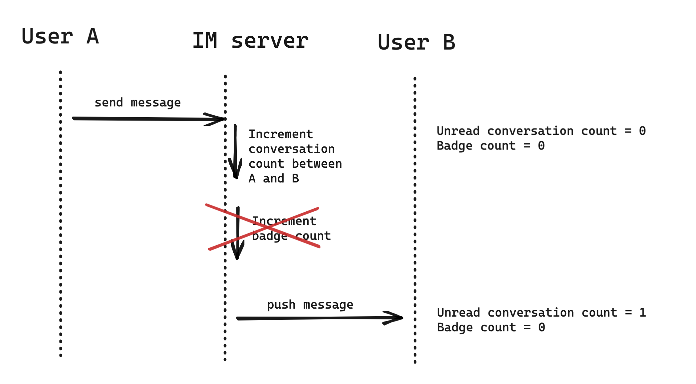
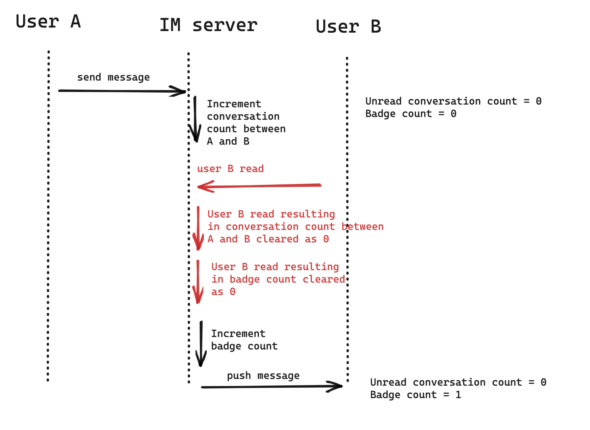
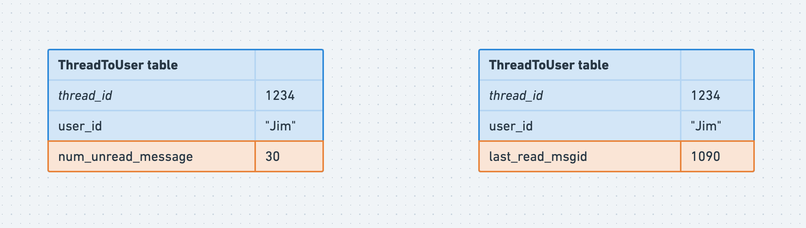
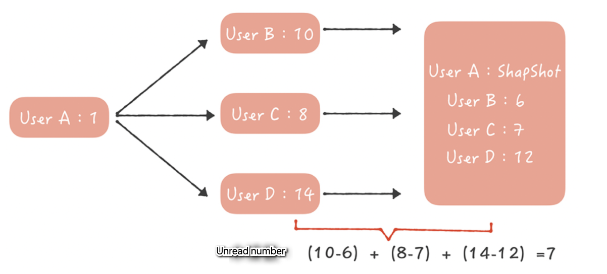

- [Badge count](#badge-count)
  - [Question1: Whether to store badge and conversation count separately](#question1-whether-to-store-badge-and-conversation-count-separately)
  - [Question2: Keep consistency between badge and conversation count](#question2-keep-consistency-between-badge-and-conversation-count)
    - [Problems](#problems)
    - [Solution](#solution)
      - [Distributed lock](#distributed-lock)
      - [Transaction](#transaction)
      - [Lua script](#lua-script)
- [Count of unread messages in a thread](#count-of-unread-messages-in-a-thread)
  - [Naive solution with SQL](#naive-solution-with-sql)
    - [Improve write requests with hash based sharding](#improve-write-requests-with-hash-based-sharding)
    - [Improve read requests with Redis](#improve-read-requests-with-redis)
      - [Not enough memory](#not-enough-memory)
  - [Avoid notification storm in large group chat](#avoid-notification-storm-in-large-group-chat)
    - [Solution: Aggregate and update](#solution-aggregate-and-update)
- [Count of unread message in newsfeed](#count-of-unread-message-in-newsfeed)
  - [How is the scenario different?](#how-is-the-scenario-different)
  - [Idea](#idea)

# Badge count




## Question1: Whether to store badge and conversation count separately
* In theory, it is possible to calculate badge count from conversation count on the fly. 
* In practice, badge counter is used in a much higher frequency than these internal counters. If it is always calculated on the fly, then it will be a performance penalty. 
* So badge count and conversation count are usually stored separately. 

## Question2: Keep consistency between badge and conversation count
### Problems
* Total unread message increment and unread message against a specific person are two atomic operations. One could fail while the other one succeed. Or other clearing operations are being executed between these two operations.





### Solution
#### Distributed lock
* MC add, Redis setNX

#### Transaction
* Redis's MULTI, DISCARD, EXEC and WATCH operations. Optimistic lock.

#### Lua script

# Count of unread messages in a thread
## Naive solution with SQL

* All attributes inside a table and using (thread id + user id) as the primary key



```
select unread_count from threadToUser table
```

### Improve write requests with hash based sharding
* Hash sharding based on (thread id + user id) over time range based sharding because chat data obviously has hot / cold data. Using time range based sharding could lead to hot shards

### Improve read requests with Redis
* Improve with Redis

#### Not enough memory
* Redis is designed for general data structures and could take much memory:
  * Revise the native data structure for Redis
  * For example, Key stored as string: 8 bit LONG type will be stored as 8 bit (sdshdr length)+ 19 bit (8 byte Long represent as string）+ 1(’\0’)=28; In addition, remove pointers
* Redis + SSD: Popularity of tweets usually calms down over time. For old data, persist them into SSD disk.

## Avoid notification storm in large group chat
* Suppose that there is a 5000 people group and there are 10 persons speaking within the group per second, then QPS for updating unread messges will be 50K; When there are 1000 such groups, the QPS will be 50M

### Solution: Aggregate and update
1. There will be multiple queues A/B/C/... for buffering all incoming requests.
2. Two components will be pulling from queues
   * Timer: Will be triggered after certain time
   * Flusher: Will be triggered if any of the queue exceed a certain length
3. Aggregator service will pull msgs from Timer and Flusher, aggregate the read increment and decrement operations


* Cons:
  * Since there is no persistent on queues, if there is a restart, the number of unread messages will be inaccurate

# Count of unread message in newsfeed

## How is the scenario different?

* Counts of tweets repost, comments... will be based on user activity (follow, edit, etc.), counts of newsfeed need to happen for everyone without any user intervention. The former is triggered by user activity, the later always happen automatically. 
* Counts of system notifications. Unread message number in newsfeed will vary among every user. 

## Idea

* Record how many posts each user has made. Also record a snapshot of all posts. 
* When need to check for how many unread messages there are in newsfeed, calculate the different between snapshots. 


