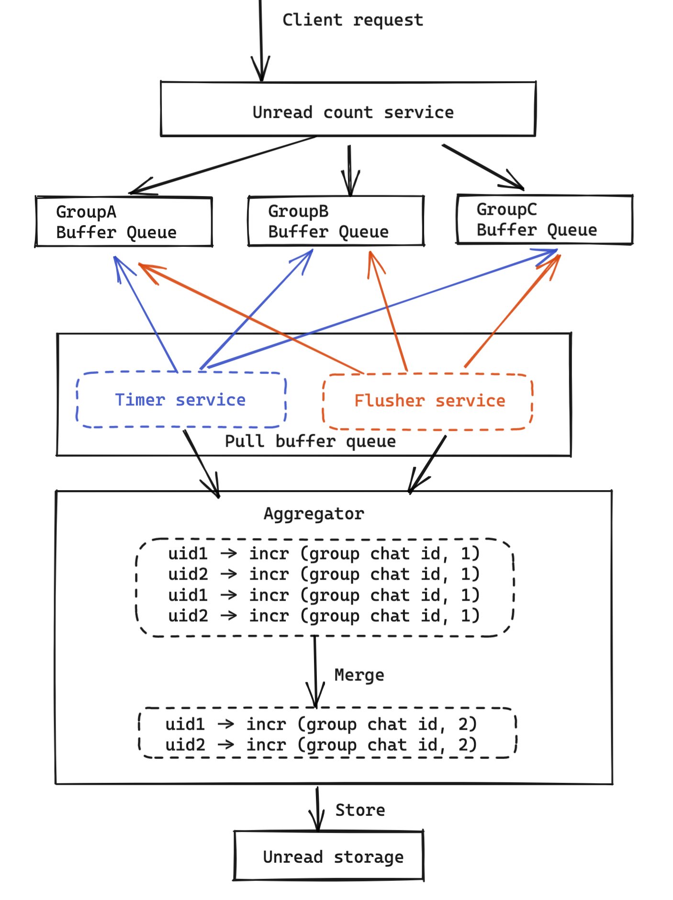

- [Badge count](#badge-count)
  - [Question1: Whether to store badge and conversation count separately](#question1-whether-to-store-badge-and-conversation-count-separately)
  - [Question2: Keep consistency between badge and conversation count](#question2-keep-consistency-between-badge-and-conversation-count)
    - [Problems](#problems)
    - [Solution](#solution)
      - [Distributed lock](#distributed-lock)
      - [Transaction](#transaction)
      - [Lua script](#lua-script)
  - [Question3: How to be efficient in large group chat](#question3-how-to-be-efficient-in-large-group-chat)
    - [Problem: Notification storm](#problem-notification-storm)
    - [Solution](#solution-1)
- [Count of comments, likes, views, retweets on a tweet](#count-of-comments-likes-views-retweets-on-a-tweet)
  - [Impl with MySQL](#impl-with-mysql)
  - [Impl with NoSQL](#impl-with-nosql)
  - [Impl with Redis](#impl-with-redis)
  - [Improve redis native storage](#improve-redis-native-storage)
  - [Improve with SSD storage](#improve-with-ssd-storage)
  - [Synchronization between DB and cache](#synchronization-between-db-and-cache)
- [Count of unread system notifications](#count-of-unread-system-notifications)
  - [V1: An unread counter of sys notification for every user**](#v1-an-unread-counter-of-sys-notification-for-every-user)
  - [V2: A last read id of sys notifications for every user](#v2-a-last-read-id-of-sys-notifications-for-every-user)
  - [V3: Small optimization on top of V2](#v3-small-optimization-on-top-of-v2)
- [Count of unread message in newsfeed](#count-of-unread-message-in-newsfeed)
  - [How is the scenario different?](#how-is-the-scenario-different)
  - [Idea](#idea)
  - [Follow-up questions](#follow-up-questions)

# Badge count


## Question1: Whether to store badge and conversation count separately
* In theory, it is possible to calculate badge count from conversation count on the fly. 
* In practice, badge counter is used in a much higher frequency than these internal counters. If it is always calculated on the fly, then it will be a performance penalty. 
* So badge count and conversation count are usually stored separately. 

## Question2: Keep consistency between badge and conversation count
### Problems
* Total unread message increment and unread message against a specific person are two atomic operations. One could fail while the other one succeed. Or other clearing operations are being executed between these two operations.


### Solution
#### Distributed lock
* MC add, Redis setNX

#### Transaction
* Redis's MULTI, DISCARD, EXEC and WATCH operations. Optimistic lock.

#### Lua script

## Question3: How to be efficient in large group chat
### Problem: Notification storm
* Suppose that there is a 5000 people group and there are 10 persons speaking within the group per second, then QPS for updating unread messges will be 50K; When there are 1000 such groups, the QPS will be 50M

### Solution
* Solution: Aggregate and update
  1. There will be multiple queues A/B/C/... for buffering all incoming requests.
  2. Two components will be pulling from queues
     * Timer: Will be triggered after certain time
     * Flusher: Will be triggered if any of the queue exceed a certain length
  3. Aggregator service will pull msgs from Timer and Flusher, aggregate the read increment and decrement operations
* Cons:
  * Since there is no persistent on queues, if there is a restart, the number of unread messages will be inaccurate




# Count of comments, likes, views, retweets on a tweet
## Impl with MySQL

* All attributes inside a table and using tweet id as the primary key

```
select repost_count, comment_count, praise_count, view_count 
from t_weibo_count where tweet_id = ?
```

* Scale with partition on tweet_id
  * Hash based sharding on tweet_id
  * Range based sharding on tweet_date


* Typical performance metrics:
  *

## Impl with NoSQL

* Schema: using tweet_id as primary key


* Typical performance metrics:
  *

## Impl with Redis

* TweetId => Count

## Improve redis native storage

* Storage cost for Redis native way: 
  * Key stored as string: 8 bit LONG type will be stored as 8 bit (sdshdr length)+ 19 bit (8 byte Long represent as string）+ 1(’\0’)=28
  * Remove the unnecessary 

## Improve with SSD storage

* Redis + SSD
  * Popularity of tweets usually calms down over time. For old data, persist them into SSD disk.

## Synchronization between DB and cache

* If using DB as backend, then synchronization between DB and cache will be conducted. 
* The benefits of using a DB don't outweigh the downsides of it. (TODO: Details to be added)

# Count of unread system notifications

* System notifications will happen for every user. 

## V1: An unread counter of sys notification for every user**

* Idea: Keep a unread system notification counter for everyone. When a new notification comes out, loop through all users and increment the counter. 
* It has the folllowing downsides:
  * Full table scan will take a long time. For example, suppose 1 billion user and each user takes 1ms, thenn it will take 10^6 s in total. 
  * Furthermore, it wastes lots of storage space because most registered users are not active. 

```
List<Long> userIds = getAllUserIds();
for(Long id : userIds) {
  incrUnreadCount(id);
}
```

## V2: A last read id of sys notifications for every user

* Idea: Keep a last read message id for system notifications. The lastest sys notification message id will be same for everyone (system notification definition). When need to check for how many unread system notifications a user have, substrate the last read with lastest sys notification message. This is similar to how the "red dot" is implemented in notification systems. 

## V3: Small optimization on top of V2

* For users who are not active for certain periods, recycle their counter space. 

# Count of unread message in newsfeed

## How is the scenario different?

* Counts of tweets repost, comments... will be based on user activity (follow, edit, etc.), counts of newsfeed need to happen for everyone without any user intervention. The former is triggered by user activity, the later always happen automatically. 
* Counts of system notifications. Unread message number in newsfeed will vary among every user. 

## Idea

* Record how many posts each user has made. Also record a snapshot of all posts. 
* When need to check for how many unread messages there are in newsfeed, calculate the different between snapshots. 


## Follow-up questions

* How to solve hot partition
* How to monitor system health
* How to solve slow consumer
* How to identify performance bottleneck 
