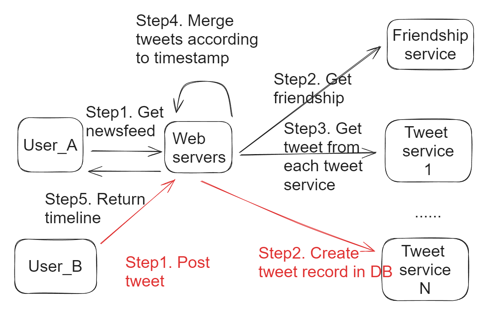
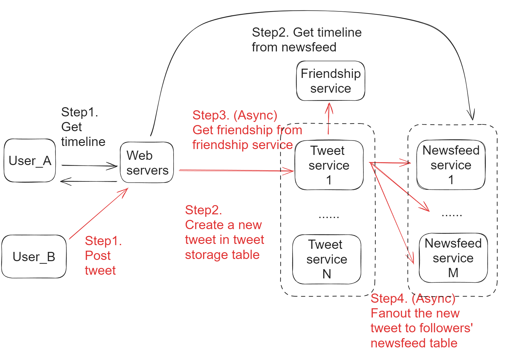

- [Pull-based](#pull-based)
  - [Use case](#use-case)
  - [Flowchart](#flowchart)
  - [Cons](#cons)
- [Push-based](#push-based)
  - [Use case](#use-case-1)
  - [Cons](#cons-1)
  - [Flowchart](#flowchart-1)
- [Push and Pull Combined approach](#push-and-pull-combined-approach)
  - [Oscillation problems](#oscillation-problems)

# Pull-based
## Use case
* Single direction relationship
  * Star users
* High latency

## Flowchart

## Cons
* Get news feed: N DB reads + K way merge (KlogK, K is the number of friends)
  * Bottleneck is in N DB reads, although they could be integrated into one big DB query. 
  * This result in high latency because it needs to wait until N DB reads finish

# Push-based
## Use case

* Bi-direction relationship
  * No star users: Users do not have a lot of followers
* Low latency

## Cons
* When number of followers is really large, the number of asynchronous task will have high latency. 
* Post a tweet: N followers, N DB writes. Executed asynchronously. 

## Flowchart

# Push and Pull Combined approach
* For users with a lot of followers, use pull; For other users, use push. 
* Define a threshold \(number of followers\)
  * Below threshold use push
  * Above threshold use pull
* For popular users, do not push. Followers fetch from their timeline and integrate into news feed. 

## Oscillation problems
* May miss updates. 
* Solutions:
  * Star users: Pull not push
  * Half star user: Pull + Push
  * Normal user: Push

