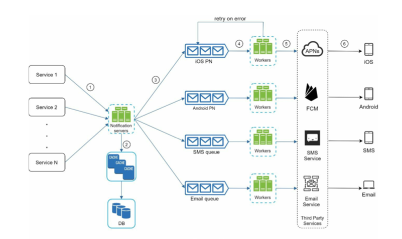

- [Notifications](#notifications)
  - [Type of notifications](#type-of-notifications)
  - [Structure](#structure)
  - [High level design](#high-level-design)
- [Additional feature: Follow and unfollow](#additional-feature-follow-and-unfollow)
- [Additional feature: Likes and dislikes](#additional-feature-likes-and-dislikes)
  - [Schema design](#schema-design)
  - [Denormalize](#denormalize)
  - [Drafted overflow](#drafted-overflow)
  - [Friendly links - good summary on newsfeed](#friendly-links---good-summary-on-newsfeed)

# Notifications

## Type of notifications

* iOS: 
  * APN: A remote notification service built by Apple to push notification to iOS devices. 
* Android:
  * Firebase Cloud Messaging: Instead of APNs, FCM is commonly used to send notifications to mobile devices. 
* SMS:
  * Third party SMS providers such as Twillo, Nexmo, etc.
* Email:
  * Set up their own email servers
  * Or commercial email service such as Sendgrid, Mailchimp, etc.

## Structure

* Provider builds notification with device token and a notification payload.

## High level design

* Notification servers could be the bottleneck
  * A single notification server means a single point of failure
  * Performance bottleneck: Processing and sending notifications can be resource intensive. For example, constructing HTML pages and waiting for responses from third party services could take time. Handling everything in one system can result in the system overload, especially during peak hours.
* Add message queue to decouple:
  * Move the database and cache out of the notification server.
  * Introduce message queues to decouple the system components.

# Additional feature: Follow and unfollow
* Asynchronously executed
  * Follow a user: Merge users' timeline into news feed asynchronously
  * Unfollow a user: Pick out tweets from news feed asynchronously
* Benefits:
  * Fast response to users.
* Disadvantages: 
  * Consistency. After unfollow and refreshing newsfeed, users' info still there. 

# Additional feature: Likes and dislikes

## Schema design

* Tweet table

| Columns | Type |
| :--- | :--- |
| id | integer |
| userId | foreign key |
| content | text |
| createdAt | timestamp |
| likeNums | integer |
| commentNums | integer |
| retweetNums | integer |

* Like table

| Columns | Type |
| :--- | :--- |
| id | integer |
| userId | foreignKey |
| tweetId | foreignKey |
| createdAt | timestamp |

## Denormalize

* Select Count in Like Table where tweet id == 1
* Denormalize: 
  * Store like\_numbers within Tweet Table
  * Need distributed transactions. 
* Might resulting in inconsistency, but not a big problem. 
  * Could keep consistency with a background process.

## Drafted overflow

* [Pull push overview](https://github.com/DreamOfTheRedChamber/system-design-interviews/tree/b195bcc302b505e825a1fbccd26956fa29231553/images/newsfeed_pullPushOverview.jpg)

## Friendly links - good summary on newsfeed

* [https://liuzhenglaichn.gitbook.io/systemdesign/news-feed/facebook-news-feed](https://liuzhenglaichn.gitbook.io/systemdesign/news-feed/facebook-news-feed)
