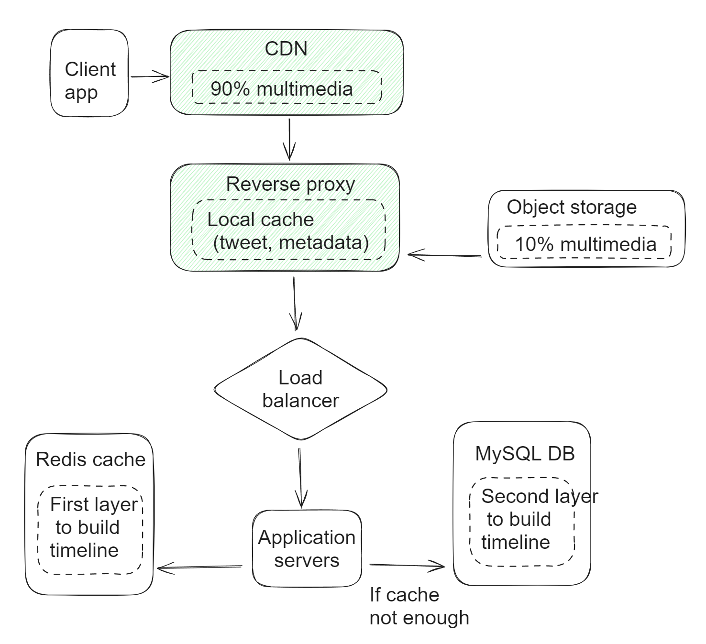
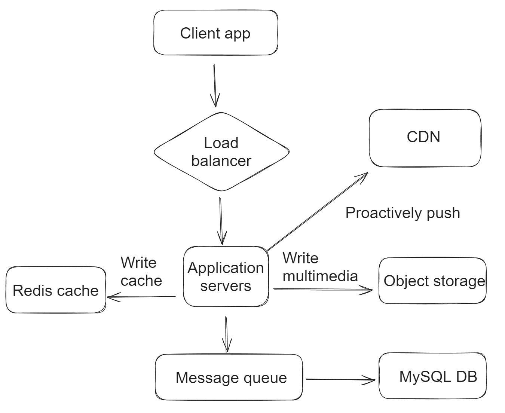

- [Get timeline optimization](#get-timeline-optimization)
- [Create tweet optimization](#create-tweet-optimization)
- [Scale pull](#scale-pull)
- [Scale push](#scale-push)
- [Cache algorithm](#cache-algorithm)
- [Hot spot / Thundering herd problem](#hot-spot--thundering-herd-problem)
- [References](#references)

# Get timeline optimization

# Create tweet optimization
* Write requests directly come to load balancer, without landing on CDN and reverse proxy. 
* Write to database will happen through message queue to avoid sudden spike in requests due to tweets/newsfeed creation. 

# Scale pull
* Add cache before visiting DB, faster than 1000 times
* What to cache
  * Cache each user's timeline
    * N DB query request -&gt; N cache requests
    * Trade off: Cache all timeline? Only cache the latest 1000 timeline
  * Cache each user's newsFeed
    * For users without newsfeed cache: Merge N followers' 100 latest tweets, sort and take the latest 100 tweets.
    * For users with newsfeed cache: Merge N followers' tweets after a specific timestamp. And then merge with the cache. 

# Scale push
* Push-based approach stores news feed in disk, much better than the optimized pull approach.
* For inactive users, do not push
  * Rank followers by weight \(for example, last login time\)
* When number of followers > number of following
  * Lady Gaga has 62.5M followers on Twitter. Justin Bieber has 77.6M on Instagram. Asynchronous task may takes hours to finish. 

# Cache algorithm
* LRU algorithm is not suitable for this case because during the pull-based model, it will get tweets for all followers from different servers. If a specific follower is not that popular, it stands high probability for cache miss in LRU algorithm. 
* Instead, expiration based algorithm is used: Tweets within certain time frame is cached. For example, 7 days of tweets are cached. 
  * UserID is the cache key and a user's tweets content is cache value. 
  * According to estimation, 7 days' tweet content is 700GB. 

# Hot spot / Thundering herd problem
* When superstar posts a tweet, if it is only cached in Redis, it would result in hot key problem. 
* Superstars' tweets could be cached locally on web servers as well. 

# References
* Extension read: Facebook lease get problem "Scaling Memcache at Facebook"
  * https://dev.to/lazypro/handling-stale-sets-and-thundering-herds-of-cache-170c
  * 
* 京东热key探测框架设计与时间： 
  * https://mp.weixin.qq.com/s/xOzEj5HtCeh_ezHDPHw6Jw
  * https://gitee.com/jd-platform-opensource/hotkey
